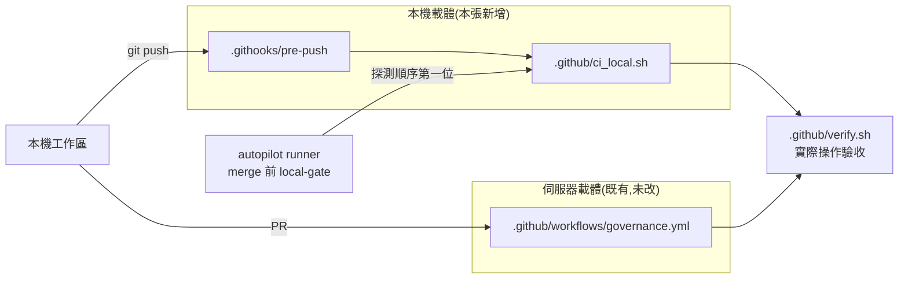
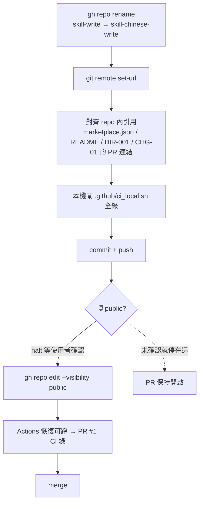

# CHG-20260810-02 — repo 改名 skill-chinese-write,並把治理閘補上本機載體

- Project: skill-chinese-write / skill: writing
- Branch: claude/ai-sdlc-autopilot-handshake-4a3f7a
- Date: 2026-08-10 (UTC+0)
- Type: 結構(對外識別)+ 治理閘
- Proposed by: 使用者(「fix ci problem, it no need for full-ci, it's a skill repo」→「can change it to public, but it should be rename skill-chinese-write first」)
- Implemented by: Claude(Cowork session)
- Risk: 中(改動對外識別:repo 名稱與 marketplace id;不碰 skill 內容與 lint 規則)
- Autonomy: 改名與本機閘 auto(DIR-001);**轉 public 一律 halt**(不可逆公開,不在 DIR-001 授權內)
- Commit/PR: https://github.com/kamira/skill-chinese-write/pull/1
- Recurrence check: 非重複。首次改名;首次遇到 CI 因帳務完全不啟動。
- Diagrams: 見 `## Design diagrams`
- Skill: ai-sdlc v1.22
- Related: docs/writing/changes/CHG-20260810-01.md(同一支 branch、同一個 PR)

## 動機

CHG-20260810-01 的 PR 卡在 merge 閘:GitHub Actions 回報
`The job was not started because recent account payments have failed`。

這裡有一個容易做錯的判斷:使用者最初的指示是「不需要 full-ci」,聽起來像是要把 workflow 改小。
**但把 workflow 改小完全沒有用**——私有 repo 的 Actions 需要帳務正常,帳務一斷是 job 連排都不會排,
紅的不是步驟,是啟動。步驟砍到剩一行,照樣紅。

使用者接著指定真正的解法:**轉 public**(public repo 的 Actions 免費),但**要先改名**為
`skill-chinese-write`。本張收改名與本機閘;轉 public 留在停點等人。

## 使用者故事

1. 作為 repo 擁有者,我要 repo 叫 `skill-chinese-write`,以便名稱說得出它是中文寫作技能,而不是泛稱的「寫作」。
2. 作為安裝過此 marketplace 的人,我要在 README 讀到舊名改新名這件事,以便知道自己得移除再重加。
3. 作為維護者,我要治理閘有一個**本機**載體,以便下一次 CI 停擺時,merge 不會再被卡整整一輪。
4. 作為維護者,我要 repo 轉 public 之前有人真的看過內容一遍,以便公開是決定,不是手滑。

## Decisions & trade-offs

| 決策 | 選項 | 前提假設 | 為什麼這樣選 |
|------|------|----------|--------------|
| 怎麼修 CI | A 砍小 workflow / B 轉 public / C 全部搬到本機 | 帳務短期內不會修好 | **B 為主、C 為輔**。A 是無效解(帳務擋的是啟動)。B 讓既有 workflow 原封不動繼續運作;C 補上「CI 再度停擺時仍有閘」 |
| 保留 `governance.yml` 嗎 | 刪掉 / 保留 | 轉 public 後 Actions 免費可用 | **保留,一行都沒改**。使用者說「不需要 full-ci」是在帳務前提下講的;前提換了,砍閘就沒有理由——沒人要求砍測試 |
| marketplace `name` 要不要跟著改 | 跟著改 / 維持 skill-write | 目前只有擁有者裝過 | **跟著改**。id 與 repo 名分岔的成本會一直付下去;現在改的代價只有一次「移除再重加」,寫進 README |
| 舊 CHG 的 `Project:` 欄位 | 全部改寫 / 保留原值 | 紀錄是歷史,不是現況 | **保留**。改寫既有紀錄本身就是漂移;新紀錄用新名,README 交代改名這件事 |
| 轉 public 誰來按 | AI 自動 / 停下來等人 | DIR-001 只授權低/中風險 | **停下來等人**。公開不可逆——內容一旦外流,快取與 fork 不會因為改回 private 而消失 |
| hook 怎麼裝 | 自動裝 / 提供安裝腳本 | `core.hooksPath` 不隨 clone 帶過來 | **提供腳本並明說缺口**。裝不裝是本機決定,假裝它自動生效才是空頭規則(KN-001) |

## Design diagrams

**受影響區域的架構:治理閘的三個載體**

三個載體共用同一支 `verify.sh`,所以本機與伺服器驗的是同一件事,不會各驗各的。

**本次變更的流程:改名 → 對齊 → 公開**

## 修改指引

### Goal

把 repo 對外識別改為 `skill-chinese-write`,repo 內引用同步對齊;治理閘補一個本機載體;轉 public 留為停點。

### Impact scope

| 受影響項目 | 類型 | 改動 | 連帶影響 |
|-----------|------|------|---------|
| GitHub repo 名稱 | 目錄/對外 | `skill-write` → `skill-chinese-write` | 舊 URL 由 GitHub 轉址;本機 remote 需 set-url |
| `.claude-plugin/marketplace.json` 的 `name` | 設計 | 同步改名 | 裝過舊 id 的人要移除再重加(README 交代) |
| `README.md` | 文件 | 標題、安裝指令、改名說明 | 無 |
| `docs/writing/knowledge/knowledge.md` | 文件 | DIR-001 的 repo 名 | 無 |
| `.github/ci_local.sh`、`.githooks/pre-push`、`scripts/install-hooks.sh` | 新增 | 本機治理閘 | 需手動跑一次 install-hooks.sh |
| repo 可見性 | 對外 | private → public | **不可逆**;停點,等人 |

skill 內容(`skills/writing/`)、lint 規則、`plugins/`、`tools/`:**零改動**。
`plugins/` 與 `skills/` 未變動,故 catalog 的 bump-on-change 不觸發,`metadata.version` 不動。

### Modification steps

- [x] 1. `gh repo rename skill-chinese-write`,並 `git remote set-url`
- [x] 2. 對齊 repo 內引用:marketplace.json `name`、README(標題+安裝+改名說明)、DIR-001、CHG-20260810-01 的 PR 連結
- [x] 3. 新增本機閘:`.github/ci_local.sh`(呼叫 verify.sh + 風格夾具 + py_compile + JSON + catalog)
- [x] 4. 新增 `.githooks/pre-push` 與 `scripts/install-hooks.sh`,並在本 worktree 裝上
- [x] 5. 公開前內容普查:全歷史憑證掃描、追蹤檔清單、`__pycache__` 是否入版控
- [ ] 6. **停點**:向使用者出示普查結果並取得確認後,`gh repo edit --visibility public`
- [ ] 7. 確認 Actions 恢復可跑 → PR #1 全綠 → merge

### Structure document updates

本 repo 無 `docs/structure/`(單一 plugin,結構寫在 README 與 AGENTS.md);README 的「這個 repo 有什麼」表格已含新增路徑之外的既有項目,新增的三支為工具鏈檔案,不列入該表。

## Risk & rollback

- 風險一:marketplace id 改名讓既有安裝失效 → 緩解:README 明寫要移除再重加;plugin id `writing` 不動
- 風險二:轉 public 不可逆,內容外流後改回 private 也救不回 → 緩解:列為停點,先普查再確認(步驟 5、6);普查結果見 ACC
- 風險三:hook 需手動安裝,沒裝的機器等於沒閘 → 緩解:安裝腳本自己寫明這個缺口;真正擋在 merge 前的是 runner 的 local-gate,它會自己找 `.github/ci_local.sh`
- 回滾:`gh repo rename skill-write` + `git remote set-url` 還原;repo 內引用 `git revert`;**轉 public 無回滾**(這正是它列停點的理由)

### Acceptance operation(實際操作驗收)

- **operate**:跑 `bash .github/ci_local.sh`;確認 `gh repo view kamira/skill-chinese-write` 回得到新名;確認 `git remote -v` 指向新 URL;跑一次憑證與追蹤檔普查。
- **observe**:各自的退出碼與輸出。
- **pass**:`ci_local.sh` exit 0(含 verify.sh 的紅燈可達探針);repo 名為 `skill-chinese-write`;remote 為新 URL;普查零命中(偵測器自身的 regex 不算)。

## 狀態

Implemented — 步驟 1~5 完成;**步驟 6、7 停在轉 public 的停點等使用者確認**。
驗收見 ../acceptance/ACC-20260810-01.md。
