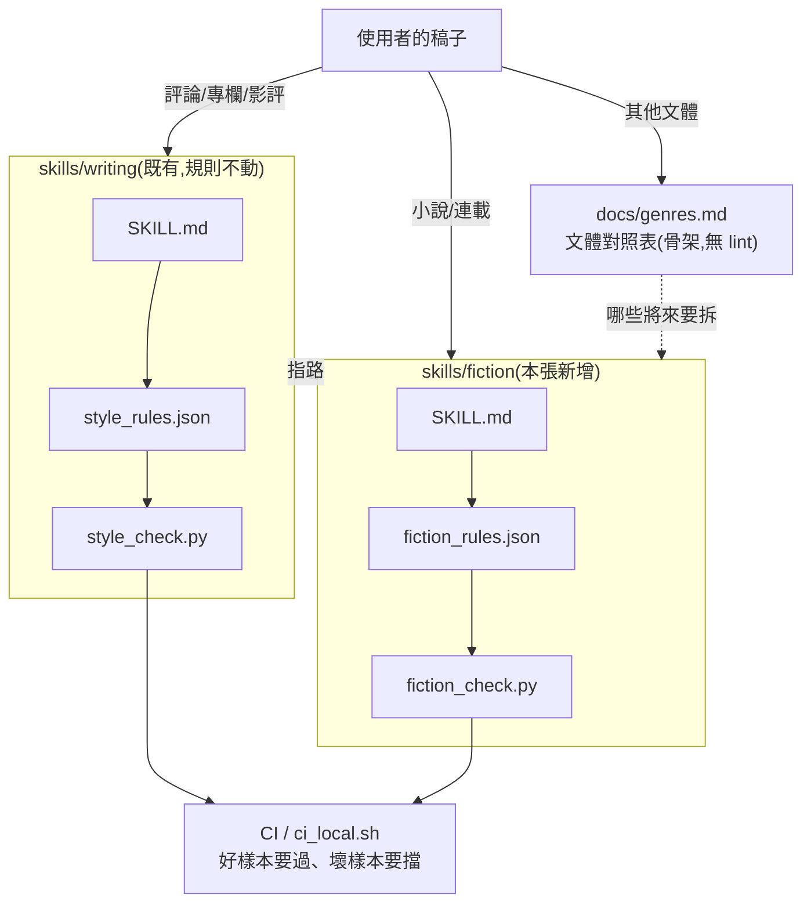
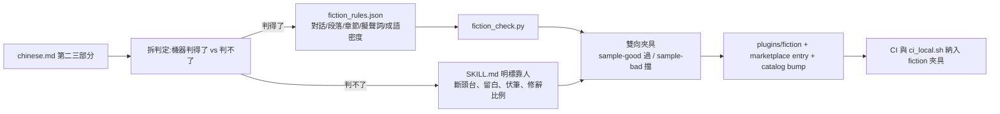

# CHG-20260810-03 — 新增 fiction skill:小說有自己的規則,不共用評論的 lint

- Project: skill-chinese-write / skill: fiction(新增)、writing(僅改指路)
- Branch: claude/fiction-skill
- Date: 2026-08-10 (UTC+0)
- Type: 新功能(新增 skill 與 plugin entry)
- Proposed by: 使用者(提供 `chinese.md`;定調「different write should be different skill」;選定「先做 fiction 一支,其餘先立骨架」)
- Implemented by: Claude(Cowork session)
- Risk: 中(新增 plugin entry 會進 marketplace;既有 `writing` 只改指路不動規則)
- Autonomy: auto(DIR-001 涵蓋中風險)
- Commit/PR: https://github.com/kamira/skill-chinese-write/pull/2
- Recurrence check: 非重複。首次在本 repo 新增第二支 skill。
- Diagrams: 見 `## Design diagrams`
- Skill: ai-sdlc v1.22
- Related: 使用者提供的 `chinese.md`(第二、三部分);docs/writing/changes/CHG-20260810-02.md

## 動機

`writing` 的 SKILL.md 自己寫著「小說與散文尚未實作,不要冒充」,並且說明了理由:
**評論靠論證推進,小說靠場景和人物推進,硬套只會產出四不像。**使用者提供的 `chinese.md`
補上了小說那一塊的規格,而且是三個部分裡**唯一厚到能落成 lint** 的一塊。

## 為什麼是新 skill,而不是往 writing 加一節

不是為了整齊。是因為**共用 lint 會直接誤殺小說**:

| `writing` 的硬規則 | 對小說 |
|--------------------|--------|
| 必須出現第一人稱「我」 | **錯**。第三人稱限知是小說主流視角,全篇沒有「我」完全正常 |
| 結尾句低於 12 字即違規 | **錯**。斷頭台法則要的正是「那保險箱裡竟然是⋯⋯」這種戛然而止 |
| 刻意句(明喻/對稱)全篇上限 3 處 | **錯**。武俠的武打段落要的就是密集對偶與誇張 |
| 條列佔比上限 25% | 無意義。小說不會有條列 |

三條硬規則裡有三條要反過來。把它們寫成「若文體為小說則跳過」,等於在一支 lint 裡養兩套
互斥的判準——這正是 KN-002 講的「門檻要按文本類型分流」推到結構層的樣子:**分流分到最後,
就是不同的 skill**。

## 使用者故事

1. 作為寫小說的人,我要一支不會拿評論標準罵我的 lint,以便「沒有『我』」「結尾很短」不再被判違規。
2. 作為寫小說的人,我要對話換行、段落長度、章節字數這些**硬規範**被機器擋下來,以便不用自己數。
3. 作為寫網路連載的人,我要段落與章節門檻能切換成網文標準(每段 3 行、每章 2000-3000 字),以便同一支工具兩種載體都能用。
4. 作為使用者,我要知道 `chinese.md` 裡**哪些規則機器判得了、哪些判不了**,以便不會誤以為全部都有人在把關。
5. 作為維護者,我要其餘文體先有一份對照表,以便之後要拆哪一支時有依據,而不是每次重讀 `chinese.md`。

## Decisions & trade-offs

| 決策 | 選項 | 前提假設 | 為什麼這樣選 |
|------|------|----------|--------------|
| 共用 `style_check.py` 還是新寫 | 共用+旗標 / 新寫 `fiction_check.py` | 兩套判準有三條互斥 | **新寫**。共用要在一支腳本裡塞兩套互斥硬規則,日後每加一個文體就多一層 if |
| `chinese.md` 的「修辭比例 40%-50%」怎麼處理 | 落成斷言 / 明標靠人 | 沒有任何程式量得出「幾成是譬喻」 | **明標靠人**(KN-001 的第二條路)。假裝有斷言比沒有更糟 |
| 「成語比例 25%-35%」怎麼處理 | 照數字實作 / 自訂密度指標 / 不做 | 原文沒有定義分母,25% 的是什麼不明 | **自訂「成語次數/千字」並明說是本 skill 自訂**,不冒充實作了原文的百分比。**此項為代使用者決定**,可在 confirm 時推翻 |
| 網文 / 出版兩套門檻 | 兩份規則檔 / 一份 + `--mode` | 差別只在數值,不在規則種類 | **一份 + `--mode web|print`**。兩份規則檔會分岔 |
| 其餘 19 個文體放哪 | 各自建 skill 骨架 / 一份對照表 | 每個文體在原文只有 4-6 行 | **一份 `docs/genres.md` 對照表**。用四到六行去生一個 skill,產出的就是空頭規則(KN-001) |
| 既有 `writing` 要不要動 | 不動 / 改指路 | SKILL.md 現在寫「小說未實作」 | **只改指路**:那句話現在是假的,必須改;規則一條不動 |

## Design diagrams

**受影響區域:兩支 skill 的邊界與共同載體**

`writing` 與 `fiction` **不共用規則檔也不共用腳本**,只共用 CI 的雙向夾具紀律。

**本次變更的流程**

## 修改指引

### Goal

把 `chinese.md` 第二、三部分落成一支獨立可用的 `fiction` skill:判得了的變成斷言,判不了的明標靠人;其餘文體收進一份對照表。

### Global Constraints(每個 task 都要遵守)

- **不動 `writing` 的任何規則**(`style_rules.json` 與 `style_check.py` 零改動),只改 SKILL.md 的指路文字
- 每一條寫進 references 的規則,**要嘛在 `fiction_rules.json` 有欄位且 `fiction_check.py` 有斷言,要嘛在該處明講靠人判斷**(KN-001,不允許第三種)
- 新增任何判定後,門檻要按文本類型分流:對話行、標題、引號內不得用敘述段的標準去量(KN-002)
- 夾具必須**雙向**:`sample-good.md` 要過,`sample-bad.md` 要被擋;只驗「跑得動」等於沒驗
- 自訂而非原文既有的指標,一律在文件裡標明「本 skill 自訂」

### Tasks(checkbox=續作點)

- [x] T1. `skills/fiction/assets/fiction_rules.json`:規則單一真相(對話、段落、章節、擬聲詞、成語密度、流派配比)
  - interfaces: consumes chinese.md 第二三部分 / produces 規則欄位供 fiction_check.py 讀
  - test: `python -m json.tool` 通過;每個欄位都能被 T2 的斷言引用
- [x] T2. `skills/fiction/scripts/fiction_check.py`:五組判定 + `--mode web|print` + `--json`
  - interfaces: consumes fiction_rules.json / produces exit 0|1|2 與報表
  - test: 對 sample-good 回 0、對 sample-bad 回 1
- [x] T3. `skills/fiction/assets/sample-good.md` 與 `sample-bad.md`:雙向夾具
  - interfaces: consumes fiction_check.py / produces CI 可跑的紅綠兩端
  - test: good exit 0、bad exit 1,且 bad 的每一類違規都至少命中一次
- [x] T4. `skills/fiction/SKILL.md` + `references/`(dialogue / structure / genres 三份)
  - interfaces: consumes chinese.md / produces 人類可讀規範,判不了的明標靠人
  - test: 逐條清點——每條規則在 JSON 有欄位,或文件裡有「靠人判斷」字樣
- [x] T5. `docs/genres.md`:其餘文體對照表(骨架),並改 `writing/SKILL.md` 的指路
  - interfaces: consumes chinese.md 第一部分 / produces 未實作文體的依據
  - test: `writing/SKILL.md` 不再宣稱小說未實作;規則區塊零改動(git diff 只碰指路段)
- [x] T6. plugin 與 catalog:`plugins/fiction/`、`build_suite.py` 的 PLUGINS、marketplace entry、版本 bump
  - interfaces: consumes skills/fiction / produces 可安裝的 plugin
  - test: `build_suite.py --check` exit 0;`catalog_check.py --check` 與 `--since origin/main` exit 0
- [x] T7. 把 fiction 夾具接進 `.github/workflows/governance.yml` 與 `.github/ci_local.sh`
  - interfaces: consumes 夾具 / produces 兩個載體都驗雙向
  - test: `bash .github/ci_local.sh` exit 0;刻意讓 sample-bad 通過時該步必須轉紅

### Interaction spec

- kind: cli
- cmd: python skills/fiction/scripts/fiction_check.py skills/fiction/assets/sample-good.md
- artifacts: 終端輸出(exit code 即判定)

### Acceptance operation(實際操作驗收)

- **operate**:對 `sample-good.md`、`sample-bad.md` 各跑一次 `fiction_check.py`(print 與 web 兩種 mode);跑 `build_suite.py --check`、`catalog_check.py --check`、`bash .github/ci_local.sh`;對 `writing/style_check.py` 跑既有三份夾具確認零回歸。
- **observe**:各自的退出碼與報表內容。
- **pass**:good exit 0、bad exit 1 且違規清單涵蓋每一類;三支治理腳本 exit 0;`writing` 三份夾具行為與本張之前完全相同。

### Structure document updates

本 repo 無 `docs/structure/`;README 的「這個 repo 有什麼」表格需新增 `skills/fiction/`、`plugins/fiction/`、`docs/genres.md` 三列。

## Risk & rollback

- 風險一:新增 plugin entry 會進 marketplace,裝了 `writing` 的人會看到第二支 → 緩解:純加法,`writing` 規則零改動;README 說明兩支的分工
- 風險二:對話換行、擬聲詞這類判定容易誤報(KN-002 的老問題) → 緩解:先做成警告,只有「換人說話沒換行」「擬聲詞+一聲」樣板列硬性;夾具用真正的小說片段而非人造句
- 風險三:成語密度是自訂指標,可能與使用者對 `chinese.md` 的理解不符 → 緩解:文件明標「本 skill 自訂」,並在本 CHG 列為代決定事項
- 回滾:刪 `skills/fiction/`、`plugins/fiction/`、`docs/genres.md`,還原 marketplace entry 與 `writing/SKILL.md` 的指路段

## 狀態

已驗收(見 ../acceptance/ACC-20260810-02.md)。7 個 task 全數完成。
