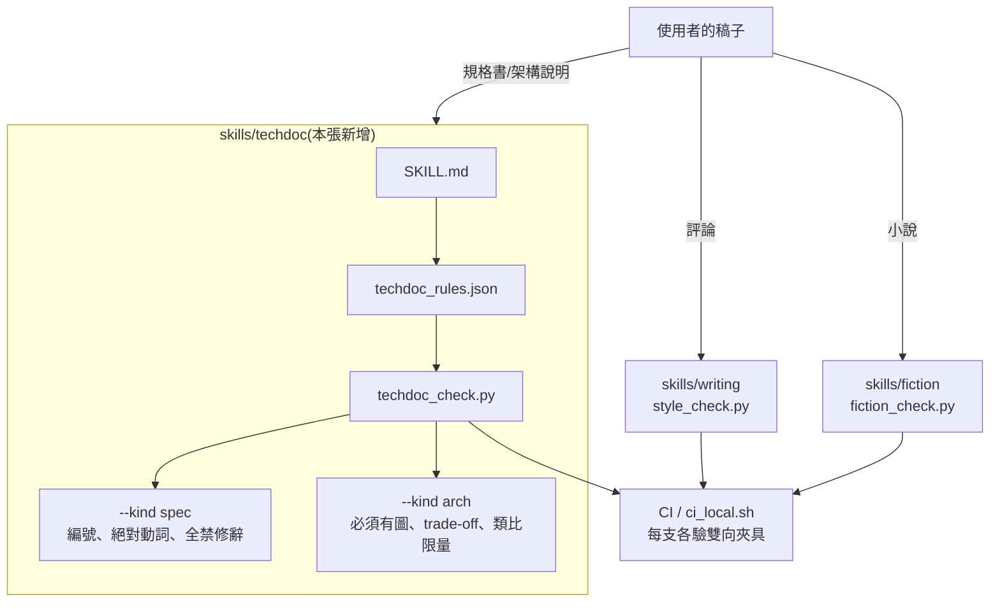
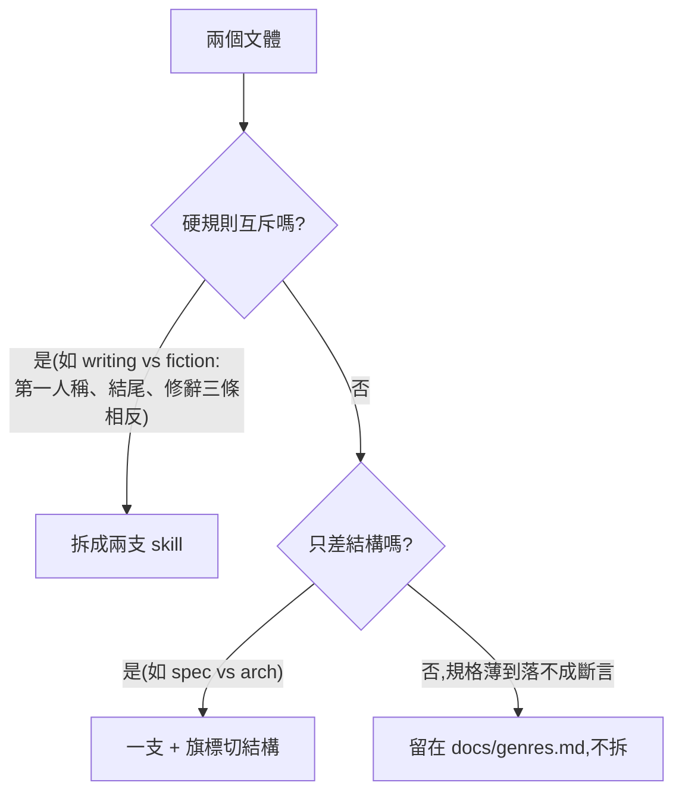

# CHG-20260810-04 — 新增 techdoc skill:規格書與架構說明,以及「什麼時候該拆成兩支」的判準

- Project: skill-chinese-write / skill: techdoc(新增)
- Branch: claude/techdoc-skill
- Date: 2026-08-10 (UTC+0)
- Type: 新功能(新增 skill 與 plugin entry)
- Proposed by: 使用者(「auto next」——授權依 `docs/genres.md` 自行挑選下一支)
- Implemented by: Claude(Cowork session)
- Risk: 中(新增 plugin entry 會進 marketplace;既有兩支 skill 零改動)
- Autonomy: auto(DIR-001 涵蓋中風險)
- Commit/PR: https://github.com/kamira/skill-chinese-write/pull/3
- Recurrence check: **重複** CHG-20260810-03 的動機(依 `chinese.md` 把一個文體落成 skill)→ 本輪建立 KN-003,把「什麼時候拆成兩支 skill」的判準寫成規則
- Diagrams: 見 `## Design diagrams`
- Skill: ai-sdlc v1.22
- Related: docs/writing/changes/CHG-20260810-03.md;docs/genres.md

## 動機

上一張把小說拆出去之後,`docs/genres.md` 留了 13 個未實作文體。挑下一支的依據寫在那份表的「難點」欄:**規格厚到能落成斷言的才值得拆**,只有四五行的拆出來會是空頭規則(KN-001)。

依這個依據,技術與工程應用文體是唯一合格的一組:

| 文體 | 為什麼判得了 |
|------|-------------|
| 規格書 | 修辭比例是 **0%**——「零」比「40%-50%」好判太多;模糊形容詞可以列詞表;絕對動詞(必須/應/不可)可以數;模組化編號可以認 |
| 架構說明 | 「圖文互補」是**二元的**:有沒有圖看得出來。這一條的判定強度和 ai-sdlc 自己的設計圖規則同級 |

其餘 11 個文體的核心指標仍是修辭比例(15%-90% 不等),那個東西沒有程式量得出來,現在拆等於生空頭規則。

## 為什麼是一支 techdoc,不是 spec 與 architecture 兩支

使用者定調「different write should be different skill」。這一張要決定的是**那句話的邊界在哪**——照字面推到底,20 個文體就是 20 支 skill,而其中 11 支會沒有任何斷言。

判準應該是**硬規則互不互斥**,不是文體名字不同:

| | writing vs fiction | spec vs architecture |
|---|---|---|
| 第一人稱 | 一個必須有,一個不需要 | 兩個都不該有 |
| 結尾短句 | 一個禁,一個要 | 兩個都無所謂 |
| 修辭 | 一個限量,一個是文體本身 | **兩個都是 0%** |
| 模糊形容詞 | 未規範 | **兩個都禁,一律換具體數據** |
| 差在哪 | 硬規則**相反** | 只差**結構**(編號條列 vs 圖文互補) |

硬規則相反就必須拆——共用會誤殺(上一張的具體證據)。只差結構的,拆開只會產生兩份 90% 重複的規則檔,而重複的規則檔一定會分岔。所以做成一支 `techdoc`,用 `--kind spec|arch` 切結構規則,與 fiction 的 `--mode print|web` 同一個道理。

**這條判準本身比這支 skill 重要**,所以同輪寫進 knowledge(KN-003)。

## 使用者故事

1. 作為寫規格書的人,我要「快速回應」「良好體驗」這種模糊形容詞被擋下來,以便被迫寫出具體數據。
2. 作為寫規格書的人,我要需求句缺少「必須/應/不可」時被提醒,以便驗收時知道哪些是硬要求。
3. 作為寫架構說明的人,我要文件裡沒有任何圖時被擋下來,以便「圖文互補」不是一句口號。
4. 作為讀技術文件的人,我要譬喻與誇張在規格書裡被完全禁止,以便沒有任何一句話需要猜。
5. 作為維護者,我要知道**下一支該不該拆**有明文判準,以便不用每次重新爭論。

## Decisions & trade-offs

| 決策 | 選項 | 前提假設 | 為什麼這樣選 |
|------|------|----------|--------------|
| 規格書與架構說明拆幾支 | 兩支 / 一支兩 kind | 兩者硬規則相同,只差結構 | **一支**。判準是硬規則互不互斥;拆開會產生兩份 90% 重複且必然分岔的規則檔 |
| 模糊形容詞列硬性還是警告 | 硬性 / 警告 | 原文寫「拒絕模糊形容詞,一律改用具體數據」,語氣為絕對 | **硬性**。這是技術文件最常見也最貴的缺陷:驗收時才發現「快速」沒有定義 |
| 架構說明沒有圖要不要擋 | 擋 / 提醒 | 原文把「圖文互補」列為核心手法之首 | **擋**。二元可判,且與 ai-sdlc 自己的設計圖規則同源:讀不了的確認材料換不到確認 |
| 架構說明的類比要不要禁 | 全禁 / 限量 | 原文允許類比,但僅限「抽象架構類比為已知實物」 | **限量兩處**,且只在 `--kind arch`;`--kind spec` 全禁 |
| 絕對動詞要不要硬性 | 硬性 / 比例警告 | 不是每個條列都是需求句(也有說明句) | **比例警告**。逐條硬性會對說明句誤報,而誤報的代價高於漏報(KN-002) |
| 成語怎麼處理 | 沿用 fiction 的表 / 小表 / 不做 | 技術文件的成語問題是「文學性成語」,不是全部成語 | **另立小表**(約 30 條文學性成語)。共用 fiction 的 140 條表會把「一氣呵成」這種中性詞也算進來 |

## Design diagrams

**受影響區域:三支 skill 的邊界**

三支互不共用規則檔與腳本。`spec` 與 `arch` 共用**同一份**規則檔,因為它們的硬規則相同。

**判準:什麼時候拆成兩支**

## 修改指引

### Goal

把 `chinese.md` 的規格書與架構說明落成一支 `techdoc` skill(兩種 kind),並把「什麼時候拆成兩支」的判準寫進 knowledge。

### Global Constraints(每個 task 都要遵守)

- **既有兩支 skill 零改動**(`skills/writing/` 與 `skills/fiction/` 的 diff 必須為空,指路除外)
- 每一條寫進 references 的規則,要嘛有欄位加斷言,要嘛明講靠人判斷(KN-001)
- 判定要按 kind 分流:`spec` 的規則不得套用在 `arch` 上,反之亦然(KN-002)
- 夾具雙向,且**每一條斷言都要有夾具會踩到**(ACC-20260810-02 抓到的洞,這次先做)
- 自訂而非原文既有的指標,一律標明「本 skill 自訂」

### Tasks(checkbox=續作點)

- [x] T1. `skills/techdoc/assets/techdoc_rules.json`:模糊形容詞、誇張詞、修辭樣式、絕對動詞、文學性成語、兩種 kind 的結構規則
  - interfaces: consumes chinese.md 技術文體節 / produces 規則欄位
  - test: `python -m json.tool` 通過
- [x] T2. `skills/techdoc/scripts/techdoc_check.py`:`--kind spec|arch` + `--json`
  - interfaces: consumes techdoc_rules.json / produces exit 0|1|2
  - test: 對應夾具回 0 / 1;kind 錯誤回 2
- [x] T3. 三份夾具:`sample-spec-good.md`、`sample-arch-good.md`、`sample-bad.md`
  - interfaces: consumes techdoc_check.py / produces 紅綠兩端
  - test: 兩份 good exit 0、bad 在兩種 kind 都 exit 1;每條斷言都有夾具踩到
- [x] T4. `skills/techdoc/SKILL.md` + `references/spec.md` + `references/architecture.md`
  - interfaces: consumes chinese.md / produces 人類可讀規範,判不了的明標靠人
  - test: 逐條清點,每條規則有欄位或有「靠人判斷」字樣
- [x] T5. knowledge 建 KN-003(拆 skill 的判準),並更新 `docs/genres.md` 的已實作表
  - interfaces: consumes 本張的決策 / produces 下一次挑文體的依據
  - test: INDEX 有 KN-003;genres.md 的技術文體兩列移到已實作
- [x] T6. plugin 與 catalog:`plugins/techdoc/`、PLUGINS、marketplace entry、版本 bump
  - interfaces: consumes skills/techdoc / produces 可安裝的 plugin
  - test: `build_suite.py --check` 與 `catalog_check.py` 皆 exit 0
- [x] T7. 把 techdoc 夾具接進 `governance.yml` 與 `ci_local.sh`,並用探針證明紅燈可達
  - interfaces: consumes 夾具 / produces 兩個載體都驗雙向
  - test: `bash .github/ci_local.sh` exit 0;把 good 當 bad 餵給守衛時守衛必須開火

### Interaction spec

- kind: cli
- cmd: python skills/techdoc/scripts/techdoc_check.py skills/techdoc/assets/sample-spec-good.md --kind spec
- artifacts: 終端輸出(exit code 即判定)

### Acceptance operation(實際操作驗收)

- **operate**:兩份 good 各以對應 kind 跑一次;`sample-bad.md` 以兩種 kind 各跑一次;交叉跑(spec-good 用 `--kind arch`)看 kind 是否真的改變結論;跑 `build_suite.py --check`、`catalog_check.py --check`、`bash .github/ci_local.sh`;對 `writing` 與 `fiction` 的既有夾具各跑一次確認零回歸。
- **observe**:各自的退出碼與報表內容。
- **pass**:good exit 0、bad 兩種 kind 皆 exit 1;交叉跑的結論不同(證明 kind 不只是旗標);三支治理腳本 exit 0;既有兩支 skill 的夾具行為完全不變。

### Structure document updates

`docs/genres.md`:規格書與架構說明兩列由「尚未實作」移入「已實作」;README 的 repo 結構表新增 `skills/techdoc/`。

## Risk & rollback

- 風險一:模糊形容詞列硬性會誤報(「穩定」「顯著」在某些句子是中性的) → 緩解:詞表只收**用來描述需求或效果**的形容詞,並提供 `--allow` 個案放行(沿用 writing 的設計)
- 風險二:架構說明「必須有圖」的判定認不出所有畫圖方式 → 緩解:認 mermaid fence、markdown 圖片、以及 ASCII 方框三種;認不出時的誤報由 `--allow-no-diagram` 放行並記錄
- 風險三:三支 skill 之後,規則檔的共通部分會開始重複 → 緩解:本張不預先抽共用層(還看不出哪些真的共通);寫進 KN-003 的觀察區,第二次出現再處理
- 回滾:刪 `skills/techdoc/`、`plugins/techdoc/`,還原 marketplace entry、`docs/genres.md` 與 knowledge 的 KN-003

## 狀態

已驗收(見 ../acceptance/ACC-20260810-03.md)。7 個 task 全數完成。
