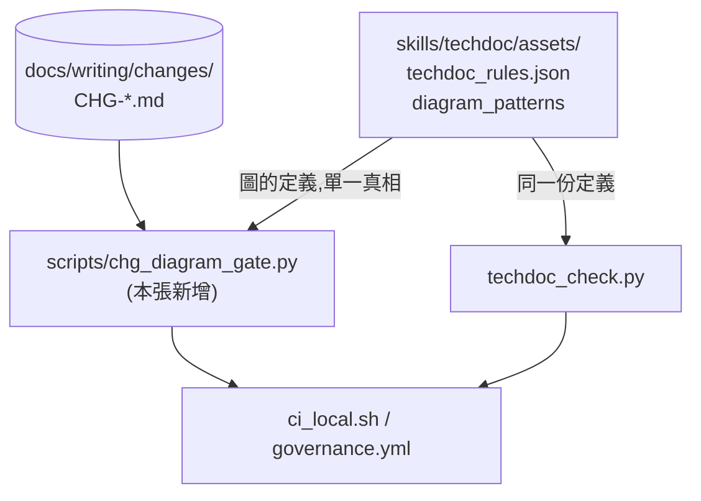
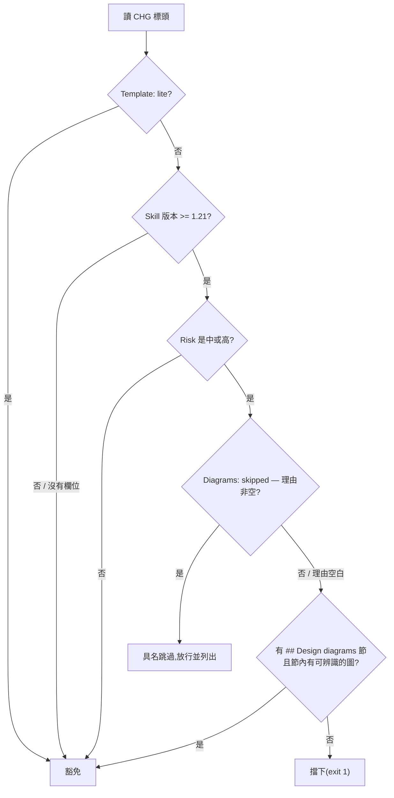

# CHG-20260810-05 — 把「中高風險 CHG 要有設計圖」從自律變成閘

- Project: skill-chinese-write / skill: (治理工具,不屬任何 skill)
- Branch: claude/chg-diagram-gate
- Date: 2026-08-10 (UTC+0)
- Type: 治理閘(新增)
- Proposed by: 使用者(「if it can be automatically, just do it. no need human」)
- Implemented by: Claude(Cowork session)
- Risk: 中(新增會擋 CI 的閘;判錯會讓所有變更卡住)
- Autonomy: auto(DIR-001 涵蓋中風險)
- Commit/PR: <close-out 回填>
- Recurrence check: **重複** KN-001 的型樣第五次(規則存在、沒有斷言)→ 更新 KN-001 的計數與證據,不另建新條
- Diagrams: 見 `## Design diagrams`
- Skill: ai-sdlc v1.22
- Related: docs/writing/changes/CHG-20260810-04.md(techdoc 的缺圖判定被本張重用)

## 動機

ai-sdlc 自 v1.21 起要求中/高風險 CHG 附設計圖(受影響區域的架構圖 + 本次變更的流程圖)。這條規則在本 repo **從來沒有任何機器在查**——三張中風險 CHG 都有圖,純粹因為我記得畫。

這是 KN-001 的型樣第五次出現:規則寫在文件裡、看起來完整、沒有人會執行。前四次都發生在 skill 的風格規則上,這次發生在**治理規則自己身上**。

觸發點是使用者拿 `techdoc_check.py --kind arch` 去驗一張 CHG,回報 `有圖 True`——判定能力早就有了,只差接上去。

## 使用者故事

1. 作為維護者,我要中/高風險 CHG 缺設計圖時 CI 轉紅,以便那條規則不靠我記性。
2. 作為維護者,我要舊 CHG 不被新規則追溯處罰,以便加閘不用回頭改十一份歷史紀錄。
3. 作為維護者,我要「這張我決定不畫」是一個要簽名的動作,以便跳過留得下痕跡。
4. 作為維護者,我要「什麼算一張圖」與 techdoc 用同一份定義,以便兩邊不會分岔。

## Decisions & trade-offs

| 決策 | 選項 | 前提假設 | 為什麼這樣選 |
|------|------|----------|--------------|
| 判定寫在哪 | 擴充 techdoc_check / 新寫治理腳本 | 這是治理閘,不是文體 lint | **新寫 `scripts/chg_diagram_gate.py`**。CHG 不是技術文件,拿文體 lint 去管帳本會混淆兩件事;但**圖的定義從 `techdoc_rules.json` 讀**,不複製 |
| 追溯還是前瞻 | 全部套用 / 只管 v1.21 之後 | 舊 CHG 寫於規則存在之前 | **前瞻**。與 ai-sdlc 的 `DIAGRAM_SINCE` 一致;追溯會逼人改歷史紀錄,而改歷史紀錄本身就是漂移 |
| 低風險要不要管 | 一律要 / 只管中高 | 記帳成本要隨風險縮放 | **只管中高**,`Template: lite` 一律豁免 |
| 跳過怎麼認 | 不准跳 / 具名跳過 | 使用者有權決定不看圖 | **`Diagrams: skipped — <理由>`**,且**理由空白視同未宣告**(空白的簽名不是簽名) |
| 只查有沒有圖,還是查圖對不對 | 查語意 / 只查存在 | 沒有 parser 判得出依賴方向畫反了 | **只查存在**,並在報表明說判不了語意——那正是要給人看的原因 |

## Design diagrams

**受影響區域:閘與既有判定的關係**

圖的定義只有一份,兩個消費者共用——分成兩份必然分岔。

**本次變更的流程:一張 CHG 怎麼被判**

## 修改指引

### Goal

把「中/高風險 CHG 要有設計圖」做成前瞻性的閘,圖的定義與 techdoc 共用同一份。

### Global Constraints(每個 task 都要遵守)

- **前瞻**:v1.21 之前的 CHG 一律不受影響,不得逼任何歷史紀錄改寫
- 圖的定義**從 `techdoc_rules.json` 讀**,不在本腳本複製一份
- 三支 skill 零改動
- 夾具雙向:要有會過的 CHG,也要有會被擋的 CHG,且**紅燈可達要被證明**
- 只查圖存不存在,判不了的(圖對不對)在報表明說

### Tasks(checkbox=續作點)

- [x] T1. `scripts/chg_diagram_gate.py`:標頭解析 + 前瞻判定 + 具名跳過 + 圖偵測
  - interfaces: consumes CHG 標頭與 techdoc_rules.json / produces exit 0|1|2
  - test: 對現有 11 張 CHG 全數放行(3 張有圖、8 張前瞻豁免)
- [x] T2. 夾具:`tests/fixtures/chg-gate/` 放會過與會被擋的兩份假 CHG
  - interfaces: consumes 閘 / produces 紅綠兩端
  - test: good exit 0、bad exit 1,且 bad 的理由具名
- [x] T3. 接進 `ci_local.sh` 與 `governance.yml`,並用探針證明紅燈可達
  - interfaces: consumes 夾具 / produces 兩個載體都驗雙向
  - test: `bash .github/ci_local.sh` exit 0;把 bad 夾具丟進真實掃描範圍時必須轉紅
- [x] T4. 更新 KN-001 的計數與證據(第五次觸發,且首次發生在治理規則自己身上)
  - interfaces: consumes 本張 / produces 知識庫更新
  - test: KN-001 的 seen/applied 由 4/4 變 5/5,證據列出本張

### Interaction spec

- kind: cli
- cmd: python scripts/chg_diagram_gate.py --repo .
- artifacts: 終端輸出(exit code 即判定)

### Acceptance operation(實際操作驗收)

- **operate**:對真實的 `docs/writing/changes/` 跑一次;對兩份夾具各跑一次;把 bad 夾具放進真實掃描範圍證明會轉紅;跑 `bash .github/ci_local.sh`;對三支 skill 的既有夾具各跑一次確認零回歸。
- **observe**:各自的退出碼與訊息。
- **pass**:真實 CHG 全數放行且報表列出哪些被豁免、哪些真的檢查了;bad 夾具 exit 1 且理由具名;探針證明紅燈可達;`ci_local.sh` exit 0;三支 skill 零回歸。

### Structure document updates

README 的 repo 結構表新增 `scripts/`(目前只有 `install-hooks.sh`,本張加入第二支)。

## Risk & rollback

- 風險一:閘判錯會讓所有變更卡住 → 緩解:預設**只管中高風險 + v1.21 以後**,範圍最小;逃生口 `Diagrams: skipped — 理由`
- 風險二:標頭格式有兩種寫法(獨立行 vs `Date | Risk | ...` 同一行的 lite 格式),解析漏掉會誤判 → 緩解:兩種都解析,並在夾具各放一份
- 風險三:「有圖」判定認不出某些畫法 → 緩解:與 techdoc 共用定義,那份已認 mermaid / markdown 圖片 / ASCII 方框三種
- 回滾:刪 `scripts/chg_diagram_gate.py` 與夾具,還原兩個閘載體的那一步

## 狀態

已驗收(見 ../acceptance/ACC-20260810-04.md)。4 個 task 全數完成。
