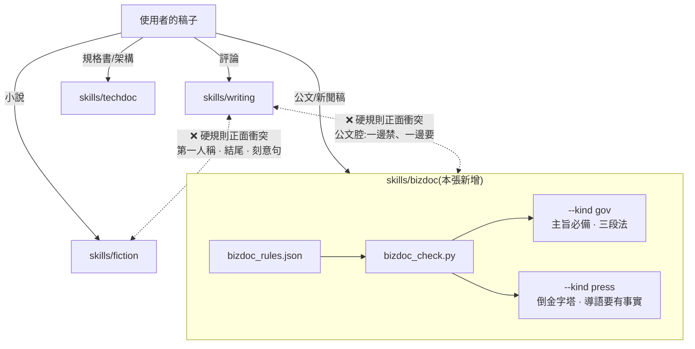

# CHG-20260810-06 — 新增 bizdoc skill:公文與新聞稿,`writing` 禁的正是它要的

- Project: skill-chinese-write / skill: bizdoc(新增)
- Branch: claude/bizdoc-skill
- Date: 2026-08-10 (UTC+0)
- Type: 新功能(新增 skill 與 plugin entry)
- Proposed by: 使用者(「if it can be automatically, just do it. no need human」)
- Implemented by: Claude(Cowork session)
- Risk: 中(新增 plugin entry 會進 marketplace;既有三支 skill 零改動)
- Autonomy: auto(DIR-001 涵蓋中風險)
- Commit/PR: https://github.com/kamira/skill-chinese-write/pull/5
- Recurrence check: **重複** CHG-20260810-03 / 04 的動機(依 `chinese.md` 把文體落成 skill),判準已於 CHG-20260810-04 建成 KN-003,本張是**第一次照 KN-003 走完流程**而非再建新條
- Diagrams: 見 `## Design diagrams`
- Skill: ai-sdlc v1.22
- Related: docs/writing/changes/CHG-20260810-04.md(KN-003 的來源);docs/genres.md

## 動機

`docs/genres.md` 剩下的 11 個文體裡,商務應用文是**唯一**通過 KN-003 檢驗的一組——其餘 10 個的核心指標都是修辭比例,而那個東西量不出來。

它通過的方式還特別乾淨:**它與 `writing` 是正面衝突**。`writing` 把「制度」「窗口」「綜上所述」「予以」整類公文腔列為硬性違規,而公文要的正是那套固定行文。硬規則相反 → 依 KN-003 第一條,必須拆成獨立 skill。

## 依 KN-003 的兩次判斷

| 問題 | 答案 |
|------|------|
| bizdoc vs writing 硬規則互斥嗎? | **是**。公文腔一邊禁、一邊要;情感修辭一邊限量、一邊全禁 → **拆成兩支** |
| 公文 vs 新聞稿互斥嗎? | **否**。兩者硬規則相同(禁情感修辭、禁情緒詞),只差結構:公文是主旨/說明/辦法三段法,新聞稿是倒金字塔導語 → **一支 + `--kind`** |

這是 KN-003 建檔之後第一次實際使用,兩個分支各走一次。

## 使用者故事

1. 作為寫公文的人,我要「令人震驚」「深感痛心」這類情緒詞被擋下來,以便公文不帶個人情緒。
2. 作為寫公文的人,我要缺少「主旨」段時被擋下來,以便格式不靠記性。
3. 作為寫新聞稿的人,我要導語沒有具體事實(數字/日期)時被提醒,以便第一段就交代得出事情。
4. 作為使用者,我要知道 bizdoc 與 writing **不可混用**,以便不會拿評論的 lint 去量公文然後滿江紅。
5. 作為維護者,我要這一輪是照 KN-003 判的,以便驗證那條判準真的能用,而不是寫完就擱著。

## Decisions & trade-offs

| 決策 | 選項 | 前提假設 | 為什麼這樣選 |
|------|------|----------|--------------|
| 公文與新聞稿拆幾支 | 兩支 / 一支兩 kind | 硬規則相同,只差結構 | **一支 + `--kind gov\|press`**,照 KN-003 第二條 |
| 「主旨」缺失列硬性還是警告 | 硬性 / 警告 | 公文格式中主旨為必備,說明與辦法視需要 | **只有主旨列硬性**。說明/辦法不強制——簡單公文只有主旨是合法的 |
| 導語要不要驗 5W | 全驗 / 只驗具體事實 | 5W 需要語意理解 | **只驗導語有沒有數字或日期**,當作「有沒有具體事實」的可測代理,且列**警告**不列硬性 |
| 成語怎麼處理 | 沿用既有表 / 另立小表 | 公文與新聞稿的成語是「概括災情/事件規模」那一類 | **另立小表**,並標明密度區間為本 skill 自訂 |
| 模糊詞用哪一組 | 沿用 techdoc / 另立 | 公文的模糊詞是「相關單位」「有關方面」,不是「快速」「良好」 | **另立**。兩組詞彙幾乎不重疊,共用會兩邊都不準 |
| 要不要禁第一人稱「我」 | 禁 / 不做 | 公文用「本府」「本局」,但 `chinese.md` 未言明 | **不做**。原文沒寫的規則不自己加,寧可少一條也不要憑空發明 |

## Design diagrams

**受影響區域:四支 skill 的邊界,以及兩處正面衝突**

兩處衝突就是 KN-003 說的「拆」的理由;`techdoc` 與 `bizdoc` 不衝突但也不合併——它們的**結構規則**沒有交集。

**本次變更的流程**

## 修改指引

### Goal

把 `chinese.md` 的商務應用文體落成 `bizdoc` skill(兩種 kind),並在過程中驗證 KN-003 這條判準實際可用。

### Global Constraints(每個 task 都要遵守)

- **既有三支 skill 零改動**(`skills/writing`、`skills/fiction`、`skills/techdoc` 的 diff 必須為空)
- 每一條寫進 references 的規則,要嘛有欄位加斷言,要嘛明講靠人判斷(KN-001)
- **每一條斷言都要有夾具會踩到**(KN-001 往下一層,ACC-20260810-02 的教訓)
- 判定按 kind 分流,`gov` 的規則不得套用在 `press` 上(KN-002)
- 原文沒寫的規則不自己發明

### Tasks(checkbox=續作點)

- [x] T1. `skills/bizdoc/assets/bizdoc_rules.json`:情緒詞、情感修辭、模糊指涉、弱動詞、成語小表、兩種 kind 的結構規則
  - interfaces: consumes chinese.md 商務應用文節 / produces 規則欄位
  - test: `python -m json.tool` 通過
- [x] T2. `skills/bizdoc/scripts/bizdoc_check.py`:`--kind gov|press` + `--allow` + `--json`
  - interfaces: consumes bizdoc_rules.json / produces exit 0|1|2
  - test: 對應夾具回 0 / 1;kind 錯誤回 2
- [x] T3. 三份夾具:`sample-gov-good.md`、`sample-press-good.md`、`sample-bad.md`
  - interfaces: consumes bizdoc_check.py / produces 紅綠兩端
  - test: 兩份 good exit 0、bad 在兩種 kind 都 exit 1;交叉跑證明 kind 會改變結論
- [x] T4. `skills/bizdoc/SKILL.md` + `references/official.md` + `references/press.md`
  - interfaces: consumes chinese.md / produces 人類可讀規範,判不了的明標靠人
  - test: 逐條清點,每條規則有欄位或有「靠人判斷」字樣
- [x] T5. plugin 與 catalog + `docs/genres.md` 與 README 更新
  - interfaces: consumes skills/bizdoc / produces 可安裝的 plugin
  - test: `build_suite.py --check` 與 `catalog_check.py` 皆 exit 0
- [x] T6. 接進 `ci_local.sh` 與 `governance.yml`,並用探針證明紅燈可達
  - interfaces: consumes 夾具 / produces 兩個載體都驗雙向
  - test: `bash .github/ci_local.sh` exit 0;把 good 當 bad 餵給守衛時守衛必須開火

### Interaction spec

- kind: cli
- cmd: python skills/bizdoc/scripts/bizdoc_check.py skills/bizdoc/assets/sample-gov-good.md --kind gov
- artifacts: 終端輸出(exit code 即判定)

### Acceptance operation(實際操作驗收)

- **operate**:兩份 good 各以對應 kind 跑一次;`sample-bad.md` 以兩種 kind 各跑一次;交叉跑(gov-good 用 `--kind press`,反之亦然);跑 `build_suite.py --check`、`catalog_check.py --check`、`chg_diagram_gate.py`、`bash .github/ci_local.sh`;對既有三支 skill 的夾具各跑一次確認零回歸。
- **observe**:各自的退出碼與報表內容。
- **pass**:good exit 0、bad 兩種 kind 皆 exit 1;交叉跑結論不同;治理腳本全 exit 0;既有三支 skill 行為完全不變。

### Structure document updates

`docs/genres.md`:商務應用文那一列移入已實作;README 的結構表新增 `skills/bizdoc/`。

## Risk & rollback

- 風險一:情緒詞詞表會誤報(新聞稿引述他人談話時可能出現「深感遺憾」) → 緩解:提供 `--allow` 個案放行,沿用既有三支的設計
- 風險二:「主旨」偵測認不出變體寫法(主旨:/主 旨:/【主旨】) → 緩解:三種寫法都認,並在夾具各放一份
- 風險三:第四支 skill 之後規則檔重複更明顯 → 緩解:KN-003 的觀察區已記,本張仍不抽共用層;**第三次出現就處理**
- 回滾:刪 `skills/bizdoc/`、`plugins/bizdoc/`,還原 marketplace entry、`docs/genres.md` 與 README

## 狀態

已驗收(見 ../acceptance/ACC-20260810-05.md)。6 個 task 全數完成。
