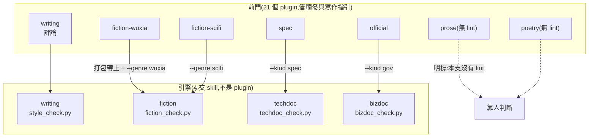
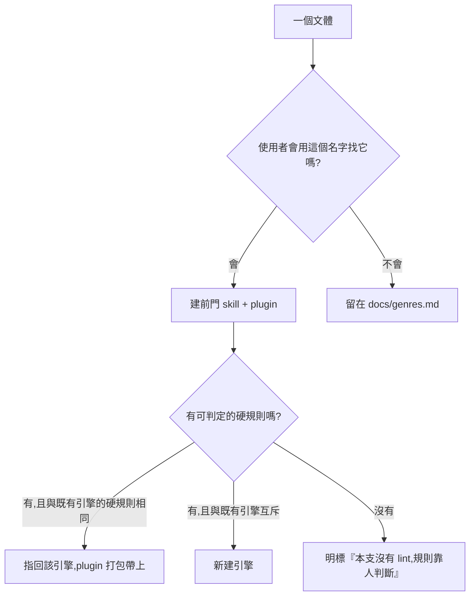

# CHG-20260810-08 — 每個文體一支 skill:前門 23 支、引擎 4 支,並改寫 KN-003

- Project: skill-chinese-write / skill: 全部(新增 19 支、既有 4 支轉為引擎兼前門)
- Branch: claude/genre-split
- Date: 2026-08-10 (UTC+0)
- Type: 結構(skill 邊界重劃)
- Proposed by: 使用者(「把所有 SKILL 更詳細的分開,每種文體都獨立一個 skill,小說除了主層以外,還要有子層的分類」)
- Implemented by: Claude(Cowork session)
- Risk: 中(marketplace 由 4 個 entry 變 21 個;既有四支的規則檔與腳本零改動)
- Autonomy: auto(DIR-001 涵蓋中風險)
- Commit/PR: https://github.com/kamira/skill-chinese-write/pull/7
- Recurrence check: 非重複,但**與既有知識牴觸**:KN-003 說「規格薄到落不成斷言的先不拆」。本張改寫 KN-003 而非違反它,理由見下。
- Diagrams: 見 `## Design diagrams`
- Skill: ai-sdlc v1.22
- Related: docs/writing/changes/CHG-20260810-04.md(KN-003 的來源);docs/genres.md

## 動機:KN-003 少算了一件事

KN-003 建檔時的判準是**硬規則互不互斥**,結論是「規格薄的先不拆,留在對照表」。那條算的是**工程成本**——重複的規則檔會分岔。

使用者指出它少算了**觸發面**:有人說「幫我寫一篇武俠」時,應該打中一支叫武俠的 skill,而不是先知道要載入 `fiction` 再加 `--genre wuxia`。skill 的第一個功能是**被找到**,而 KN-003 完全沒有討論這一層。

兩件事都對,而且不衝突——它們管的是不同的東西:

| 問題 | 判準 |
|------|------|
| 要不要獨立成一支 skill? | **觸發面**:使用者會不會用這個名字來找它 |
| 規則檔與腳本共不共用? | **硬規則互不互斥**(原 KN-003) |

所以 KN-003 改寫成兩層,不是被推翻。

## 設計:前門 + 引擎

每個文體都有自己的 SKILL.md 與 plugin(**前門**,管觸發與寫作指引);判定邏輯集中在四支**引擎** skill,前門的 plugin 把引擎一起打包(`build_suite.py` 的 `PLUGINS` 本來就吃 tuple),否則只裝 `fiction-wuxia` 的人手上不會有那支 lint。

沒有可判定規則的文體,**SKILL.md 明標「本支沒有 lint,規則靠人判斷」**——這是 KN-001 的第二條路,不是空頭規則。有結構、有寫作指引、誠實標示哪些是硬線,只是硬線目前是空集合。

## 使用者故事

1. 作為想寫武俠的人,我要說「幫我寫一篇武俠」就打中武俠 skill,以便不必先知道 `--genre` 這個參數存在。
2. 作為只裝了 `fiction-wuxia` 的人,我要那支 lint 也在手上,以便交稿前跑得動。
3. 作為想寫散文的人,我要一支散文 skill 告訴我散文怎麼寫,並**明白告訴我它沒有 lint**,以便不會以為有東西在把關。
4. 作為維護者,我要規則檔不因為拆成 23 支而複製 23 份,以便它們不會分岔。
5. 作為維護者,我要 KN-003 被改寫而不是被靜靜違反,以便下一次判斷有依據。

## Decisions & trade-offs

| 決策 | 選項 | 前提假設 | 為什麼這樣選 |
|------|------|----------|--------------|
| 沒有 lint 的文體要不要建 skill | 建 / 不建 | 使用者要求每個文體都獨立 | **建,並明標沒有 lint**。KN-001 允許「明講靠人判斷」,禁的是假裝有斷言 |
| 子層 skill 的 lint | 各自一份 / 指回主層 | 武俠與科幻的規則檔會 95% 相同 | **指回主層**,plugin 打包時把引擎帶上 |
| 既有四支要不要改名 | 改 / 不改 | `writing` 實際上就是評論 skill | **不改**。改名會動到已發布的 marketplace id,而收益只有名稱好看 |
| 引擎要不要獨立成 plugin | 要 / 不要 | 引擎沒有單獨安裝的意義 | **不要**。引擎是 skill 但不是 plugin,由前門打包帶入 |
| KN-003 怎麼處理 | 廢除 / 改寫 / 標為被覆蓋 | 它的工程成本論述仍然成立 | **改寫成兩層**:觸發面決定拆不拆,硬規則決定共不共用 |
| 企劃書收不收 | 收 / 不收 | `chinese.md` 只給「規格化與標準化」一句 | **收為前門,無 lint**,並在 SKILL.md 明說規格來源薄 |

## Design diagrams

**前門與引擎的關係**

**一個文體要怎麼被歸位**

## 完整清單(23 支 skill / 21 個 plugin)

| # | skill | 前門 / 引擎 | lint |
|---|-------|------------|------|
| 1 | `writing` | 兩者 | `style_check.py` |
| 2 | `fiction` | 兩者(小說主層:對話、分段、分章) | `fiction_check.py` |
| 3 | `fiction-flash` | 前門(微型小說) | 主層 `--genre flash` |
| 4 | `fiction-long` | 前門(中長篇) | 主層 `--genre long` |
| 5 | `fiction-wuxia` | 前門(武俠仙俠) | 主層 `--genre wuxia` |
| 6 | `fiction-scifi` | 前門(科幻) | 主層 `--genre scifi` |
| 7 | `fiction-mystery` | 前門(懸疑推理驚悚) | 主層 `--genre mystery` |
| 8 | `fiction-romance` | 前門(言情都市) | 主層 `--genre romance` |
| 9 | `techdoc` | 引擎 | `techdoc_check.py` |
| 10 | `spec` | 前門(規格書) | 引擎 `--kind spec` |
| 11 | `architecture` | 前門(架構說明) | 引擎 `--kind arch` |
| 12 | `bizdoc` | 引擎 | `bizdoc_check.py` |
| 13 | `official` | 前門(公文) | 引擎 `--kind gov` |
| 14 | `press` | 前門(新聞稿) | 引擎 `--kind press` |
| 15 | `proposal` | 前門(企劃書) | **無** |
| 16 | `prose` | 前門(散文) | **無** |
| 17 | `poetry` | 前門(詩歌) | **無** |
| 18 | `drama` | 前門(戲劇) | **無** |
| 19 | `narrative` | 前門(記敘文) | **無** |
| 20 | `lyric` | 前門(抒情文/心得) | **無** |
| 21 | `exposition` | 前門(說明文) | **無** |
| 22 | `fu` | 前門(賦/駢文) | **無** |
| 23 | `historiography` | 前門(史傳/奏啟) | **無** |

`techdoc` 與 `bizdoc` 是引擎但不是 plugin,由對應前門打包帶入。

## 修改指引

### Goal

把 23 個文體各自變成獨立可觸發的 skill,判定邏輯集中在四支引擎,並把 KN-003 改寫成兩層判準。

### Global Constraints(每個 task 都要遵守)

- **四支引擎的規則檔與腳本零改動**(`style_rules.json`、`fiction_rules.json`、`techdoc_rules.json`、`bizdoc_rules.json` 與四支 `*_check.py` 的 diff 必須為空)
- 沒有 lint 的前門,SKILL.md **必須有一節明標「本支沒有 lint」**,不得留下看起來像規則的句子(KN-001)
- 每個前門的 description 要能被**該文體的自然說法**觸發(「幫我寫武俠」「來一篇散文」)
- 子層 plugin 的 `PLUGINS` 必須把引擎 skill 一起帶上,否則裝了也跑不動
- 規則內容一律出自 `chinese.md`,原文沒寫的不自己發明

### Tasks(checkbox=續作點)

- [x] T1. 小說子層六支:`fiction-flash` / `-long` / `-wuxia` / `-scifi` / `-mystery` / `-romance`
  - interfaces: consumes chinese.md 第二部分 / produces 六份 SKILL.md,各自指回 `--genre`
  - test: 六份都有「交稿前跑主層 lint」節與正確的 `--genre` 參數
- [x] T2. 技術與商務四支前門:`spec` / `architecture` / `official` / `press`
  - interfaces: consumes chinese.md / produces 四份 SKILL.md,指回 `--kind`
  - test: 四份的 `--kind` 參數與引擎的 kinds 一致
- [x] T3. 無 lint 前門九支:`proposal` / `prose` / `poetry` / `drama` / `narrative` / `lyric` / `exposition` / `fu` / `historiography`
  - interfaces: consumes chinese.md 第一部分 / produces 九份 SKILL.md
  - test: 九份都有「本支沒有 lint」節;`grep` 檢查無任何假裝成斷言的句子
- [x] T4. plugin 與 catalog:19 個新 plugin 目錄、`PLUGINS` 對照表(含引擎打包)、marketplace entry、版本 bump
  - interfaces: consumes 19 支新 skill / produces 可安裝的 plugin
  - test: `build_suite.py --check` 與 `catalog_check.py` 皆 exit 0
- [x] T5. 改寫 KN-003 為兩層判準,更新 `docs/genres.md` 與 README
  - interfaces: consumes 本張的決策 / produces 下一次判斷的依據
  - test: KN-003 的規則節有「觸發面」與「共用面」兩層;genres.md 的未實作表清空
- [x] T6. 一致性斷言:新增 `scripts/skill_inventory_check.py`,確認每支 skill 的 SKILL.md、plugin.json、marketplace entry 三處齊備且版本一致,且無 lint 的前門確實有明標節
  - interfaces: consumes 全部 skill / produces exit 0|1
  - test: 故意拿掉一支的明標節時必須轉紅
- [x] T7. 接進 `ci_local.sh` 與 `governance.yml`
  - interfaces: consumes T6 / produces 兩個載體都驗
  - test: `bash .github/ci_local.sh` exit 0

### Interaction spec

- kind: cli
- cmd: python scripts/skill_inventory_check.py --repo .
- artifacts: 終端輸出(exit code 即判定)

### Acceptance operation(實際操作驗收)

- **operate**:跑 `skill_inventory_check.py`;跑四支引擎的既有夾具確認零回歸;`build_suite.py --check`、`catalog_check.py --check`、`chg_diagram_gate.py`、`bash .github/ci_local.sh`;隨機抽三支無 lint 前門確認有明標節。
- **observe**:各自的退出碼與輸出。
- **pass**:清點腳本 exit 0 且列出 23 支;四支引擎的 diff 為空;治理腳本全 exit 0。

### Structure document updates

`docs/genres.md` 的「尚未實作」表清空(全部有前門了),改記各支的 lint 狀態;README 的結構表改為家族分組。

## Risk & rollback

- 風險一:marketplace 由 4 個 entry 變 21 個,清單變長難找 → 緩解:description 寫成該文體的自然說法,並在 README 分家族列表
- 風險二:無 lint 的九支被誤以為有把關 → 緩解:SKILL.md 明標 + T6 的斷言強制檢查那一節存在
- 風險三:子層 plugin 忘記打包引擎,裝了跑不動 → 緩解:T6 的清點腳本檢查 `PLUGINS` 的 tuple
- 回滾:刪 19 個新 skill 與 plugin,還原 marketplace、`PLUGINS`、KN-003

## 狀態

已驗收(見 ../acceptance/ACC-20260810-06.md)。7 個 task 全數完成。
