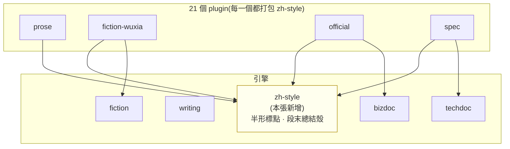
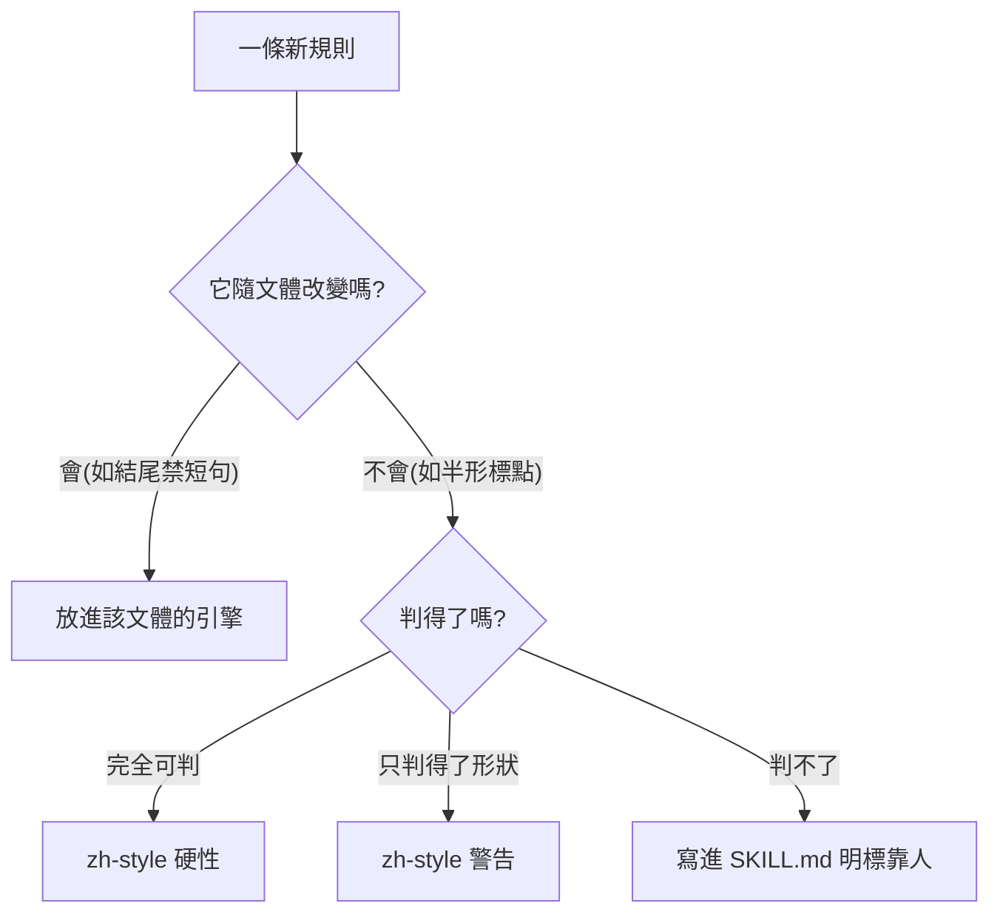

# CHG-20260810-09 — 第五支引擎 zh-style:不屬於任何文體的兩條規則

- Project: skill-chinese-write / skill: zh-style(新增引擎)+ 全部 21 個 plugin 打包
- Branch: claude/zh-style
- Date: 2026-08-10 (UTC+0)
- Type: 新功能(跨文體引擎)
- Proposed by: 使用者(「不得出現半形符號」;「正常人不會故意寫一段短語來總結全部內容」;結尾格式的具體改法)
- Implemented by: Claude(Cowork session)
- Risk: 中(新增硬性違規會擋所有既有夾具;12 份夾具需同步修正)
- Autonomy: auto(DIR-001 涵蓋中風險)
- Commit/PR: https://github.com/kamira/skill-chinese-write/pull/8
- Recurrence check: **重複** KN-003 觀察區記的「跨 skill 共用需求」第二次出現 → 本張建立共用層並更新 KN-003
- Diagrams: 見 `## Design diagrams`
- Skill: ai-sdlc v1.22
- Related: docs/writing/changes/CHG-20260810-08.md(23 支拆分,KN-003 觀察區的來源)

## 動機

使用者審稿時指出兩件事,而它們有一個共同點:**都不屬於任何單一文體**。

1. **半形標點**。「不得出現半形符號」——這在散文、公文、規格書裡一樣是錯,它是正字法不是文體風格。而 repo 自己的 **12 份夾具全部違反**,被當成「好樣本」在 CI 裡跑了一輪又一輪。
2. **總結式結尾**。「正常人不會故意寫一段短語來總結全部內容」——這在小說、散文、記敘文裡一樣是替讀者下結論。

`writing` 已經有一條「結尾不准用一句短話作總結」,但它的斷言只抓**長度**(低於 12 字)。使用者抓到的四個結尾都超過 12 字,**全部安全通過**——規則寫的是「總結」,斷言抓的是「短」。這是 KN-001 第三種變體(斷言比規則窄)的又一次。

KN-003 的觀察區寫著「第二次真正需要跨 skill 共用時再處理」。這是第二次。

## 為什麼是新引擎而不是塞進四支既有的

依 KN-003 的兩層判準:

| 問題 | 答案 |
|------|------|
| 要不要獨立成一支 skill? | **不要**。沒有人會說「幫我寫一篇正字法」——它沒有觸發面,所以是引擎不是前門 |
| 規則檔共不共用? | **必須共用**。半形標點在四支引擎裡的判定完全相同;複製四份必然分岔 |

所以是**第五支引擎、零個新 plugin**,由現有 21 個 plugin 全部打包帶入。

## 使用者故事

1. 作為任何文體的寫作者,我要半形標點被擋下來,以便不必自己一個一個檢查。
2. 作為使用者,我要 repo 自己的夾具先符合這條規則,以便「好樣本」名副其實。
3. 作為寫散文或小說的人,我要結尾出現總結殼時被提醒,以便不會替讀者把話講完。
4. 作為維護者,我要這條共用規則只有一份,以便四支引擎不會各自演化出不同的標點判定。

## Decisions & trade-offs

| 決策 | 選項 | 前提假設 | 為什麼這樣選 |
|------|------|----------|--------------|
| 半形標點列硬性還是警告 | 硬性 / 警告 | 使用者原話「不得出現」語氣為絕對 | **硬性**。完全可判定,零語意成分 |
| 總結殼列硬性還是警告 | 硬性 / 警告 | 判不了「是否總結全文」,只判得了殼的形狀 | **警告**。抓的是形狀不是語意,誤報必然存在 |
| 判定範圍 | 全篇 / 只管結尾 | 使用者的例子全在結尾;開頭要冷、結尾要重 | **只管最後一段**。**此項為代決定**——使用者未答「管整篇還是只管結尾」 |
| 反轉句要不要排除 | 排除 / 不排除 | 揭曉靠光禿落地,加連接詞會變成解釋 | **不另外排除,但列警告**——警告可以無視,硬性不行。**此項為代決定** |
| 程式碼區塊與英文 | 一併轉 / 排除 | 半形在英文與程式碼裡是正確的 | **排除**。只在中文字元相鄰時判定 |
| 12 份夾具怎麼修 | 手改 / 腳本轉 | 306 處以上,手改必漏 | **腳本轉,然後重跑全部 lint 確認紅綠不變** |

## Design diagrams

**第五支引擎的位置**

`zh-style` 是唯一被**所有** plugin 打包的引擎——因為它管的不是文體,是中文本身。

**一條規則該放哪一層**

## 修改指引

### Goal

建立第五支引擎 `zh-style`,收兩條不隨文體改變的規則;修正 12 份夾具的半形標點;由 21 個 plugin 全部打包。

### Global Constraints(每個 task 都要遵守)

- ~~四支既有引擎的規則檔與腳本零改動~~ → **施工中推翻**:修正夾具之後發現規則檔本身壞了(`[::]` 是兩個半形冒號,一直拒絕標點正確的公文)。計畫與現實衝突時改計畫,19 條樣式補上兩種寬度,並以「14 個退出碼逐一不變」為驗證
- 夾具轉全形之後,**每一份的紅綠判定必須與轉換前完全相同**——`sample-bad.md` 仍要被擋,`sample-good.md` 仍要過
- 半形只在**中文字元相鄰**時判違規;程式碼區塊、英文、數字、markdown 語法一律排除(KN-002 分流)
- 總結殼判定只看**最後一段**,且只列警告
- 每條斷言都要有夾具會踩到,且紅燈可達要被證明

### Tasks(checkbox=續作點)

- [x] T1. `skills/zh-style/assets/zh_style_rules.json` + `scripts/zh_style_check.py`
  - interfaces: consumes 中文文本 / produces exit 0|1|2
  - test: 好樣本 exit 0、壞樣本 exit 1
- [x] T2. 雙向夾具 `sample-good.md` / `sample-bad.md`,每條斷言都有東西踩到
  - interfaces: consumes zh_style_check.py / produces 紅綠兩端
  - test: bad 同時命中半形與總結殼兩類
- [x] T3. `skills/zh-style/SKILL.md`:說明它是引擎、兩條規則、以及判不了的部分
  - interfaces: consumes 使用者的兩則指令 / produces 人類可讀規範
  - test: 有「這是引擎」與「判不了什麼」兩節
- [x] T4. 轉正 12 份既有夾具的半形標點,並確認四支引擎的紅綠判定完全不變
  - interfaces: consumes 既有夾具 / produces 全形版本
  - test: 轉換前後,12 份夾具在各自 lint 下的 exit code 逐一相同
- [x] T5. `PLUGINS` 全部 21 個 plugin 加掛 `zh-style`,並更新 `docs/genres.md` 與 README
  - interfaces: consumes zh-style / produces 打包關係
  - test: `skill_inventory_check.py` 與 `build_suite.py --check` 皆 exit 0
- [x] T6. 更新 KN-003(觀察區轉為規則:規則不隨文體改變就放共用引擎)與 KN-001(第七次)
  - interfaces: consumes 本張 / produces 知識庫更新
  - test: KN-003 有「一條規則該放哪一層」的判準
- [x] T7. 接進 `ci_local.sh` 與 `governance.yml`:zh-style 夾具雙向 + 12 份既有夾具的半形零容忍
  - interfaces: consumes T1~T4 / produces 兩個載體都驗
  - test: `bash .github/ci_local.sh` exit 0;故意把一個半形塞回夾具時必須轉紅

### Interaction spec

- kind: cli
- cmd: python skills/zh-style/scripts/zh_style_check.py skills/zh-style/assets/sample-good.md
- artifacts: 終端輸出(exit code 即判定)

### Acceptance operation(實際操作驗收)

- **operate**:對 zh-style 的兩份夾具各跑一次;對 12 份既有夾具跑 zh-style;轉換前後逐一比對四支引擎對那 12 份的 exit code;跑 `skill_inventory_check.py`、`build_suite.py --check`、`catalog_check.py`、`bash .github/ci_local.sh`;把一個半形逗號塞回某份夾具證明會轉紅。
- **observe**:各自的退出碼與報表。
- **pass**:zh-style good exit 0 / bad exit 1;12 份夾具在 zh-style 下全 exit 0;**四支引擎對那 12 份的判定與轉換前逐一相同**;治理腳本全 exit 0;紅燈探針開火。

### Structure document updates

`docs/genres.md` 新增「不屬於任何文體的引擎」一節;README 的引擎數由 4 改為 5。

## Risk & rollback

- 風險一:轉全形可能改變既有 lint 的 regex 命中(規則檔裡有 `[^,。;、!?\n]` 這類含半形的字元類) → 緩解:T4 的測試就是逐一比對轉換前後的 exit code,不只看有沒有跑過
- 風險二:總結殼的形狀判定會誤報(反轉句、對話標記) → 緩解:只列警告、只看最後一段、對話標記排除
- 風險三:21 個 plugin 全部加掛,複本數量再增 → 緩解:`build_suite` 本來就是冪等產生;`skill_inventory_check` 會驗打包關係
- 回滾:刪 `skills/zh-style/`,還原 `PLUGINS` 與 12 份夾具的標點

## 狀態

已驗收(見 ../acceptance/ACC-20260810-07.md)。7 個 task 全數完成。
