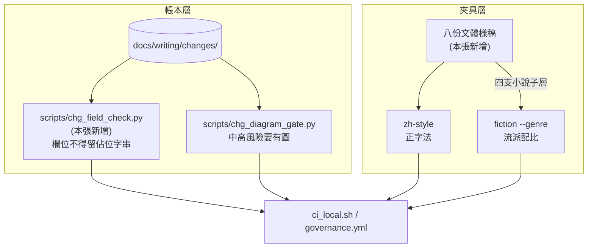
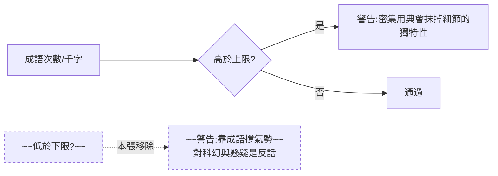

# CHG-20260810-10 — 八篇樣稿收成夾具、拆掉自己發明的成語下限、補上佔位字串的斷言

- Project: skill-chinese-write
- Branch: claude/samples-as-fixtures
- Date: 2026-08-10 (UTC+0)
- Type: 補強(夾具 + 兩道斷言)
- Proposed by: 使用者(「auto do it」——收掉我自己列出的三件待辦)
- Implemented by: Claude(Cowork session)
- Risk: 中(改動 `fiction` 的判定行為;新增會擋 CI 的斷言)
- Autonomy: auto(DIR-001 涵蓋中風險)
- Commit/PR: https://github.com/kamira/skill-chinese-write/pull/10
- Recurrence check: **重複** KN-001 第八次(模板欄位有斷言驗存在、無斷言驗內容)→ 更新 KN-001 證據
- Diagrams: 見 `## Design diagrams`
- Skill: ai-sdlc v1.22
- Related: docs/writing/changes/CHG-20260810-09.md(zh-style);ACC-20260810-07 列出的未收尾項

## 動機

上一輪收尾時我自己列了三件沒做完的事,使用者說「auto do it」。三件裡有兩件可做,第三件(兩處代決定)是等覆核,沒有工可施。

做的過程中冒出第三件必須一起處理的:

**把樣稿收成夾具,CI 就會對每一篇跑成語密度,而下限那條會對科幻與懸疑印出「這個流派靠成語撐氣勢與速度感」——那是武俠的說法,對這兩個流派完全相反。**加夾具卻同時加入必然誤報的警告,違反 KN-002。

## 三件事

### 一、成語下限是我自己發明的

`chinese.md` 從頭到尾只說各流派的成語「用得多」或「用得少」,**沒有任何一個流派說過「至少要幾個」**。我把描述性的百分比讀成了雙向區間。

更糟的是警告理由六個流派共用一句話,所以低於下限時一律印武俠的說法。而原文對科幻的理由是「過多古典成語會破壞未來感」、對懸疑是「文字要保持高透明度」——**這兩個流派寫到 0 個成語是做對了**。

下限一律改為 0,下限警告整條移除。上限不動(武俠 bad 夾具的 17/千字 > 14 仍然會報)。

### 二、`doc_integrity` 查欄位存在,不查欄位有內容

兩張 CHG 的 `Commit/PR:` 停在「<close-out 回填>」一路綠燈進了 main,是用眼睛抓到的。

新增 `scripts/chg_field_check.py`:標頭欄位的值若整個被 `<...>` 包住即違規。

**為什麼不改 `doc_integrity_check.py`**:它在 `tools/` 底下,是隨身副本,就地改會讓漂移檢查轉紅(AGENTS.md 第 4 條)。要改得送回上游再同步下來,所以本 repo 自己的斷言放 `scripts/`。

### 三、八篇樣稿收成夾具

四支小說子層(scifi / mystery / romance / flash)各得一份,CI 以自己的流派跑;四支沒有 lint 的(prose / poetry / narrative / fu)也各得一份——**它們至少有 `zh-style` 的正字法在管**。

樣稿原本在暫存區,已被清掉;內容從對話紀錄的最終版重寫,並以 lint 實跑驗證。

## 使用者故事

1. 作為寫科幻的人,我不要因為沒用成語就被警告——原文說的是少用,不是至少要幾個。
2. 作為維護者,我要 CHG 的欄位沒填完時 CI 轉紅,以便不靠眼睛抓。
3. 作為寫散文的人,我要那支 skill 至少有一份示範稿,以便知道「沒有 lint」不等於「沒有標準」。
4. 作為維護者,我要四支小說子層的流派配比有夾具在驗,以便 `--genre` 不只是旗標。

## Decisions & trade-offs

| 決策 | 選項 | 前提假設 | 為什麼這樣選 |
|------|------|----------|--------------|
| 成語下限 | 保留 / 移除 | 原文沒有任何流派說過下限 | **移除**。原文沒寫的不自己發明,而且它對半數流派說反話 |
| 佔位字串斷言放哪 | 改 tools/ / 新寫 scripts/ | tools 是隨身副本,不得就地改 | **新寫 `scripts/chg_field_check.py`** |
| 判定「未填」的方式 | 比對特定字串 / 值被 `<>` 包住 | 模板的佔位字串不只一種寫法 | **形狀判定**:值整個被角括號包住。涵蓋 `<close-out 回填>`、`<hash / PR link>` 等所有變體 |
| 沒有 lint 的四支要不要給夾具 | 要 / 不要 | 它們只有 zh-style 管得到 | **要**。示範稿本身就是規範的一部分,而且正字法有東西在驗 |
| 樣稿內容 | 重寫 / 放棄 | 暫存區已清空,使用者手上有 | **從對話紀錄的最終版重寫**,並以 lint 實跑驗證 |

## Design diagrams

**新增的兩道斷言在哪一層**

**成語判定的改動**

## 修改指引

### Goal

收掉上一輪列出的兩件待辦,並移除施工中發現的自訂下限。

### Global Constraints(每個 task 都要遵守)

- 上限判定不得改變——武俠 bad 夾具的 17/千字 仍要報
- 新增斷言一律內建 `--self-test` 證明紅燈可達
- 不得就地改 `tools/` 底下的隨身副本
- 八份夾具要能通過各自的 lint,且**未指定 genre 時不得誤報**

### Tasks(checkbox=續作點)

- [x] T1. 移除成語下限:六個流派的 `per_1000` 下限改 0,下限警告整條移除
  - interfaces: consumes fiction_rules.json / produces 只有上限的判定
  - test: 四支子層夾具零提醒;武俠 bad 夾具的上限警告仍在
- [x] T2. `scripts/chg_field_check.py`:標頭欄位不得留佔位字串,含 `--self-test`
  - interfaces: consumes CHG 標頭 / produces exit 0|1|2
  - test: self-test 綠紅皆可達;對真實帳本 16 份 exit 0
- [x] T3. 八篇樣稿寫進對應 skill 的 `assets/sample-good.md`
  - interfaces: consumes 對話紀錄的最終版 / produces 八份夾具
  - test: 八份全過 zh-style;四支子層各以自己的流派 exit 0
- [x] T4. 接進 `ci_local.sh` 與 `governance.yml`,重新編號為 13 步
  - interfaces: consumes T1~T3 / produces 兩個載體都驗
  - test: `bash .github/ci_local.sh` exit 0

### Interaction spec

- kind: cli
- cmd: python scripts/chg_field_check.py --repo .
- artifacts: 終端輸出(exit code 即判定)

### Acceptance operation(實際操作驗收)

- **operate**:跑 `chg_field_check.py --self-test` 與對真實帳本;對八份新夾具跑 zh-style;四支子層各以自己的流派跑;武俠 bad 夾具確認上限警告仍在;跑 `build_suite --check`、`catalog_check`、`skill_inventory_check`、`bash .github/ci_local.sh`。
- **observe**:各自的退出碼與提醒數。
- **pass**:八份夾具全過;四支子層**零提醒**;武俠上限警告仍在;治理腳本全 exit 0。

### Structure document updates

無新增路徑類型(夾具進既有的 `assets/`,腳本進既有的 `scripts/`)。

## Risk & rollback

- 風險一:移除下限會讓「成語太少」的稿子不再被提醒 → 接受。原文沒有這條要求,而誤報的代價高於漏報
- 風險二:佔位字串的形狀判定可能誤傷正常的角括號值(如 `<https://...>`) → 緩解:只判**整個值**被包住,含空白或其他字元就不算
- 風險三:樣稿是重寫的,可能與使用者手上那份有字句差異 → 緩解:以 lint 實跑驗證,並在此明說來源
- 回滾:還原 `fiction_rules.json` 的 `per_1000` 與 `fiction_check.py` 的下限分支;刪八份夾具與 `chg_field_check.py`

## 狀態

已驗收(見 ../acceptance/ACC-20260810-08.md)。4 個 task 全數完成。
