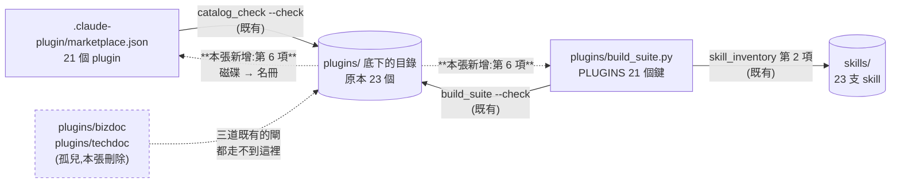
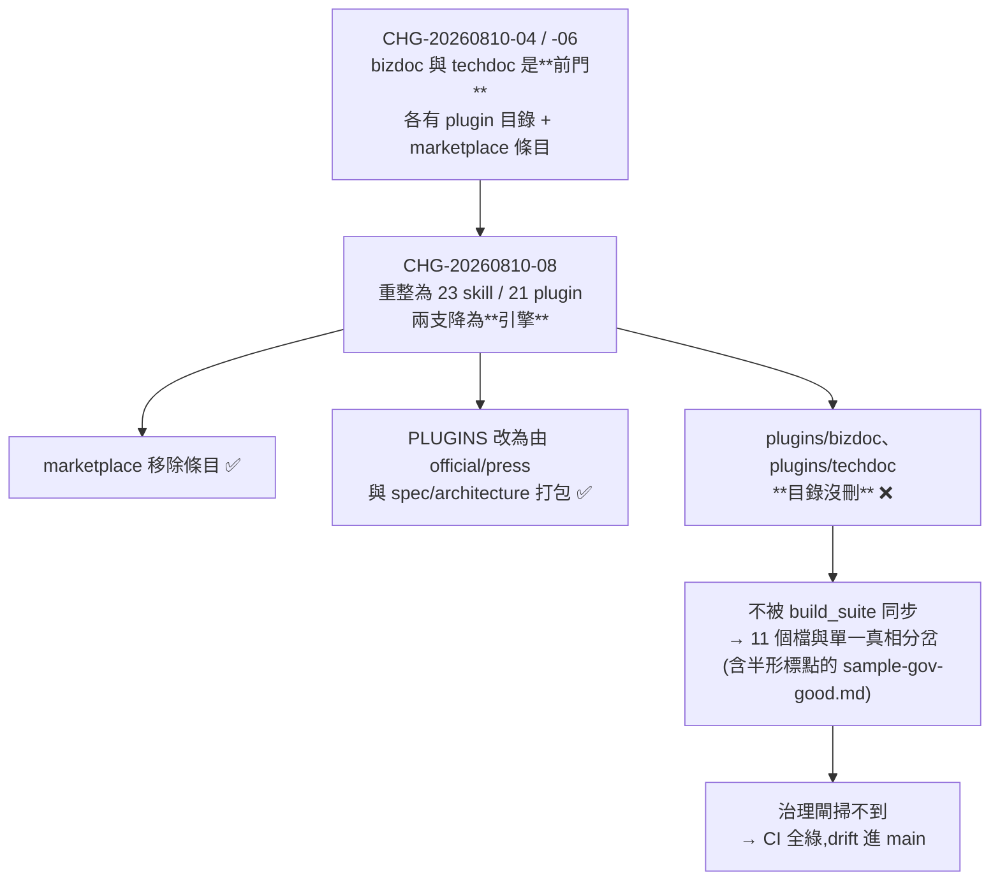

# CHG-20260814-02 — 刪掉 plugins/bizdoc 與 plugins/techdoc 兩個孤兒目錄,並補上「磁碟 → 名冊」的反向斷言

- Project: skill-chinese-write
- Branch: claude/zen-jepsen-2e1290
- Date: 2026-08-14 (UTC+0)
- Type: 清理(刪除建置殘留)+ 補強(一道新斷言)
- Proposed by: 使用者(指出 `plugins/bizdoc/` 與 `plugins/techdoc/` 是被 git 追蹤的孤兒目錄,要求依治理流程刪除或說明保留理由)
- Implemented by: Claude(Cowork session,Opus 5)
- Risk: 中(刪除已被 git 追蹤的檔案;新增會擋 CI 的斷言;marketplace 版本 bump)
- Autonomy: auto(DIR-001 涵蓋中風險)
- Commit/PR: 分支 claude/zen-jepsen-2e1290(hash 於收尾 commit 回填;PR 未開)
- Recurrence check: **重複** KN-001 第九次(斷言的方向只有單向:名冊 → 磁碟,沒有磁碟 → 名冊)→ 更新 KN-001 證據
- Diagrams: 見 `## Design diagrams`
- Skill: ai-sdlc v1.22
- Related: CHG-20260810-04(建 techdoc)、CHG-20260810-06(建 bizdoc)、CHG-20260810-08(23 支前門 / 21 個 plugin 的重整)、CHG-20260810-09(zh-style 進 CI)

## 動機

`plugins/bizdoc/` 與 `plugins/techdoc/` 兩個目錄(共 23 個檔)被 git 追蹤,但**不在任何一份名冊裡**:

- 不在 `.claude-plugin/marketplace.json` —— 那裡 21 個 plugin,沒有這兩個
- 不在 `plugins/build_suite.py` 的 `PLUGINS` 對照表 —— bizdoc 由 `official` / `press` 打包,techdoc 由 `spec` / `architecture` 打包

兩件事合起來的後果是:`build_suite.py` 不會同步它們,而所有治理閘也掃不到它們——

- `ci_local.sh` 第 7 步的 zh-style 全 repo 掃描,glob 是 `skills/*/assets/...`,不含 `plugins/`
- 第 11 步的 `py_compile` 明文排除 `*/plugins/*/skills/*`
- 第 13 步的 `catalog_check` 只從 marketplace 名冊往磁碟查,不在名冊裡的目錄它看不見

於是它們停在 2026-08-10 建檔當天的狀態,再也沒動過(`git log` 證實:bizdoc 最後一次是 0383778,techdoc 是 67a7486)。與頂層 `skills/` 的單一真相對比,**兩邊 11 個檔全部已分岔**,其中 `plugins/bizdoc/skills/bizdoc/assets/sample-gov-good.md` 用的是半形標點——正是 zh-style 判為硬性違規的那一類。

這個 drift 在 `origin/main` 上就存在,不是任何進行中分支引進的。

## 為什麼是刪除,不是納管

三條理由,都來自 repo 自己已經寫下的判準:

1. **`bizdoc` 與 `techdoc` 是引擎,不是前門。**兩份 SKILL.md 自己就這樣寫:「本支是**引擎**:一般使用請裝 `official`(公文)或 `press`(新聞稿),它們會把本支帶進來。」KN-003 的四種組合裡,引擎走的是組合 2 的被帶入端——由前門 plugin 打包,不自己出一個 plugin。
2. **第三支引擎 `zh-style` 就沒有 plugin 目錄。**它被 21 個 plugin 全數打包,而 `plugins/zh-style/` 不存在。同樣是引擎,兩邊處理方式不一致——不一致的那半是 bizdoc / techdoc。
3. **KN-003 的觸發面判準直接否掉納管。**「要不要獨立成一支 skill」的判準是使用者會不會用這個名字來找它。沒有人會說「幫我寫一篇 bizdoc」——會說的是「幫我寫一份公文」,那打中的是 `official`。把引擎放上架,等於在 21 支前門旁邊擺兩個沒有人會搜的名字。

這兩個目錄是 CHG-20260810-04 / -06 的遺留物:當時 bizdoc 與 techdoc **確實是前門**。CHG-20260810-08 把 23 支 skill 重整成 21 個 plugin、把這兩支降為引擎時,`PLUGINS` 與 marketplace 都改對了,**只有磁碟上的目錄沒有跟著刪**。

## 光刪不夠——這是 KN-001 的第九次

刪掉之後,同樣的東西還是可以再長回來,因為**沒有任何一道閘在查「`plugins/` 底下有什麼」**。現有的斷言全部是單向的:

| 現有斷言 | 方向 | 抓得到孤兒嗎 |
|----------|------|--------------|
| `catalog_check --check` | marketplace 名冊 → 磁碟(查 plugin.json 在不在) | 抓不到。孤兒不在名冊裡,不會被走訪 |
| `skill_inventory_check` 第 2 項 | `PLUGINS` → `skills/`(查打包的 skill 存不存在) | 抓不到。查的是 `skills/`,不是 `plugins/` |
| `build_suite --check` | `PLUGINS` → plugin 內複本 | 抓不到。不在 `PLUGINS` 裡的 plugin 不會被走訪 |

三道閘、三個方向,沒有一個是**磁碟 → 名冊**。這與 CHG-20260810-07 是同一型:規則管的範圍比斷言查的範圍寬。所以本張同時補上 `skill_inventory_check.py` 的第 6 項——`plugins/` 的目錄集合、`PLUGINS` 的鍵集合、marketplace 的 plugin 名單,三者必須完全相等。

## 使用者故事

1. 作為維護者,我要 `plugins/` 底下不存在任何沒被名冊登記的目錄,以便「被 git 追蹤」等於「被治理閘掃得到」。
2. 作為維護者,我要下次再有孤兒目錄長出來時 CI 直接轉紅,以便不靠人用眼睛比對兩份名冊。
3. 作為使用者,我不要在 plugin 目錄裡看到兩份與單一真相分岔、且標點違規的舊夾具。

## Decisions & trade-offs

| 決策 | 選項 | 前提假設 | 為什麼這樣選 |
|------|------|----------|--------------|
| 兩個孤兒目錄 | 刪除 / 納入 marketplace + PLUGINS | 兩支的 SKILL.md 自稱引擎;第三支引擎 zh-style 沒有 plugin 目錄 | **刪除**。納管會讓引擎變成沒有人會搜的前門,違反 KN-003 的觸發面判準 |
| 新斷言放哪 | `skill_inventory_check.py` / `catalog_check.py` / 新寫一支 | 前者已經在讀 `PLUGINS`,職責是「齊備與可達」 | **`skill_inventory_check.py` 加第 6 項**。catalog_check 的職責是版本三處同步,不混進來 |
| 判定的嚴格度 | 三者相等 / 只查 `plugins/` ⊆ 名冊 | 單向包含關係擋得住孤兒,但擋不住「名冊有、磁碟沒有」 | **三者完全相等**。這次的洞就是單向造成的,不再犯第二次 |
| `plugins/` 底下的 `.py` 工具檔 | 一併判定 / 排除 | `build_suite.py`、`catalog_check.py` 是檔案不是目錄 | **只走訪目錄**,檔案不參與判定 |
| marketplace 版本 | 不動 / bump | `catalog_check --since` 規定動到 `plugins/` 就要 bump | **bump 2.2.0 → 2.2.1**。刪檔也是實質變動 |

## Design diagrams

**三份名冊與磁碟的關係,以及本張補上的那一條**

**孤兒是怎麼產生的**

## 修改指引

### Goal

刪掉兩個孤兒目錄,並讓「孤兒目錄」這件事從此在 CI 轉紅。

### Global Constraints(每個 task 都要遵守)

- 不得動到頂層 `skills/bizdoc/` 與 `skills/techdoc/` —— 那是單一真相,由 `official` / `press` / `spec` / `architecture` 四個 plugin 正常打包
- 不得動到 `plugins/official/skills/bizdoc/` 等**正當**的建置產物
- 新增斷言必須內建 `--self-test` 證明紅燈可達(KN-001)
- 不得就地改 `tools/` 底下的隨身副本
- `ci_local.sh` 13 步全數維持 exit 0

### Tasks(checkbox=續作點)

- [x] T1. 刪除 `plugins/bizdoc/` 與 `plugins/techdoc/`(共 23 個檔)
  - interfaces: consumes 兩個目錄 / produces `plugins/` 底下剩 21 個目錄 + 2 個 .py 工具
  - test: `git status` 顯示 23 個 deleted;`build_suite.py --check` 仍 exit 0(它本來就不走訪這兩個);`bizdoc_check.py` / `techdoc_check.py` 的六份夾具仍全數通過
- [x] T2. `skill_inventory_check.py` 新增第 6 項:`plugins/` 目錄集合 == `PLUGINS` 鍵集合 == marketplace plugin 名單
  - interfaces: consumes `plugins/` 目錄清單 + `PLUGINS` + `marketplace.json` / produces 三向差集的問題列表
  - test: `--self-test` 綠紅皆可達(合成集合:相等要過,多一個孤兒、少一個目錄、名冊分岔三種都要被抓);對真實 repo 刪除前 exit 1、刪除後 exit 0
- [x] T3. marketplace `metadata.version` 2.2.0 → 2.2.1
  - interfaces: consumes 刪檔這個實質變動 / produces bump 後的 catalog
  - test: `catalog_check --repo . --check` exit 0;`catalog_check --repo . --since origin/main` exit 0
- [x] T4. `bash .github/ci_local.sh` 全綠
  - interfaces: consumes T1~T3 / produces 13 步 exit 0
  - test: exit 0

### Interaction spec

- kind: cli
- cmd: python scripts/skill_inventory_check.py --repo .
- artifacts: 終端輸出(exit code 即判定)

### Acceptance operation(實際操作驗收)

- **operate**:先在**刪除前**跑新版 `skill_inventory_check.py --repo .`,確認它抓得到這兩個孤兒(紅燈對真實輸入可達,不只對合成樣本);再刪除、再跑一次;跑 `--self-test`;跑 `build_suite.py --check`、`catalog_check --check` 與 `--since origin/main`;六份 bizdoc / techdoc 夾具各以自己的 kind 跑;最後 `bash .github/ci_local.sh`。
- **observe**:各自的退出碼與問題列表內容。
- **pass**:刪除前 exit 1 且訊息點名 bizdoc 與 techdoc;刪除後 exit 0;self-test 綠紅皆可達;六份夾具判定不變;ci_local 13 步 exit 0。

### Structure document updates

無新增路徑類型(刪除既有目錄;斷言加在既有的 `scripts/skill_inventory_check.py`)。

## Risk & rollback

- 風險一:若有人曾以 `--source ./plugins/bizdoc` 這種路徑直裝方式安裝過孤兒 plugin,刪除會讓該路徑失效 → 接受。這兩個目錄從不在 marketplace 名冊裡,不是公開的安裝入口;真要用引擎,`official` / `press` / `spec` / `architecture` 四支都把它完整帶入
- 風險二:新斷言可能誤殺 `plugins/` 底下未來新增的非 plugin 目錄(例如共用素材夾) → 緩解:訊息明說「要嘛登記進 PLUGINS 與 marketplace,要嘛不要放在 `plugins/` 底下」;真有這種需求時再開 CHG 加白名單,不預先開後門
- 風險三:三向相等的判定與 `catalog_check` 的職責可能被誤認為重複 → 緩解:兩者方向相反,已在本張的表格裡寫明;`skill_inventory_check.py` 的 docstring 同步註明
- 回滾:`git revert` 本張的 commit——刪掉的 23 個檔在 git 歷史裡完整可還原

## 狀態

已驗收(見 ../acceptance/ACC-20260814-02.md)。4 個 task 全數完成。
