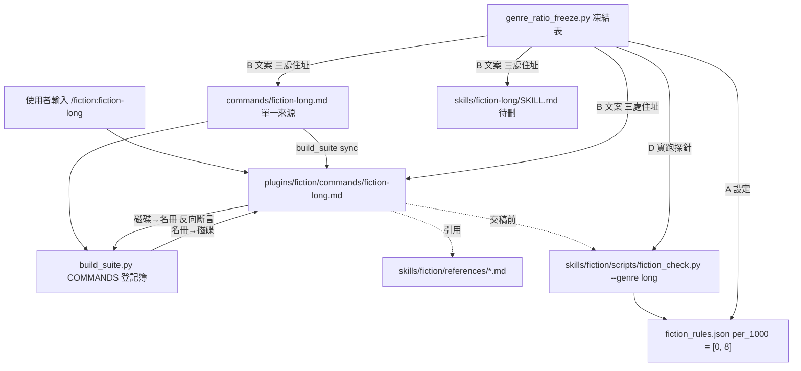
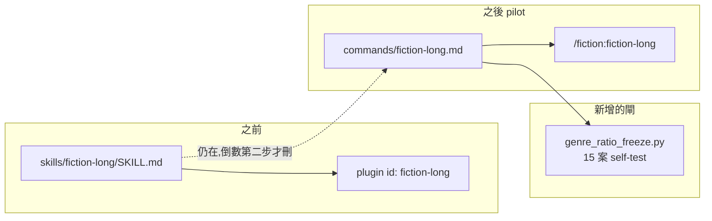

# CHG-20260814-05 — 第一批真實搬遷:fiction-long 成 command,並補上配比凍結閘

- Project: skill-chinese-write
- Branch: claude/fiction-command-pilot
- Date: 2026-08-14 (UTC+0)
- Type: 重構(搬遷)+ 新增治理閘
- Proposed by: 使用者(「skill 只分大類,細項寫作技巧與目標則在 skill 底下的指令中」)
- Implemented by: Claude Opus 5(Cowork session)
- Collaborators:
  - **Claude Fable 5(審議席)**——本張的六條裁決全部出自它;**推翻了審議席
    自己先前「freeform 收九個文類」的裁決**(那個「九」沒有附產生它的量測指令);
    並用合成 probe **兩個方向打穿了我寫的誠實欄**(F1),連帶抓到我又漏報一次數字
  - **OpenAI Codex(審議席)**——三次連線逾時,本張的裁決**單席成立**(見「## 未達標處」)
- Risk: 高(第一次動 skill 內容;後續批次會刪除已發布 plugin id)
- Autonomy: 部分——pilot 走 DIR-001;批量與刪除 id 見「## 停點」
- Commit/PR: 分支 claude/fiction-command-pilot(close-out 回填)
- Recurrence check: **重複** KN-004,本張內犯了**兩次**(第 3、第 4 次):
  一次把引擎訊息的字面猜成「超過」(實為「高於」),一次把「誠實欄驗到 N 個
  command 檔」報成同步前的舊數字。因此 KN-004 的適用範圍從「數字」擴到
  「**任何寫進斷言的字面值**」。
  另**重複** KN-001(斷言比規則窄):`[C]` 誠實欄整份文件當一個單元,
  等於「規則寫逐項、斷言查整體」——見「## 審議席打穿的」
- Diagrams: 見 `## Design diagrams`
- Skill: ai-sdlc v1.35
- Related: CHG-20260814-03(建 commands/ 機制)、CHG-20260810-10(拆掉成語下限)、
  CHG-20260814-04(KN-004 擴寫)

## 動機

`CHG-20260814-03` 只建了機制:`COMMANDS` 登記簿維持空白,零真實 command 進 repo。
本張是**第一次真的搬東西**——把 `skills/fiction-long/` 這支子層 skill 搬成
`/fiction:fiction-long` 這個 command。

審議席裁定先做**單支 pilot**,全綠再批量其餘五支。理由是搬遷的失敗模式一次只搬
一支時看得見,六支一起搬會互相蓋掉。

## 順帶回填

`CHG-20260814-04` 的 `Commit/PR` 欄原寫「PR 待開;close-out 回填 squash commit」,
本張一併填為:**`6fea545`(PR #14,governance pass 16s)**。
不為一行回填單開一個 PR。

## 搬遷過程中量到的三件事

### 一、成語密度的下限,文案說 lint 在管,實際上引擎裡沒有那段程式

六支子層的文案都寫「成語密度 X-Y 次/千字 | **lint 會數**」。而規則檔是:

```
long [0,8]  flash [0,3]  mystery [0,5]  wuxia [0,14]  scifi [0,3]  romance [0,10]
```

**只有上限。** 更關鍵的是引擎原始碼:

```python
lo, hi = band          # ← lo 解出來就丟掉,底下只用 hi
if d > hi:
    res["warnings"].append(...)
```

下限不是被設成 0,是**根本沒有那段程式**——`CHG-20260810-10` 把它拆掉了
(理由:下限是自己發明的,原始規格沒有,而且對科幻與懸疑是反的,它們寫到
0 個成語是做對了)。但文案沒跟著改。

這與審議席早先點名的「修辭比例 % 沒有機器真相」同型:**宣稱引擎在管、實際沒有**。
比沒有規則更危險,因為讀的人會以為有東西在替他把關。

### 二、同一個「配比」欄位,三個數字的機器真相程度完全不同

| 欄 | 狀態 | 憑什麼這樣說 |
|---|---|---|
| 修辭比例 % | **無機器真相** | 沒有程式量得出一段文字有幾成是譬喻 |
| 成語密度**上限** | **引擎硬管** | 合成超標稿實跑,引擎確實報違規 |
| 成語密度**下限** | **引擎不管** | 合成零成語稿實跑,引擎不吭聲 |

審議席指定凍結表要凍「**狀態**」欄本身,不只凍數字——因為它防的不是數字漂移,
是**執法狀態漂移**:「原本引擎管的變成沒人管」。那種漂移下每個數字都還在原位,
純字面比對一律綠燈,而規範已經名存實亡。

### 三、`skill_inventory_check` 的報表把「隨附 skill」印成「引擎」

它印「引擎 4 支(bizdoc、fiction、techdoc、zh-style)」,而實際有引擎的是 **5 支**
——`writing` 不見了。成因:

```python
engines = sorted({s for tup in plugins.values() for s in tup[1:]})
```

`tup[1:]` 切的是「被當隨附帶進某個 plugin 的 skill」。`writing` 在自己的 plugin 裡
永遠排第一位,所以永遠切不到。**執法沒錯,報表的數字錯了**——而治理閘印一個錯的
數字,正是 `ACC-20260814-04` 在修的那一類。已改成兩個數分開印,各自標明怎麼數出來的。

## 本張做了什麼

| # | 動作 | 檔案 |
|---|---|---|
| 1 | 新增配比凍結閘 | `scripts/genre_ratio_freeze.py`(新) |
| 2 | 建立 pilot command | `commands/fiction-long.md`(新) |
| 3 | 登記並同步 | `plugins/build_suite.py` 的 `COMMANDS`、`plugins/fiction/commands/fiction-long.md`(生成) |
| 4 | 修報表數字錯誤 | `scripts/skill_inventory_check.py` |
| 5 | 接進 CI | `.github/ci_local.sh`、`.github/verify.sh` |
| 6 | 回填 CHG-04 的 Commit/PR | `docs/writing/changes/CHG-20260814-04.md` |

**沒做的**:沒刪 `skills/fiction-long/`,沒動 marketplace 的 21 個 plugin id,
沒搬其餘五支。刪除排在倒數第二步,七項前置。

### 配比凍結閘的四層斷言

- **[A] 設定**:引擎上限 == 凍結表;引擎下限必須恆為 0
- **[B] 文案**:六支流派的數值,在**三處住址**(舊 SKILL.md、頂層 command、
  plugin 內 command)逐一比對。只驗一處,另外兩處就是下一個孤兒
- **[C] 誠實欄**:command 檔一旦報出區間,必須同時寫明下限沒有機器在管、
  修辭比例靠人判斷。**依住址判定,不用旗標**——旗標會製造一個「未驗」狀態,
  而未驗與通過在 CI 輸出裡長得一樣,這個 repo 已經為那件事付過一次代價
- **[D] 執法探針**:合成超標稿與零成語稿**實跑引擎**,證明兩個狀態是真的。
  期望值由 `STATUS` 推導,所以把 `STATUS` 改成與現實不符的字串,閘會立刻紅

`--self-test` 15 案,每條斷言都有紅端。其中案 15 值得記:
**光改設定復活不了下限**,所以紅端必須把那段程式**注回引擎**才打得出來——
否則那會是一條沒有紅端的規則,也就是 KN-001 本人。

## 我在本張裡犯的錯(第 3 次 KN-004)

`[D]` 探針初版判定違規的條件寫成 `"成語" in blob`。引擎每次都會印一行
「成語 N 次(X/千字)」的**統計**,於是超標稿與零成語稿都「命中」——
上限被改成天文數字也照樣綠燈。探針自己的假陽性,和它要抓的病同型。

改成比對違規行之後,我把方向詞寫成「超過」。**引擎的用字是「高於」。**
那個字面是我從亂碼終端機的輸出裡猜的,不是量出來的,於是探針對真引擎恆為假陰性。

成因與 `ACC-20260814-03`(五檔 vs 7 檔)、`ACC-20260814-04` 記的完全相同:
**用回憶代替量測**。差別只在這次回憶的是一個字,不是一個數字。

因此 KN-004 的適用範圍要從「凡數量、檔數、案數」擴到
「**凡寫進斷言的字面值——數字、訊息字串、路徑、旗標名**」,一律要附產生它的指令與原文。

## 審議席打穿的:誠實欄本身是一場關鍵字賓果(F1)

`[C]` 初版把**整份文件當一個判定單元**,只要求兩個語義成分「都出現在文件裡」。
複審(fable)用合成 probe 兩個方向都穿了:

| 造假方向 | 舊實作的結果 | 為什麼 |
|---|---|---|
| 成語那列正面說謊「上限與下限都會擋」 | **綠燈** | 第二成分被*修辭那列*的「沒有程式量得出」跨列滿足 |
| 修辭那列說謊「lint 會量」 | **綠燈,而且誤掛一條下限的罪名** | 被*成語那列*的「靠人判斷」跨列滿足 |

還有一個更難堪的:第二成分的 regex 寫成 `不(?:會|被)?(?:檢查|…)`,
**配不上「不會被檢查」**——`(?:會|被)?` 只吃得下一個字。而閘自己的綠端範例
用的正是那個措辭。**綠端一直是靠跨列污染成立的**,案 9 會紅也只是因為替換
順帶刪掉了「下限」二字,不是因為抓到謊。

這正是審議席裁決 5「禁止合寫」要擋的形狀,**而我寫的閘擋不住**。

**修法**:切成判定單元(表格列各自獨立、其餘依空行分段),兩個成分必須落在
**同一單元**;修 regex;補兩個紅端案,而且各自附帶「**不得誤掛罪名**」的反向斷言
——抓錯人和沒抓到一樣壞。self-test 15 → **17 案**。

### 閘擋下了我自己,而我改的是文案不是閘

改嚴之後,`commands/fiction-long.md` 立刻被自己的閘擋下:那段解釋文字裡
**引用了舊的錯誤寫法當反例**,引號裡含著一個成語區間。

修法是把引用改成示意寫法(`X-Y 次/千字`),不是給閘加一條「引號內豁免」
——那會變成「寫在引號裡就不必誠實」的後門。

`ACC-20260814-03` 已經記過這條線:**驗收基準是拿來被滿足的,不是拿來被改到能滿足的。**

## fiction plugin 的版號(A(a))

`catalog` 已 bump 2.4.0 → 2.5.0,但 `fiction` plugin 自己停在 `1.0.0`,
而它出貨內容多了一個 command。審議席裁定**必須 bump、本批、merge-blocking**:
plugin 管理器是以 plugin 版號決定要不要更新的,停在 1.0.0 等於**已安裝的使用者
永遠拿不到這個 command**。

三處同動 `1.0.0 → 1.1.0`:marketplace entry、`plugins/fiction/.claude-plugin/plugin.json`、
`skills/fiction/SKILL.md` 的 `metadata.version`。

**skill 本體其實沒變。** 審議席的理由:三處同步規則下,`SKILL.md` 的
`metadata.version` 語意是「plugin 版」不是「skill 內容版」;為了語意純度拆掉
同步不變式是更糟的交易。此處據實記明。

## 我在本輪又漏報了一次數字

我回報「誠實欄驗到 **1** 個 command 檔」,實際是 **2**。
那個 1 是**同步之前**跑的——`plugins/fiction/commands/fiction-long.md` 當時還不存在。

複審量到 2 並指出分歧。**第 4 次同型**,而且就發生在本張正在擴寫 KN-004 的同時。

## 另一件要記的:本地 `--since` 的綠燈沒有意義

`catalog_check --repo . --since origin/main` 在 commit 之前一律綠,因為它比的是
`<REF>..HEAD`,而未 commit 的改動不在 HEAD 裡。**這不是缺陷,是我讀錯了它的語意**
——但值得記下來,因為「本地綠燈」在這個窗口裡不能當作通過。

## Design diagrams

### 受影響區域



### 本次變更



**並存是刻意的。** 舊 skill 與新 command 同時存在的窗口裡,配比凍結閘的 [B]
逐一比對三處住址,任何一處漂了就紅——那是這個窗口的安全繩。

## 停點

1. **批量其餘五支之前**,本張的 pilot 必須全綠且經審議席複核(codex 未審,見下)
2. **刪除 21 個舊 plugin id** 排倒數第二步,七項前置,含「精確列舉 21 個刪除目標,
   證明沒有第 22 個連帶」
3. **`freeform` 大類的建立**——成員 8 支(非先前裁決的 9 支),自傳不進本批

## 驗收條件

1. `scripts/genre_ratio_freeze.py --self-test` exit 0,**17 案**全過,每條斷言有紅端;
   其中誠實欄的兩個說謊方向各自附「不得誤掛罪名」的反向斷言
2. `scripts/genre_ratio_freeze.py --repo .` exit 0,誠實欄驗到 **2** 個 command 檔
   (數字附指令:`python scripts/genre_ratio_freeze.py --repo .` 的輸出行)
3. `commands/fiction-long.md` 的配比文案採審議席指定的兩段式,誠實欄 [C] 通過
   (依住址自動生效,無旗標可關)
4. `plugins/build_suite.py --check` exit 0,`plugins/fiction/commands/fiction-long.md` 已生成
5. `scripts/skill_inventory_check.py --repo .` 印出**引擎 5 支**(含 writing)且 exit 0
6. 三處住址的相對路徑等價:`../skills/fiction/references/*.md` 在頂層與 plugin 內都指得到
7. `bash .github/ci_local.sh` exit 0,新閘已接進 `ci_local.sh` 與 `verify.sh`
8. `CHG-20260814-04` 的 `Commit/PR` 欄已回填 `6fea545` / PR #14
9. 本張的每一個數字與字面值**都附產生它的指令與原文**(KN-004 擴寫後自我適用)
10. `fiction` 三處版號同為 `1.1.0`,`catalog_check --repo . --check` 與 `--since origin/main` 皆 exit 0

## 登記為批量前置(不擋本批,審議席裁定)

1. **相對連結斷言**——每個 command 檔在**兩個住址各自**以自身目錄解析所有相對連結,
   斷連即紅。目前零閘在看,而這是批量搬遷最會靜默斷的東西
2. **per-plugin 的 bump 閘**——「plugin 目錄自 REF 有 diff → 該 plugin 的
   `entry.version` 必須與 REF 時不同」,形狀照 `catalog_check.py` 的 catalog 級檢查下沉
3. **F2**:`[B]` 只斷言凍結值**存在**,不斷言矛盾區間**不存在**
   ——同一份 command 同時寫 25%-35% 與 20%-30% 會綠
4. **F3**:`ci_local` 的 `[10e]` 與 `verify.sh`(由 step [1] 呼叫)**重複跑同一套自檢**,
   自檢成本 ×2。「自檢很慢」有一半是自己疊出來的

## Status

施工中 — 待 ACC-20260814-05。
