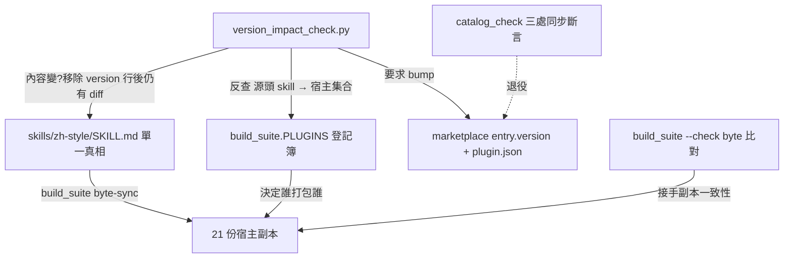
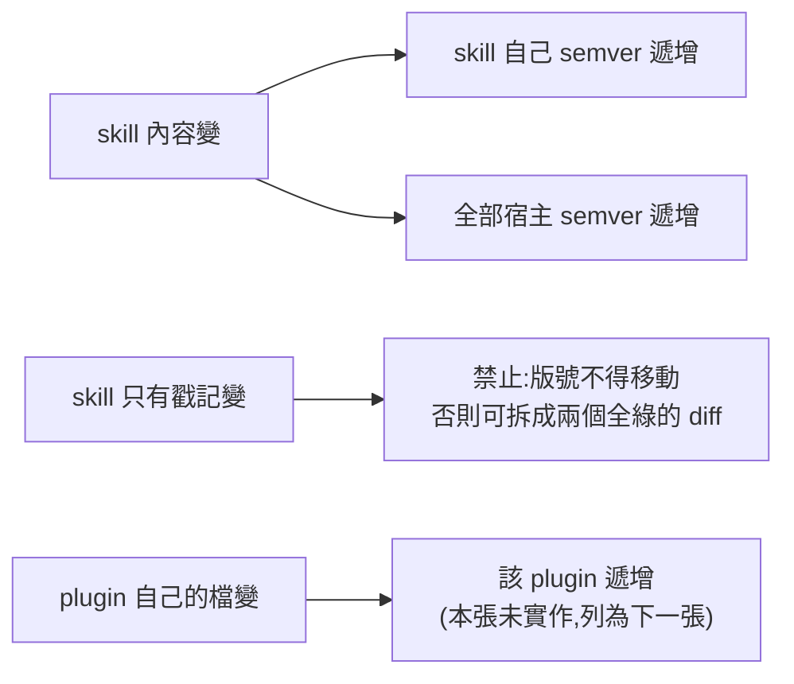

# CHG-20260814-06 — 版號解耦,並補上「隨附副本內容變更 → 宿主必 bump」

- Project: skill-chinese-write
- Branch: claude/version-decoupling
- Date: 2026-08-14 (UTC+0)
- Type: 治理修正(版本紀律)
- Proposed by: 審議席(codex + fable 合議,PR #15 覆核時裁定)
- Implemented by: Claude Opus 5(Cowork session)
- Collaborators:
  - **Claude Fable 5(審議席)**——量出六個副本的 delta 只有版號行,因而把
    「戳記漣漪」與「實質變更」分開;並指出本張要修的真洞
  - **OpenAI Codex(審議席)**——裁定解耦方向,並確認 bump 閘的判準應為
    「該 plugin **最終出貨樹**是否改變」而非只比對同名 skill
- Risk: 高(動的是版本紀律本身;退役一條現行斷言)
- Autonomy: 部分——實作走 DIR-001;「戳記回收」與「退役斷言」見「## 停點」
- Commit/PR: 分支 claude/version-decoupling(close-out 回填)
- Recurrence check: **重複** KN-001 的形狀——`catalog_check` 的
  `--since` bump 規則只看**同名** skill,而出貨樹裡有 20 支是隨附進來的;
  規則寫「plugin 變動就要 bump」,斷言只查了其中一小塊
- Diagrams: 見 `## Design diagrams`
- Skill: ai-sdlc v1.35
- Related: CHG-20260814-05(戳記漣漪在那張被量出來)、ACC-20260814-05(已知瑕疵記載)

## 動機:兩個病,同一個根

### 病一(真洞):實質變更不會逼宿主 bump

```
$ python - <<'PY'  # 從 build_suite.PLUGINS 反查
zh-style 被 21 個 plugin 打包
fiction  被  7 個 plugin 打包
PY
```

今天 `zh-style` 的**規則內容**改一條,`catalog_check --since` 只會逼
marketplace 的 `metadata.version` bump;**21 個宿主 plugin 的 `entry.version`
與 `plugin.json` 一個都不用動,閘全綠。**

成因在 `catalog_check.py` 的 `skills_of()`:

```python
def skills_of(repo, plugin):
    return [p for p in [repo / "skills" / plugin / "SKILL.md"] if p.is_file()]
```

**它只看同名 skill。** 而一個 plugin 的出貨樹裡,同名的只有一支,其餘全是隨附。
規則想管的是「plugin 變了就要 bump」,斷言查的卻只是那一小塊——
**規則寫得比斷言寬**,那是 KN-001 的形狀。

傷害是實打實的 A(a) 級:行為變了、版號沒動、已安裝使用者拿不到,而且乘以 21。

### 病二(假洞):戳記漣漪逼出無內容版本

`CHG-20260814-05` 把 `fiction` 三處版號 bump 到 1.1.0,其中一處是
`skills/fiction/SKILL.md` 的 `metadata.version`——**那是被三處同步斷言拖著動的**,
fiction skill 的內容一個字沒改。再經 `build_suite` 的 byte-sync 灌進六個宿主副本:

```
$ git diff <ref>...HEAD --stat -- 'plugins/fiction-*/skills/fiction/SKILL.md'
 6 files changed, 6 insertions(+), 6 deletions(-)
唯一變動:metadata.version: 1.0.0 → 1.1.0
```

若照「出貨樹變了就 bump」硬套,這六個宿主就得 bump,而它們的 release note
只能寫「內含戳記變了」——**正是 `CHG-20260814-03` 剛擋掉的無內容版本污染歷史。**

### 同一個根

`catalog_check` 的三處同步斷言(`entry.version == plugin.json version ==
SKILL.md metadata.version`)**把 skill 版號與 plugin 版號綁死**。
於是 plugin 因 command 而動,skill 版號被迫跟跳;skill 因內容而動,
宿主 plugin 卻不必動。**兩個方向都錯。**

## 做法(審議席裁定方向 (i):解耦)

### 判準:內容 vs 戳記

一支 skill 的 delta 取自**它整棵出貨樹**——`SKILL.md`、`assets/`、`references/`、
`scripts/` 全算。其中只有根 `SKILL.md` 排除 `metadata.version` 那一行;
排除後若為空,是**戳記變更**,否則是**內容變更**。

| 情形 | 規則 |
|---|---|
| skill **內容**變 | 該 skill 自己 + **全部宿主 plugin**,版號都必須 **semver 遞增** |
| skill 只有**戳記**變 | **禁止**。版號不得移動 |
| plugin 自己的檔變(command、plugin.json、README) | 該 plugin 必須遞增 |

### 中間那一列是禁令,不是豁免

草案原本把它寫成「沒有人需要 bump」。**審議席(fable)指出那是本張定稿前必改的一處**:

> 放行式寫法留下的洞不只是漂移:它讓「先無內容動戳記、下一張 CHG 再動內容」
> 把一次內容變更拆成兩個各自全綠的 diff 成為可能。

所以判準是**雙向**的:內容變 → 必 bump;內容沒變 → 戳記必凍結。
少了後半條,前半條可以被繞過。

### 另外兩條也是審議席補的

- **「必 bump」= semver 遞增,不是「不同」。** 內容變更 + 版號 `1.0.0 → 0.9.9`,
  diff 非空,照字面規則會綠。`catalog_check --since` 現行就只比「不同」,本閘不抄。
- **fail-open 變成承重牆。** `catalog_check.check_since` 在 ref 解析不到時
  無聲 `return []`(「不誤殺」)。舊的靜態斷言沒有這個逃生門;
  版本紀律全部改押在 `--since` 上之後,CI 裡 ref 解析失敗必須**硬紅**
  (fetch 是 CI 自己的責任),skip 只留給本地且要顯式要求。

**兩個判準上的裁決(codex):**

- **整棵樹都要算。** `fiction_rules.json` 與 `fiction_check.py` 也在出貨樹裡,
  改它們同樣是行為變更,而它們沒有 `metadata.version` 可言。
  原話:「以『該 skill 的所有打包檔案』計算 delta。」
- **空白與註解變更也算內容變更。** 原話:「出貨與副本一致性以 byte 為準,
  只要 byte 狀態改變,同一版本就不應指向兩種產物;僅精確排除
  `metadata.version` 那一行。」

第二條意味著這個閘**沒有語意層的寬容**:改一個空格就要 bump 21 個宿主。
那不是誤傷,那是 copy-bundling 的誠實成本——`ACC-20260814-05` 已經記過
「逃掉它就是重演 A(a) 乘以 21」。

### 戳記回收(停點 1)已裁決:**不收回**

codex 的裁決:「已進 main 與 catalog 的版號不可倒退;既有 byte 瑕疵記為歷史例外,
不以回退已發布版本修補。」

所以 `skills/fiction/SKILL.md` 維持 1.1.0,`fiction-flash` 等六個 plugin 的
`1.0.0` 對應兩種 byte 狀態這件事,**永久記為歷史例外**,不修。
`ACC-20260814-05` 的記載因此從「待後續 CHG 消除」改為「已裁定不修,理由是版號不可倒退」。

### 三條規則的搬動

| 規則 | 之前 | 之後 |
|---|---|---|
| `entry.version == plugin.json version` | ✅ 有 | ✅ 保留 |
| `== SKILL.md metadata.version` | ✅ 有 | **退役**(這條就是綁死的來源) |
| skill 內容變 → skill 版號必 bump | ❌ 無 | ✅ 新增 |
| skill 內容變 → 宿主 plugin 必 bump | ❌ 無 | ✅ 新增(**這是真洞的修補**) |
| plugin 副本 vs 頂層來源一致 | ✅ `build_suite --check` byte 比對 | ✅ 不動 |

### 退役那條斷言,不是「嚴格更強」,是刻意改變不變量

我原本把它寫成「替代品必須嚴格更強」。**審議席(codex)糾正了這個框架**:

> 不是嚴格更強,而是刻意改變不變量。

舊斷言抓的是「三處版號分岔」。`writing` 那次(SKILL.md 停在 1.3.0、另外兩處
1.4.0,全綠地活了一輪)就是被它抓到的。**解耦之後,那個形狀是合法的**——
skill 版號本來就該與 plugin 版號各走各的。新規則組**不會**再擋它,而且是故意的。

真正該被接住的不是「分岔」,是分岔在代理的那個**傷害**:
**skill 內容變了,而它的版號沒動。** 舊斷言只是那個傷害的粗糙代理,
而且是個會誤傷的代理——`CHG-20260814-05` 的戳記漣漪就是它逼出來的。

所以驗收要驗**兩件事**,不是一件:

| # | 形狀 | 期望 |
|---|---|---|
| 6a | skill **內容**變了、skill 版號沒動 | **必紅**——真正的傷害要被接住 |
| 6b | 三處版號分岔、**內容沒變** | **必綠**——舊斷言會擋,新規則刻意放行 |

**6b 不是漏洞,是本張的宣告。** 把它寫成一個綠端案例,是為了讓後來的人看得出
這是決定,不是疏忽——沒有這條,下一個看到「版號不一致卻沒紅」的人會把它當 bug 修回去。

## 停點

1. ~~`fiction` SKILL.md 的 1.1.0 戳記要不要收回?~~ **已裁決:不收回**
   (codex:版號不可倒退,既有 byte 瑕疵記為歷史例外)。停點解除。
2. **退役三處同步斷言**——雖是審議席裁定的方向,但退役一條現行斷言屬高風險,
   實作完成後須經兩席複核才 merge。

## 有意識接受的殘餘風險

**base 上已經存在的分岔,任何 diff 式的閘都永遠看不見。**

舊的三處同步斷言是**狀態式**的——每一趟靜態檢查都重新查一次現況。
新規則組是 **diff 式**的,只看 `base..HEAD`。這個轉換丟掉的東西不只 writing 那一個形狀:
**凡是在新閘上線之前就已經存在於 base 的不一致,新規則組一律看不到。**

審議席(fable)要求這句話白紙黑字寫下來,不能默默吞掉。
它能被接受的唯一理由是:戳記凍結保證這類不一致從此無法被**引入**。
已經在裡面的,要靠別的方式清——那不是本張的範圍。

## 驗收條件

1. 新閘 `scripts/version_impact_check.py`:`--self-test` 全過,每條斷言紅端可達
2. **真洞的紅端**:合成「隨附 skill 內容變、宿主未 bump」→ 必紅;
   且「只 bump 其中一個宿主」另一個仍必紅(「有 bump 就算過」是常見的鬆脫)
3. **戳記凍結的紅端**:合成「內容一個 byte 沒變、版號卻動了」→ **必紅**
   (原草案寫成必綠,審議席糾正為禁令——放行式寫法可被「先動戳記、再動內容」繞過)
4. **skill 內容變但自己版號沒有遞增** → 必紅
5. **版號倒退不算 bump**:合成「內容變 + `1.0.0 → 0.9.9`」→ 必紅
6. **不變量的改變要看得見**,兩案:
   - **6a** skill 內容變、skill 版號沒動 → **必紅**(真傷害被接住)
   - **6b** 三處版號分岔、內容沒變 → **必綠**(舊斷言會擋,新規則刻意放行)
7. **退役要有實測證據**:造出 `writing` 那次的分岔形狀,
   實跑 `catalog_check --repo . --check` 得 exit 0,並附還原後工作樹乾淨的證明
8. **fail-closed**:`--since` 取不到 ref 時預設 exit 1;
   顯式 `--allow-missing-ref` 才綠且輸出明說「未驗到,不是通過」
9. **EXCLUDE 交叉斷言**:本閘與 `build_suite.EXCLUDE` 兩份名單分岔 → 必紅
10. 對真實 repo 於 `origin/main` 基準 exit 0
11. `catalog_check --self-test` 仍全綠;新閘已接進 `ci_local.sh` 與 `verify.sh`,
    且 `ci_local` 的那一步在取不到 `origin/main` 時**硬紅**,不 fail-open
12. `bash .github/ci_local.sh` 與 `.github/verify.sh` 皆 exit 0
13. 每個數字與字面值附產生它的指令與原文(KN-004)

### 二讀追加(審議席四項 MB)

14. **MB-1**:宿主版號非 semver 必紅,三案——`"banana"`、`"1.1"`、`"0.0.1-rollback"`;
    另加一案 entry 與 plugin.json 單邊 bump 必紅。
    **格式檢查不看舊值,遞增檢查才看**——二讀 probe 又打到這裡:
    初版把格式檢查也綁在「舊值存在」上,於是**新 plugin 帶 `"banana"` 全綠**。
    新 plugin 沒有「遞增」可言是真的,但它照樣得是合法 semver。已補案 21
15. **MB-2**:基準改用 `git merge-base`。紅端要打的是 `resolve_base()` 而非 `check()`
    ——誤傷發生在**基準的選擇**上,拿寫死的 base 去跑 `check` 永遠重現不出來。
    案內須先證明「拿 tip 當基準確實會紅」,否則這一案證明不了 merge-base 修掉了什麼
16. **MB-3**:`catalog_check.static_self_test()` 兩案——entry ≠ plugin.json 必紅、
    SKILL.md 與 plugin.json 分岔必綠;且**實測「模擬有人把退役的斷言加回去」會被綠端抓到**
17. **MB-4**:`governance.yml` 有實跑 `--repo --since` 的 step,
    且該 step 的 `git fetch` **不加 `|| true`**
18. `[10f]` 不再把輸出丟 `/dev/null`
19. `strip_version_line` 只剝 frontmatter 區塊內的行;正文的 `version:` 算內容(案 19)

## Design diagrams

### 受影響區域



### 兩個方向的錯,各自被哪條規則接住



## 二讀:審議席打穿的四處(全部已修)

複審(fable)親跑紅端 probe,列四項 merge-blocking。**兩項是繞過,兩項是空話。**

### MB-1 宿主那半的 semver 檢查是空的(繞過)

`advanced()` 在任一端非 semver 時退回「不同」,而具名報錯我只補在 **skill** 那半。
複審實測三案全綠:

```
內容變 + 宿主 1.0.0 → "banana"           綠
內容變 + 宿主 1.0.0 → "0.0.1-rollback"   綠   ← 實質倒退
內容變 + 宿主 1.0.0 → "1.1"              綠   ← 誠實打錯字
```

而 `catalog_check` 只驗 marketplace 總版號的 semver 格式,
**entry / plugin.json 無人驗格式**——沒有別的閘兜底。
B-2「嚴格遞增」在宿主這一半是空的。已補具名報錯 + 三個紅端案(15、16、17),
外加一案拆開 entry / plugin.json 的單邊 bump(18)。
舊值缺席不報——那是**新 plugin**,它沒有「遞增」可言。

### MB-2 基準取 tip 而非分岔點(誤傷)

複審實測:main 合法前進(某支 skill 內容變 + 全員正確 bump)之後,
一條**只動 docs 的無關分支**跑本閘紅三條,指控它
「shared 的版號從 1.1.0 倒退到 1.0.0」——它根本沒碰過那支 skill。

`catalog_check --since` 同樣是兩點比較,但它只比「不同」所以意外容忍;
本閘改成嚴格遞增之後,**任何 skill 內容 PR 合入 main,所有未 rebase 的並行分支
都會全紅,而且紅得與自己的程式碼無關**。`ci_local.sh` 開頭自己引的 KN-002
講的就是這種閘:誤報會教人忽略它。

已改用 `git merge-base`,抽成 `resolve_base()` 以便被斷言(案 20 打的是它,不是 `check`
——誤傷發生在**基準的選擇**上,拿寫死的 base 去跑 `check` 永遠重現不出來)。
merge-base 取不到時**回 None 走 fail-closed**,不退回 tip;退回 tip 就是把剛修掉的誤傷偷偷放回來。

### MB-3 退役現場沒有錨(最值得記的一條)

複審的原話:被退役的那條斷言,**從被寫下到被拆掉,整個生命週期沒被機器看過一眼**
——拆掉它時沒有任何測試轉紅。那正是「閘被無聲拔牙」的機制本身。

更要緊的是現在式:`catalog_check --self-test` 只測 `check_since`,
**`check_static` 至今零覆蓋**。於是本張自己預言的回歸(「下一個人把它當 bug 修回去」)
**今天就能無聲發生**:把第三處斷言加回去,全部測試照綠。

已補 `static_self_test()` 兩案:保留下來的那條要有**紅端**(entry ≠ plugin.json),
退役掉的那條要有**綠端**(SKILL.md 與 plugin.json 分岔必須過)。
綠端是本次不變量改變的錨。實測「模擬有人把斷言加回去」:

```
check_static 綠端不可達:SKILL.md 與 plugin.json 分岔應**合法**
(CHG-20260814-06 退役第三處同步斷言),卻被擋下——有人把退役的斷言加回去了
```

### MB-4「CI 必須硬紅」在 GitHub 上是空話

修完之後這道閘只活在 `ci_local.sh` 的 `[10f]`;`verify.sh` 只跑 self-test,
而 **`governance.yml` 完全不跑 `--repo --since`**。裁決寫了,載體上沒有。

已在 `governance.yml` 補一個 step,而且那一行的 `git fetch` **不加 `|| true`**
——上一行的 catalog step 容許 fetch 失敗,是因為它只是版本紀律的其中一道;這一行不是。

### 兩項非阻斷,一併修掉

- `[10f]` 的 `> /dev/null` 把這道閘具名的紅端訊息整個吞掉
  (`ACC-20260813-01` 第 (4) 條記過的同型病)。已拿掉。
- `strip_version_line` 的 docstring 寫「只剝 frontmatter 裡的」,
  實作剝的是**全檔任何**符合的行。複審實測那個落差會造成**死鎖**:
  正文一行 `version:` 的真內容變更被判成「一個 byte 都沒變」的戳記紅,
  而戳記紅無論怎麼 bump 都過不了——**沒有任何一條路能讓它變綠**。
  已限縮到 frontmatter 區塊,並補案 19。

self-test 14 → **21 案**。

## 這一半比原本寫的還大(複審補充)

`PLUGINS` 的**成分變更對本閘完全隱形**:從 tuple 移除一支 skill(宿主出貨樹少一整支)→ 綠;
把既有 skill 掛進新宿主 → 綠。現況只靠副本同步觸發 catalog 級總版號。

所以下一張的範圍是三項,不是一項:

1. plugin 自身檔案變 → 該 plugin bump
2. **`PLUGINS` / `COMMANDS` 成分變更 → 該 plugin bump**(本張隱形)
3. plugin 層的凍結方向(無內容的 plugin bump 禁止)
   ——案 11 刻意放行「分岔」,但它同時放行了「plugin 無內容 bump」,
   而 `CHG-20260814-03` 打的正是那個病,現在在 plugin 層無閘

## Status

已驗收 — ACC-20260814-06。十三條驗收條件全部以**附指令的原始輸出**滿足。
**未做完的一半**:「plugin 自己的檔變 → 該 plugin bump」只寫進判準表,閘沒實作,列為下一張。
