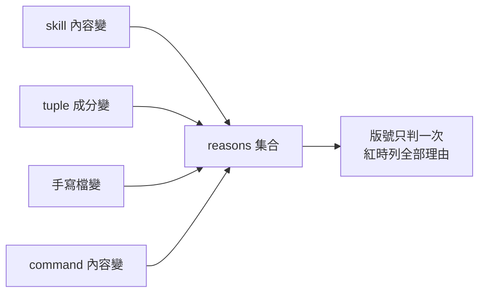

# CHG-20260814-07 — plugin 層的版本紀律:成分變更、自身檔案、戳記凍結

- Project: skill-chinese-write
- Branch: claude/plugin-level-version
- Date: 2026-08-14 (UTC+0)
- Type: 治理修正(版本紀律,plugin 層)
- Proposed by: 審議席(fable 在 CHG-20260814-06 二讀留下的五項積欠)
- Implemented by: Claude Opus 5(Cowork session)
- Collaborators:
  - **Claude Fable 5(審議席)**——五項積欠全部出自它;並在本張的設計草案裡
    找出一個**自我取消的規則**(見「## 草案的致命傷」)
  - **OpenAI Codex(審議席)**——設計覆核連線逾時,已標未審(見「## 未達標處」)
- Risk: 高(版本紀律;批量搬遷的前置)
- Autonomy: 部分——實作走 DIR-001;批量搬遷的啟動見「## 停點」
- Commit/PR: 分支 claude/plugin-level-version(close-out 回填)
- Recurrence check: **重複** KN-001,但形態是新的:
  前兩張是**判準措辭偏鬆**,本張草案是**規則在自己的定義裡失效**。
  審議席原話:「更難從措辭上看出來」
- Diagrams: 見 `## Design diagrams`
- Skill: ai-sdlc v1.35
- Related: CHG-20260814-06(本張補完它沒做完的一半)

## 動機:CHG-06 只做了 skill 層,plugin 層整層是空的

`version_impact_check` 管的是「skill 內容變 → 宿主必 bump」。
plugin **自己**的那一層完全沒有閘。審議席親測三處隱形:

```
P1  從 PLUGINS 的 tuple 移除一支 skill(宿主出貨樹少一整支)  → 綠
P2  把既有 skill 掛進新宿主                                    → 綠
P3  needs_bump(["commands/fiction-long.md"]) → 空
    頂層 command 內容變,連 catalog 總版號都不用動
```

而且 `version_impact_check.load_plugins` **完全不讀 `COMMANDS`**——只 parse `PLUGINS`。

**第 2 項是唯一會被批量搬遷直接踩到的**:批量五支要改 `COMMANDS` 五次,
而那些變更現在對閘完全隱形。

## 出貨樹的成分(量出來的)

```
$ find plugins/fiction -type f -not -path "*__pycache__*"
.claude-plugin/plugin.json        ← 自己的(手寫)
README.md                          ← 自己的
THIRD-PARTY-NOTICES.md             ← 自己的
commands/fiction-long.md           ← 生成物(頂層 commands/ + COMMANDS 成分)
skills/fiction/**   (8 檔)         ← 生成物(頂層 skills/ + PLUGINS 成分)
skills/zh-style/**  (5 檔)         ← 生成物(隨附)
```

**18 個檔裡只有 3 個是 plugin 自己的。** 所以「plugin 變了就要 bump」不能只看
目錄 diff——得先知道每個檔是被誰驅動的。

## 草案的致命傷:R4 在自己的定義裡自我取消

我原本把 plugin 層的戳記凍結寫成:

> plugin 的**整棵出貨樹**一個 byte 都沒變,但 `plugin.json` 的 version 動了 → 禁止

審議席指出:**`plugin.json` 自己就在出貨樹裡。**
version 行動了 = 樹變了一個 byte = 「整棵出貨樹沒變」**永假** = **R4 永遠不火**。

**一條紅端不可達的禁令,實效等於 fail-open。**

它把這歸為我那個病的第四種形態:

> 前兩張的病是判準**措辭**偏鬆,這張的病是**規則在自己的定義裡失效**
> ——更難從措辭上看出來。

所以本張的 self-test 裡,**R4 的紅端案是最不可妥協的一條**。

## 規則(依審議席裁定改寫)

### 驅動源,不是出貨樹

一個 plugin 的**驅動源集合**:

1. 它在 `PLUGINS` / `COMMANDS` 的 **tuple 成分本身**
2. 成分指向的頂層 `skills/<s>/` 整棵樹與 `commands/<c>.md`
3. 它**自己的手寫檔**——`plugins/<p>/**` 扣除 `skills/**` 與 `commands/**`
   兩塊生成空間,再扣除 `plugin.json` 的頂層 `version` 鍵那一行

| # | 規則 | 期望 |
|---|---|---|
| R1 | 頂層 `commands/<c>.md` 內容變 → 宣告它的每個 plugin | 必須 semver 遞增 |
| R2 | `PLUGINS` / `COMMANDS` 的成分變更(增/刪/改) → 該 plugin | 必須遞增 |
| R3 | plugin 自己的手寫檔變(**補集定義**) → 該 plugin | 必須遞增 |
| R4 | **驅動源全靜止**,而 `plugin.json` 的 version 動了 | **禁止** |

### R3 用補集,不用列舉

草案寫「`plugin.json` 除 version 行外、README **等**」——列舉式。
審議席:**列舉會讓下一個手寫檔靜默漏網,正是這個 repo 的孤兒事故形狀。**

補集定義下,**未知的檔落進「算」,不是落進「不算」**。

### 理由聚合,不是規則抑制

同一件事會讓多條規則開火(例:掛新 skill → R2 的成分變了,同時新 skill 樹
從無到有讓既有的 skill→宿主規則也火)。**兩發要的是同一個動作。**

實作成每 plugin 一個 `reasons` 集合,版號**只判一次**,紅時一行列全部理由。

審議席畫的線:

> 絕對不要寫成「R2 已觸發就跳過 R1」——**抑制邏輯的 bug 是靜默綠**,
> fail-open 的形狀;聚合邏輯的 bug 最多是理由列少一條,verdict 不變。

### R2 要比較兩端的名冊,否則是空話

`load_plugins` 現在只讀工作樹。R2 若沿用它,等於**拿 HEAD 跟 HEAD 比**。
必須改成兩端各自從 blob parse,而且**任一端 parse 不出形狀就紅**,不准 skip。

### version 行的排除只釘一個檔的一個鍵

只釘 `plugins/<p>/.claude-plugin/plugin.json` 的**頂層 `version` 鍵**。
不對樹做 regex 剝行——CHG-06 的案 19 死鎖有 JSON 雙胞胎:
巢狀物件裡的 `"version"`、README 裡恰好長那樣的一行,剝掉任何一個都是重演同一個 bug。

積欠第 4 項(`strip_version_line` 釘到 `metadata:` 區塊)是同一族修法,一併做。

## R4 的驅動源定義同時解掉一個誤導

我原本擔心:有人 bump 了 plugin 卻**忘了跑 `build_suite`**,副本沒同步 →
出貨樹沒變 → R4 報「無內容的 bump」,而**真正的問題是沒跑同步**。

驅動源版沒有這個坑:zh-style 的驅動源有變,R4 根本不火,
紅的是 `build_suite --check`,訊息正確指向「去同步」。

閘序也核實過:`build_suite --check` 在 `verify.sh`(`ci_local` 第 [1/13] 步),
`version_impact_check` 在 [10f],`set -euo pipefail` 會停在第一個紅
——**CI 裡永遠是同步訊息先出**。

## 隔壁的同型病,一併具名

`catalog_check.check_since` 對 marketplace 總版號的判準**至今是「不同」不是「遞增」**
(`old_mv == cur_mv` 才紅,所以 `1.2.0 → 1.1.0` 照過)。

那正是 `CHG-20260814-06` 我被糾正過的第二型病,**原樣活在隔壁**。
本張既然動版本紀律,順手改成遞增。

## 停點

1. **批量搬遷五支的啟動**——本張是它的前置。批量之前,審議席列的
   「必須存在而現在不存在的斷言」要全部到位(見驗收條件 8~10)
2. **六個 `fiction-*` plugin 的退役**:diff 式的閘對「plugin 整個消失」**全部隱形**
   ——`check()` 只迭代 HEAD 的名冊,消失的 plugin 誰都不看。
   **本批不含退役**,在此寫明,不讓它默默混進來

## 驗收條件

1. R1~R4 各有紅端與綠端;**R4 的紅端(驅動源全靜止 + 版號動)不可省**
2. R2 的兩端名冊各自從 blob parse;**任一端 parse 不出形狀即紅**,不准 skip
3. `COMMANDS` 進入判定(現在完全不讀)
4. 理由聚合:同一 plugin 多條規則命中時,版號只判一次,紅時列全部理由;
   **實測至少一案同時命中兩條規則**
5. R3 的補集定義:合成一個**未列舉過的手寫檔**(例 `NOTICE`),必須被算進去
6. `strip_version_line` 釘到 `metadata:` 區塊;plugin.json 只排除頂層 `version` 鍵
7. `catalog_check.check_since` 的總版號判準改為遞增,附紅端案
8. 淺 fetch 的錯誤訊息補 deepen 提示
9. `ci_local.sh` / `verify.sh` / `governance.yml` 三個載體都接上
10. `bash .github/ci_local.sh` 與 `.github/verify.sh` 皆 exit 0
11. 每個數字與字面值附產生它的指令與原文(KN-004)

## 刻意不做的:command 引用路徑的雙住址斷言

審議席列它為批量前置,我原本把它寫進本張的驗收條件。**移出。**

理由:那是一道**新閘、新能力**,不是既有規則的修正。本張的範圍是
「CHG-06 留下的五項積欠 + 同型病的順手修正」,加一道新閘進來是擴張需求。

它仍然是批量搬遷的前置,只是屬於**下一張**:
抽出 `commands/*.md` 的路徑狀引用,斷言從 repo root **與每個宣告宿主的
plugin root** 都可解析。`CHG-20260814-05` 是我手跑證明的,目前零閘。

## Design diagrams

### 驅動源,不是出貨樹

```mermaid
graph TD
  REG["PLUGINS / COMMANDS 的 tuple 成分"] --> DRV["plugin 的驅動源集合"]
  TOPS["頂層 skills/&lt;s&gt;/ 整棵樹"] --> DRV
  TOPC["頂層 commands/&lt;c&gt;.md"] --> DRV
  OWN["plugins/&lt;p&gt;/** 補集<br/>扣 skills/ commands/ 與 version 鍵"] --> DRV
  DRV -->|有變| MUST["該 plugin 必須 semver 遞增"]
  DRV -->|全靜止而版號動| FORBID["R4 禁止"]
  TREE["plugins/&lt;p&gt;/ 出貨樹"] -.草案原本用它定義<br/>plugin.json 在樹裡<br/>導致 R4 永遠不火.-> X["自我取消"]
```

### 多規則命中同一 plugin



## Status

施工中 — 待 ACC-20260814-07。
