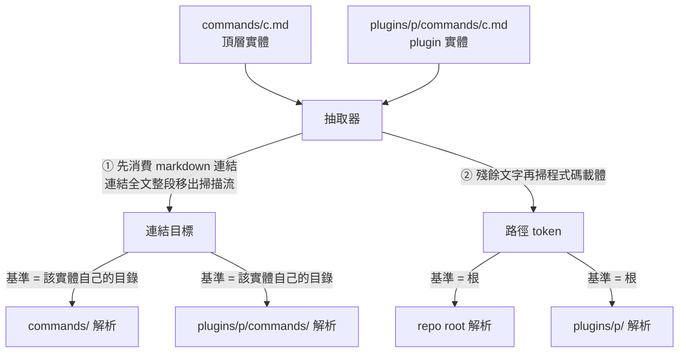
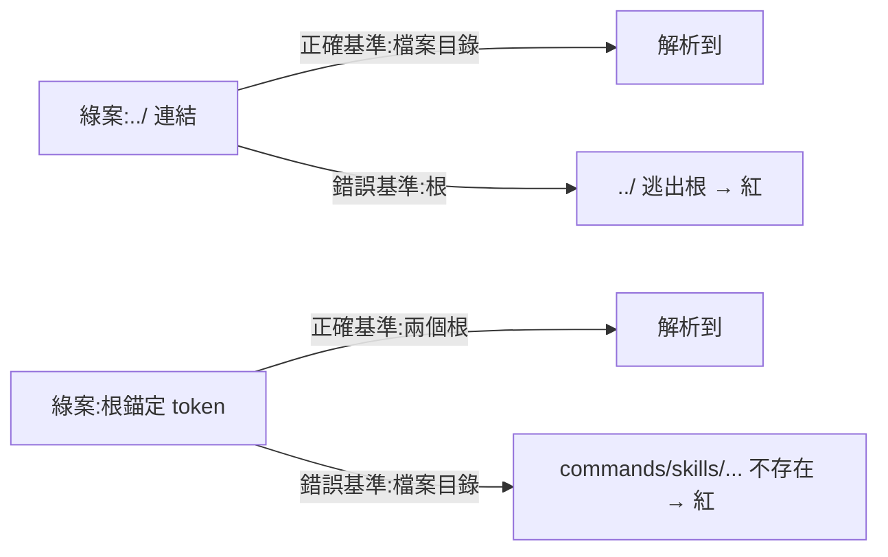

# CHG-20260814-08 — command 引用路徑的雙住址閘(批量搬遷的最後一道前置)

- Project: skill-chinese-write
- Branch: claude/command-path-gate
- Date: 2026-08-14 (UTC+0)
- Type: 新增治理閘
- Proposed by: 審議席(fable 列為批量搬遷**唯一硬前置**)
- Implemented by: Claude Opus 5(Cowork session)
- Collaborators:
  - **Claude Fable 5(審議席)**——設計裁決六點,含**抽取順序是判準的一部分**
    這個我沒量到、會在正確檔案上造成假紅的事實
  - **OpenAI Codex(審議席)**——兩類引用的基準應分開寫、圍籬內路徑不一律算
- Risk: 中(新增閘,不動既有規則)
- Autonomy: auto(DIR-001)
- Commit/PR: 分支 claude/command-path-gate(close-out 回填)
- Recurrence check: **重複** KN-001 的鄰域,但本張是**預防**——
  `CHG-20260814-05` 自己列了「相對路徑在兩個住址不等價」這個失敗模式,
  當時用人審扛過去,至今零閘
- Diagrams: 見 `## Design diagrams`(我原本寫「不適用(中風險)」——**記反了**,
  豁免只給低風險,中/高都要附。是 `chg_diagram_gate` 擋下來的)
- Skill: ai-sdlc v1.35
- Related: CHG-20260814-05(那次是手跑證明的)、CHG-20260814-07(補集定義的先例)

## 動機

`CHG-20260814-05` 的 ACC 證據 E 是我**手跑**的:

```
commands/fiction-long.md                  ../skills/fiction/references/dialogue.md
  → skills/fiction/references/dialogue.md                              ✅
plugins/fiction/commands/fiction-long.md  ../skills/fiction/references/dialogue.md
  → plugins/fiction/skills/fiction/references/dialogue.md              ✅
```

**那是佈局巧合,不是斷言保證。** 批量搬遷的五支每支都會帶這類路徑。

## 兩類引用,兩種基準

| 載體 | 基準 | 「雙住址」的意思 |
|---|---|---|
| markdown 連結 `](target)` | 該實體**自己所在的目錄** | 檔案的兩個所在地 |
| 程式碼載體裡的 token | **根** | repo root 與 `plugins/<p>/` 兩個根 |

codex:硬併成同一規則會掩蓋錯誤。所以判準寫成**帶基準的分類條款**:

- **(a)** 兩份實體各自抽出的 markdown 連結,以**該實體自己所在目錄**為基準必須解析到
- **(b)** 程式碼載體 token,以 **repo root** 與 **`plugins/<p>/`** 兩個根為基準各自必須解析到
- **(c)** 程式碼載體中 `../` 開頭的 token 一律違規——指令是從某個根執行的,不是從檔案目錄

## 審議席抓到的:抽取順序是判準的一部分

`fiction-long.md` 第 49 行:

```
[`references/dialogue.md`](../skills/fiction/references/dialogue.md)
```

**連結文字本身是一個路徑狀的 code span。** 抽取器若先掃反引號,
`references/dialogue.md` 會被當成程式碼載體 token、以根為基準、解析不到,
**在一份完全正確的檔案上假紅**。

審議席稱它是 R4 的孿生:「不是規則恆真,是**規則對正確輸入恆假**。」

所以順序寫成規範:**先消費 markdown 連結**(連結全文——含文字裡的 code span
——從掃描流移除),殘餘文字再掃程式碼載體。

## 防「恆真/恆假」的機器手段:基準判別性

審議席給的唯一可機器化的手段,已寫進驗收:

> **每個綠案夾具的每條引用,必須在錯誤基準下解析失敗。**

- 綠端連結一律用 `../` 形——實作若誤用根基準,`../` 逃出根,**綠案立刻紅**
- 綠端 token 一律根錨定形——實作若誤用檔案目錄基準,`commands/skills/...` 不存在,**綠案立刻紅**

**一個在兩種基準下都解析得到的綠案什麼都證明不了**,self-test 裡不准有這種夾具。
R4 的教訓操作化就是這一句。

## 範圍是封閉文法,不是列舉

`CHG-20260814-07` 的 R3 被否掉過列舉式寫法。這裡同理:範圍列的是**載體文法**,
而載體文法封閉——markdown 連結、程式碼載體(圍籬 + 行內 code span)。
過濾用**判定式**:有 scheme、`#` 開頭、含角括號佔位、含 CJK 段、含 `$` 變數、
無 `/` 者天然不進場。`稿件.md`、`--genre long`、`$ARGUMENTS` 因此不是被名單排除的。

**不設 ignore 名單。** 閘側豁免名單就是列舉式的鏡像,下一個真缺陷會住進名單裡。
要寫刻意不存在的路徑,用**不可抽取形**(角括號佔位、含中文段)——
豁免因此**在文本裡看得見**,審稿的人一眼知道那是刻意的假,不必去翻閘的例外表。

## 不在契約內的東西,具名

- **裸文路徑**(不在連結、不在反引號)不在本閘契約內。使用者要依賴的路徑
  必須放進兩種載體之一——這把逃逸路徑變成**寫作規範違規**,而不是閘的靜默盲區。
- `commands/` 裡未登記的檔、名冊裡缺來源的條目,是 `build_suite.sync_commands`
  反向斷言的轄區,本閘只迭代名冊配對。**寫在檔頭免得兩閘互以為對方在管。**

## 刻意不做

**`plugin.json` 比對法的更正**——codex 補審 `CHG-20260814-07` 時推翻了我的
JSON 解析實作,fable 覆核後**推翻自己前一輪的判法**並同意 codex。
但審議席同時裁定:**另開一張,不併進本張**。理由是本張範圍已由使用者釘死、
兩者零耦合、而且**那不是批量搬遷的前置**(搬遷 commit 天然帶真理由,踩不到格式死鎖)。

已記為 `CHG-20260814-09` 的內容,不在此擴張。

## 驗收條件

1. 基準判別性綠端:每個綠案在錯誤基準下必須紅(G1 `../` 連結、G2 根錨定 token)
2. **抽取順序的綠端**:連結文字是路徑狀 code span 的檔案必須綠(G3)
3. 雙住址紅端四條:連結 × 兩住址、token × 兩根
4. **抽取支路三條**:圍籬、行內 code span、連結——各自關掉必須有案轉紅
5. 形狀兩條:程式碼裡的 `../`、絕對路徑連結
6. 不可抽取形一條:角括號佔位不進場(G4)
7. **突變精準性**:每個突變施加後跑整個案集,翻紅的恰好是該案
8. 兩份實體都查,**不依賴 sync 的 byte-identical**
9. 印出抽取數(「抽出 0 條」是無聲空洞),但**不對真實語料訂最低條數**
10. 三載體接線;`ci_local.sh` 與 `verify.sh` 皆 exit 0
11. 每個數字與字面值附產生它的指令與原文(KN-004)

## Design diagrams

### 兩類引用,兩種基準



**順序不能反。** 連結文字本身可能是路徑狀的 code span
(`[\`references/dialogue.md\`](../skills/...)`),先掃反引號會把它當 token、
以根為基準、解析不到,**在一份完全正確的檔案上假紅**。

### 基準判別性:綠案必須在錯誤基準下死掉



一個在兩種基準下**都**解析得到的夾具什麼都證明不了,不准進 self-test。

## Status

已驗收 — ACC-20260814-08。十一條驗收條件全部以**附指令的原始輸出**滿足。
