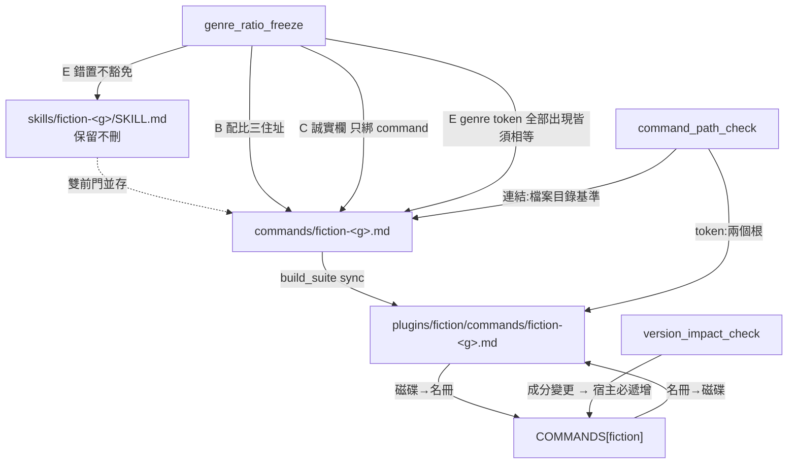

# CHG-20260814-09 — 批量搬遷五支流派成 command

- Project: skill-chinese-write
- Branch: claude/fiction-batch
- Date: 2026-08-14 (UTC+0)
- Type: 重構(搬遷)
- Proposed by: 使用者(「skill 只分大類,細項寫作技巧與目標則在 skill 底下的指令中」)
- Implemented by: Claude Opus 5(Cowork session)
- Collaborators:
  - **Claude Fable 5(審議席)**——批量的驗收模板、`--genre` 交叉錯置這個
    我完全沒問到的洞、以及糾正我餵給 codex 的錯誤前提(commit 粒度)
  - **OpenAI Codex(審議席)**——「凍結閘綠即證明,ACC 不再手抄數字」、
    以及「`--genre` 對應應成為常設閘」
- Risk: 高(第一次批量動 skill 內容)
- Autonomy: 部分——搬遷走 DIR-001;退役見「## 停點」
- Commit/PR: 分支 claude/fiction-batch(close-out 回填)
- Recurrence check: **不重複**。前四張都是「規則寫錯」,本張的失效模式是
  **重複五次同一個動作時,五次之間的不一致**——新軸,見「## 這張特有的失效模式」
- Diagrams: 見 `## Design diagrams`
- Skill: ai-sdlc v1.35
- Related: CHG-20260814-05(pilot)、CHG-20260814-08(路徑閘,本批的硬前置)

## 動機

`CHG-20260814-05` 搬了 `fiction-long` 一支當 pilot,審議席裁定「全綠再批量其餘五支」。
`CHG-20260814-08` merge 之後,批量的硬前置清空。

## 這張特有的失效模式

前四張都是「一道新規則寫錯」。**本張是重複五次同一個動作**,所以要防的東西不同:

| 風險 | 誰接住 |
|---|---|
| 配比數字漂移 | `genre_ratio_freeze` 的 `[B]`(三處住址逐值比對) |
| 相對路徑在兩住址不等價 | `command_path_check`(CHG-08) |
| 名冊與磁碟分岔 | `sync_commands` 雙向斷言 |
| **`--genre` 交叉錯置** | **本批新增的 `[E]`**——見下 |
| **五份誠實段措辭不一致** | 模板化生成 + 機器化一致性比對 |
| description 的散文正確性 | **人眼**(審議席裁定不機器化) |

## `--genre` 交叉錯置:三道閘全綠的洞

`fiction-romance.md` 裡寫成 `--genre wuxia`,凍結閘驗數字、路徑閘驗路徑、
sync 驗同步——**三道全綠**。數字整塊錯貼會被 `[B]` 抓(各流派配比互異),
但 **lint 呼叫行是獨立的一行,批量複製貼上最容易錯在這**。

審議席(fable)提出,codex 裁定應成為**常設閘**而非只放 ACC。
fable 覆核後改判並與 codex 一致,理由是它自己在 CHG-08 立的原則反過來咬它:

> **ACC 是一次執行的紀錄,不是契約**——它不會再跑第二次。
> 當修補成本是既有閘裡加一條斷言時,具名風險卻拒絕一行修補,是倒錯的。

### 為什麼住在凍結閘

判準不是「哪邊加最省」,是**誰擁有 genre 這個概念**:凍結閘有流派名冊、
genre ↔ 檔名對應、三住址迴圈;而 `command_path_check` 是 **genre 無知**的,
將來非 fiction 的 command 也走它,把流派知識塞進去是污染一道通用閘。

### 判準形狀

- **正確性:全部出現皆須相等**,不是「至少含一個正確的」——後者的漏洞是
  正確 token 在場、旁邊多一個錯貼的 wuxia,照樣綠
- **在場性:只綁 command 住址**。舊 SKILL.md **缺席豁免、錯置不豁免**
  ——缺席與寫錯是兩回事

## 這條斷言是驗收機具,不是需求擴張——但保留你的否決點

使用者明令「不要擴張需求」。審議席的判定:**這是驗收機具,不是需求**。
判例是 `genre_ratio_freeze` 自己——它就是 `CHG-20260814-05` 搬 pilot 時
因搬遷風險而生的,沒有人把它算作擴張;本條同型,風險由本批**直接製造**。

維持不擴張的邊界條件是**極簡**:既有閘加一條斷言 + 自檢案例,
不開新腳本、不動 CI 接線、不順手加任何別的。

**若你認定它仍屬擴張,退回 ACC-only** —— 兩席一致也不該替你吸收這個判斷。

## commit 粒度:五個 commit + 一次 bump

我原本以為「每流派一個 commit 就要 bump 五次」(1.1.0 → 1.6.0),
並據此問了 codex。**那個前提是錯的**,fable 實測糾正:

`version_impact_check.resolve_base()` 取的是 **merge-base**,兩點比較,
不是逐 commit 對。所以 commit 1 帶 bump(1.1.0 → 1.2.0),commit 2~5
各自加理由,而 HEAD 的 1.2.0 對分岔點的 1.1.0 **仍然嚴格遞增**
——每個 commit 單獨跑閘都綠。

**bump 必須在 commit 1**;放最後會讓中間四個 commit 單獨跑閘全紅。

codex 收到更正後改判,與 fable 一致。**它原本的裁決建立在我給的假前提上。**

## 五支一律登記 `COMMANDS["fiction"]`

凍結閘的第三住址**寫死** `plugins/fiction/commands/fiction-<g>.md`。
若登記到各流派 plugin,副本會落在 `plugins/fiction-wuxia/commands/`,
而凍結閘**靜默不驗那份副本**(`live_docs()` 只收存在的路徑,少一處不報錯)
——正是它自己註解說的「只驗其中一處,另外兩處就是下一個孤兒」。

「流派 plugin 也各自出命令」若要做,是另一張 CHG,**硬前置是先擴凍結閘的住址表**。

## 我在做這道斷言時犯的錯

`--genre` 的捕獲初版寫 `\S+`。**CJK 之間沒有空格**,於是舊 SKILL.md 的
``lint 會數(`--genre flash`),但區間是本 skill`` 被捕成
`` flash`),但區間是本 ``,**在一份完全正確的檔案上假紅**。

「規則對正確輸入恆假」的第三次,而且**是真實 repo 跑出來才發現的**
——合成夾具全部用純 ASCII,那個環境永遠照不到。

這揭示的不只是一個 bug:**夾具的字元集也是夾具的一部分**。
中文專案的閘,自檢裡沒有中文,就等於沒驗過真實輸入。
這是**所有現存閘的共同盲區**,列入殘留風險。

## 停點

**本批不含退役。** 六個 `fiction-*` plugin 與六份舊 SKILL.md 的去留是
具名擱置的開放題,需要「plugin 整個消失也看得見」的閘(迭代 `P_old`),
批量後另立 CHG。

## 殘留風險

1. **六份舊 SKILL.md 帶「lint 會數」的半真文案**,依 `CHG-20260814-05` 裁決 4
   豁免(依住址判定,回頭改注定要刪的檔是白工)。
   **死期是舊檔刪除那張 CHG**——沒有具名死期的豁免就是永久豁免,
   所以那張 CHG 在此具名為 next step,不是「之後會刪」。
2. **夾具字元集的盲區**(見上)——所有現存閘的 self-test 都是純 ASCII 環境。
3. `CHG-20260814-08` 具名的六種契約外形狀,由本批的寫作規範 rider 頂著。

## 驗收條件

1. 六支 command 齊備,`sync_commands` 雙向綠
2. `command_path_check --repo .` 綠,ACC **逐支列「連結 n / token m」並與檔面對帳**
   (目的是查多餘與錯置,不是抄數字)
3. `genre_ratio_freeze --repo .` 綠——**凍結閘綠即構成「配比字面未漂」的證明**,
   ACC 引用閘的輸出行,**不再手抄一份數字**(手抄是另造會漂的第二真相)
4. `[E]` 的紅綠端五案 + forbid;真實 repo 逐支 `--genre` 對帳全相符
5. **誠實段模板一致性**:槽位正規化後只剩一個唯一字串
6. 五份 description **逐支眼讀**(審議席裁定不機器化:錨定詞表是代理指標不是不變量)
7. `version_impact_check` 綠;**bump 在 commit 1**,五個 commit 各自單獨跑閘皆綠
8. catalog bump;`ci_local.sh` 與 `verify.sh` 皆 exit 0
9. 每個數字與字面值附產生它的指令與原文(KN-004)

## Design diagrams

### 一支流派的搬遷,四道閘各管一段

### commit 粒度:五個 commit,一次 bump

## Status

已驗收 — ACC-20260814-09。九條驗收條件全部以**附指令的原始輸出**滿足。
