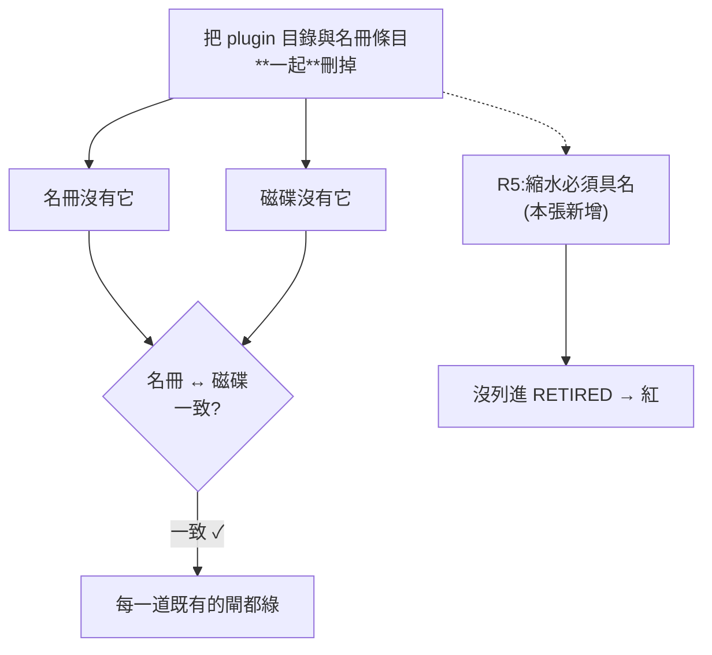
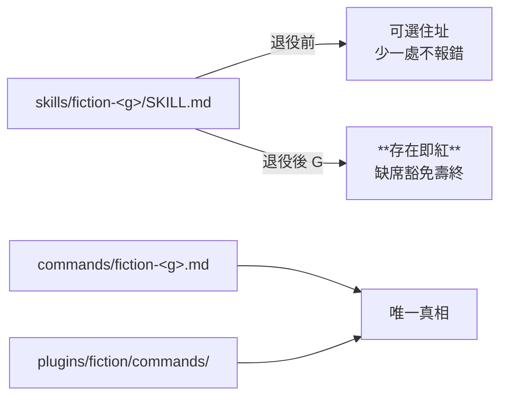

# CHG-20260814-10 — 退役六個 `fiction-*` plugin 與六份舊 SKILL.md

- Project: skill-chinese-write
- Branch: claude/fiction-retire
- Date: 2026-08-14 (UTC+0)
- Type: 退役(移除已發布 plugin id)
- Proposed by: 審議席(`CHG-20260814-09` 的具名 next step)
- Implemented by: Claude Opus 5(Cowork session)
- Collaborators:
  - **Claude Fable 5(審議席)**——六項前置、「消失也看得見」的閘設計、相位切換、
    夾具改寫量的預算警告,以及那筆我完全沒看到的 zh-style「21」連鎖
  - **OpenAI Codex(審議席)**——設計覆核連線逾時,**未審**(見「## 未達標處」)
- Risk: 高(移除已發布 plugin id,不可逆)
- Autonomy: **人類裁決**——「直接刪 vs deprecation」由使用者拍板(裁決:**A 刪**)
- Commit/PR: 分支 claude/fiction-retire(close-out 回填)
- Recurrence check: **不重複**。前五張的失效軸都是「規則寫錯」或「五次之間不一致」,
  本張是**新軸:一起消失就是一致**——刪除對每一道既有的閘都是不可見事件
- Diagrams: 見 `## Design diagrams`
- Skill: ai-sdlc v1.35
- Related: CHG-20260814-09(它把本張具名為 next step 並記了死期)

## 不可逆的那一半由使用者裁決

審議席明說這是**給 repo 擁有者按的,不是審議席替他按**。裁決是 **A:直接刪**。

技術理由(fable):

> 「結束條件不能是過一陣子」**在這個 repo 無解**——沒有任何安裝遙測,
> 任何時間窗都只是「過一陣子」加了個數字,**是儀式不是條件**。

而 deprecation 要對六個死期已定的 plugin **付兩次全額閘稅**,
與 `CHG-20260814-05` 裁決 4「回頭改注定要刪的檔是白工」同一條線。

**傷害模型**:從 marketplace 移除**不會拔走已安裝副本**,只斷更新與新裝。
斷點由遷移對應補:`fiction-<g>` plugin → `/fiction:fiction-<g>`。

## 硬前置:讓「消失」變成看得見的

**現存全部閘只斷言「名冊↔磁碟一致」,而把 plugin 目錄與名冊條目一起刪掉,
兩邊同時消失就「一致」——對每一道閘都是不可見事件。**

`version_impact_check` 的 R2 那句 `if p not in P_new and p not in C_new: continue`
就是這個盲區的所在。

### 第三張登記簿

`plugins/build_suite.py` 加 `RETIRED`。放這裡而不是 CHG 文件裡,理由是
**閘不該 parse 散文**——兩端都 blob-readable,名冊與現實想分岔就必然有一端紅。

| 規則 | 內容 |
|---|---|
| **R5** | 縮水必須具名:從名冊消失卻沒列進 `RETIRED` → 紅 |
| **R6** | 名冊與現實雙向一致:具名了卻沒真的退役 / 目錄還在 / entry 還在 → 紅 |
| **R7** | 復活必須先除名:`RETIRED` 裡的名字回到名冊 → 紅 |

「誰驗證名冊與實際刪除集合一致」的答案是 **git diff 本身**。

### 紅端在真實退役上驗過

```
現況:綠
RETIRED 視為空 → R5 抓到 6 個未具名的消失
```

**不是理論上會紅,是在這次真的退役上紅過。**

## 相位切換 `[G]`

退役之前 `skills/fiction-<g>/SKILL.md` 是「可選住址」——`live_docs()` 只收存在的
路徑,少一處不報錯。**退役之後那個寬容變成盲區**:有人手動放回一份,凍結閘看不見,
而 `[E]` 的「缺席豁免」還會替它背書。

`[G]`:對 `FROZEN` 六支,舊住址**存在即紅**。通用層(`skill_inventory_check` 第 3 項)
本來就擋得住,這是具名層——誰擁有流派名冊誰管。

### 夾具改寫量,審議席在設計期就要我預算

`[E]` 建立在舊住址上的案子整批翻紅。案 11、19 轉成 `[G]` 的反向案
(有 token 也紅 / 缺 token 也紅)。

**但 CJK 緊鄰那兩案換宿主保留,不得陪葬**——它們釘的是那個假紅回歸,
與住址無關;跟著豁免一起刪,**修好的 bug 就再度在夾具裡不可再現**(KN-001 原型)。

## 三件我沒預料到、被盤點與閘抓出來的

### 一、四支子層的夾具是 CI 承重件,不是死資產

```
ci_local [4/13]  for G in scifi mystery romance flash → skills/fiction-$G/assets/sample-good.md
ci_local [10d]   EXPECT_UNVERIFIED 字面釘死 skills/fiction-flash/assets/sample-good.md
ci_local [10d]   glob skills/fiction-*/assets/sample-*.md
```

直接刪樹,CI 紅兩處;順手改名冊,就**靜默丟掉四條成語配比的唯一流派級紅綠端**。
已搬進 `skills/fiction/assets/sample-good-<g>.md`——**夾具跟引擎住**。

### 二、`git rm -r` 沒清掉目錄

未追蹤的 `__pycache__` 留著,而我新寫的 **R6 正是查 `plugins/<p>/` 存不存在**。
**自己寫的斷言抓到自己的清理不完整。**

### 三、zh-style 的「21」連鎖(fable 抓的,我完全沒看到)

`skills/zh-style/SKILL.md` 與 `zh_style_check.py` 都寫「**21 個 plugin** 全部把它打包帶入」,
`docs/genres.md` 同。退役後是 15。

不改是明知的假話;改了就是 zh-style 內容變更 → 依 byte 判準 →
**zh-style bump + 全部 15 個存活宿主連動 bump**。

**這一筆讓本張 diff 面積翻三倍。** 裁決是**順手去字面化**(「所有 plugin」),
讓下一次退役不再觸發同型連鎖。

## 版號

```
catalog                  2.6.0 → 3.0.0   移除已發布 plugin 是 breaking
skills/fiction/SKILL.md  1.1.0 → 1.2.0   description 改指向命令(真內容變更)
skills/zh-style/SKILL.md 1.0.0 → 1.1.0   去字面化(真內容變更)
15 個存活宿主             全部 bump       zh-style 是它們全體的隨附
```

## 驗收條件

1. `RETIRED` 名冊在 `build_suite.py`,六支具名
2. R5/R6/R7 各有紅綠端;**R5 的紅端在真實退役上驗過**(不只合成樹)
3. `[G]` 相位切換:舊住址存在即紅,兩案(有 token / 缺 token)
4. **CJK 緊鄰兩案換宿主保留**,不得隨豁免陪葬
5. 四份 CI 承重夾具搬家,`ci_local` 三處引用同步更新
6. zh-style 去字面化;15 個存活宿主全部 bump
7. 清點:plugin 21 → 15、skill 24 → 18
8. `ci_local.sh` / `verify.sh` / 四道專用閘皆 exit 0
9. **commit 之後**再驗 `--since`(未 commit 的綠燈沒有意義)
10. 每個數字與字面值附產生它的指令與原文(KN-004)

## Design diagrams

### 消失為什麼看不見



### 退役後的住址相位



## 未達標處

1. **codex 未審**——設計與實作覆核皆連線逾時,本張**單席成立**。
   fable 已完成實作覆核(九發 probe + 突變測試),裁定兩條 merge-blocking,均已修。
2. **`RETIRED` 只擋名冊層的消失**。半刪狀態(目錄殘留、marketplace 不同步)
   由 `skill_inventory_check` 第 6/7 項擋,已寫進 docstring 免得兩閘互以為對方在管。

## Status

已驗收 — ACC-20260814-10。十條驗收條件全部以**附指令的原始輸出**滿足,
複審的兩條 merge-blocking 已修(帳本未 commit、判準沒一體適用)。
