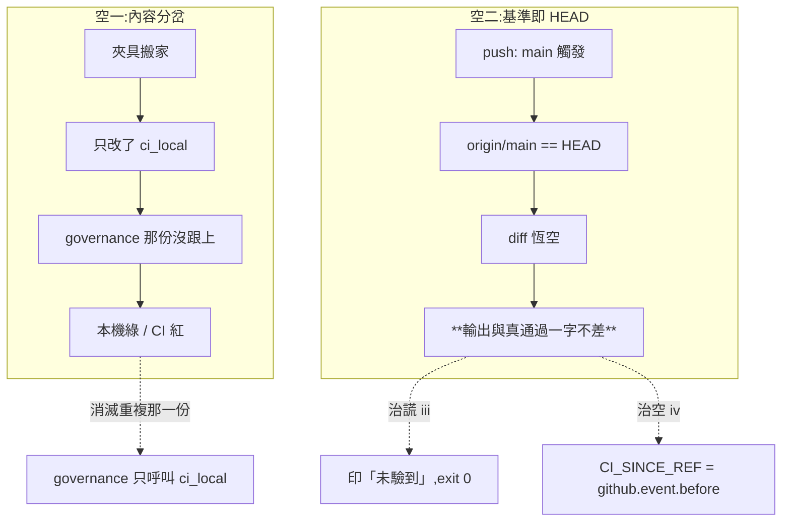
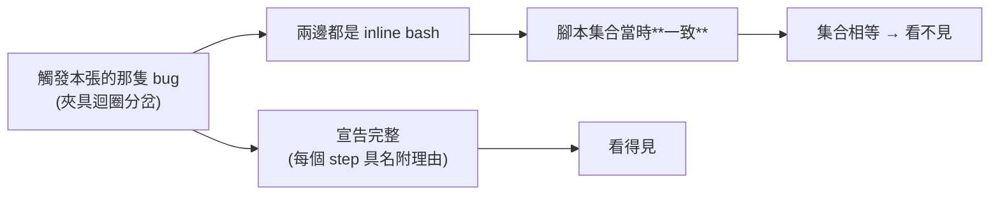

# CHG-20260816-01 — 兩個 CI 載體合一,並讓「基準即 HEAD」說實話

- Project: skill-chinese-write
- Branch: claude/carrier-parity
- Date: 2026-08-16 (UTC+0)
- Type: 治理閘重構(消滅重複載體 + 補空轉誠實層)
- Proposed by: 審議席(`ACC-20260814-10` 殘留風險的具名 next step)
- Implemented by: Claude Opus 5(Cowork session)
- Collaborators:
  - **Claude Fable 5(審議席)**——載體合一的形狀、「宣告完整而非集合相等」的判準、
    `github.event.before` 這個不依賴 merge 策略的基準、以及三處前提糾正
  - **OpenAI Codex(審議席)**——連續五次連線逾時,依重試協議標記**未審**
- Risk: 高(改的是所有閘的載體;做錯的話全部規則靜靜消失而 CI 全綠)
- Autonomy: 審議席決議(使用者裁決「全部由審議席決議」)
- Commit/PR: 分支 claude/carrier-parity(close-out 回填)
- Recurrence check: **重複**。這是「兩份重複的東西沒有交叉斷言」的第四次,
  前三次是名冊 vs 磁碟、三處版號、兩份 EXCLUDE。**本張改用消滅重複,不再加斷言**
- Diagrams: 見 `## Design diagrams`
- Skill: ai-sdlc v1.35
- Related: CHG-20260814-06(寫下「`--since` 的綠燈可能沒有意義」)、
  CHG-20260814-10(它的 ACC 把本張具名為殘留風險)

## 病灶:CI 綠的兩種空

`PR #20` 第一次 CI 紅:`ERROR: 找不到檔案 skills/fiction-scifi/assets/sample-good.md`。
夾具搬家只改了 `ci_local.sh`,而 `governance.yml` 有自己一份同樣的迴圈。
**本機閘綠——因為紅的那一份不在本機跑。**

修完那一行之後量出來的缺口比 bug 大:

```
$ python - # 比對兩個載體各自呼叫的腳本
governance 跑 17 支 / ci_local 跑 14 支
只在 ci_local 有(GitHub CI 跑不到):fixture_coupling_check、**genre_ratio_freeze**
```

`genre_ratio_freeze` 是前六張的核心閘(`[B]` 配比凍結、`[C]` 誠實欄、`[E]` genre token、
`[G]` 相位切換,25 案 self-test),而 **GitHub CI 從來沒跑過它**。

### 第二種空:基準即 HEAD

`governance.yml` 的觸發含 `push: { branches: [main] }`。在 main 上:

```
$ git rev-parse --short HEAD origin/main   → be9f55e / be9f55e
$ git merge-base HEAD origin/main          → be9f55e

$ python scripts/version_impact_check.py --repo . --since origin/main
✅ 版號影響閘(基準 be9f55e):skill 內容變更沒有漏掉宿主 bump,…
exit=0
```

**base == head,規則對每個檔案都判「沒變」,而輸出與真通過一字不差。**

這是 `CHG-20260814-06` 那句「未 commit 的 `--since` 綠燈沒有意義」的第三次現身:
前兩次的軸是**時機**(改動還沒進 commit),這次是**載體**(main-push 這個觸發本身讓兩端重合)。

**嚴重度要分兩件事寫**(審議席糾正,見下):走 PR 的 merge,其內容 diff 在 PR 載體上驗過;
所以這不等於「main 上的版號紀律從來沒驗過」。真正未覆蓋的是**直推 main** 與 **stale-base merge**;
而空轉修的是**誠實性**——判定不出來時不准長得像通過。

## 裁決:兩層修,`HEAD^` 駁回

| 層 | 位置 | 內容 |
|---|---|---|
| **(iii) 治謊** | 腳本內 | `merge-base == HEAD` → 印具名的「未驗到」,**exit 0** |
| **(iv) 治空** | 載體上 | `ci_local` 收 `CI_SINCE_REF`,push 情境由 workflow 傳 `github.event.before` |

`HEAD^` 駁回,兩條理由:它依賴 merge 策略(squash 與 merge commit 的父數不同,
而本 repo 沒有任何斷言在管 merge 策略),且對**直推多個 commit** 是盲的
——`HEAD^..HEAD` 只看得見最後一個,而直推 main 恰好是唯一沒有 PR 載體兜底的路徑。

硬紅(每次 merge 都紅)也駁回:那是 KN-002 的形狀,教會人的是忽略閘。

## 載體合一

`governance.yml` 收斂成 checkout(`fetch-depth: 0`)+ setup-python + 單一
`run: bash .github/ci_local.sh`,push 情境附 `CI_SINCE_REF` env。
四支只在 governance 跑的閘收進 `ci_local`。

**`ci_local.sh` 必須保持載體不可知**:跨界的只准 `CI_SINCE_REF` 一個變數,
腳本內不得讀 `GITHUB_*`。這條是 manifest 斷言的地基。

**檔名與路徑不動**——autopilot runner 的 local-gate 探測順序第一位寫死
`.github/ci_local.sh`,改名會斷。

### 檔頭是明知的假話,改它是本張的義務

`ci_local.sh` 檔頭寫「本機治理閘(**取代** GitHub Actions 的 governance.yml)」,
理由是私有 repo 的 Actions 帳務一斷 job 連排都不會排。**那個前提現在不成立**
(governance 正常在跑)。`CHG-20260814-10` 的「不改是明知的假話」直接適用,
舊理由降級為歷史註記。

### 行為差要入帳,不是靜默吃掉

| 差異 | 收斂後 |
|---|---|
| `py_compile` 範圍 | ci_local 含 `scripts/`、governance 不含 → CI 載體變嚴 |
| catalog `--since` | governance 是 `fetch \|\| true` 後無條件跑;ci_local 是 fetch 失敗走具名未驗到 → 以 ci_local 語意為準 |
| `verify.sh` | 從跑兩次變一次 |
| 步驟順序 | 全變 |

## manifest 斷言:判準是「宣告完整」,不是「集合相等」

我原本的提案是「兩個載體的腳本集合必須相等」。**審議席駁回,而且理由是它抓不到
觸發它的那隻 bug**:夾具迴圈在兩邊都是 inline bash,不是腳本呼叫,
腳本集合當時是一致的,**分岔的是內容**。

載體合一之後,斷言塌縮成一條不必解析 bash 的規則:

1. **掃描面是 `.github/workflows/*.yml` 全部**,不只 governance.yml——否則開第二個
   workflow 檔就是免費旁路
2. 每個 step 的 `run:` / `uses:` / `if:` / `env:` 都要 manifest 具名附理由,
   骨架三步也具名(理由寫「載體啟動最小集」)
3. **雙向嚴格**(比照 `[10d]` 的 `EXPECT_UNVERIFIED`):未具名的 step 紅;
   manifest 具名但實際不存在的 step 也紅。一多一少都轉紅,否則 manifest 會腐爛成裝飾
4. **配套斷言打在 `ci_local.sh` 與 `verify.sh` 上**:出現 `GITHUB_`、`RUNNER_`
   或以 `CI` 環境變數分支者,必須 manifest 具名;允許名單只有 `CI_SINCE_REF`

第 4 條接的是我自己交出去的反例:載體合一之後,載體條件會**遷徙進 ci_local**
(`if [ "$GITHUB_EVENT_NAME" = ... ]` 的形狀),只掃 workflow 的斷言對它全盲。

**誠實極限寫進 docstring**:這是文字層斷言,刻意的間接引用繞得過。
本 repo 的威脅模型是「未來的自己忘記」,不是對抗者。

## 順序約束

**(iii) 的治謊層連同紅綠端先落地,端點驗證才准重跑入帳。**
順序反過來的話,重跑那次的綠又是現在這種綠。

`ACC-20260814-10` 命令的那次端點驗證(在 `be9f55e` 上)其 diff 閘部分正是空轉綠,
**不入帳**,依本張重跑。

## 審議席糾正我的三處

1. **plan-check 不是本機缺口**——它在 `verify.sh [2/5]` 就有一份完整迴圈,
   而 `ci_local [1/18]` 跑 verify.sh,所以本機一直跑得到。
   governance 那一步是**第三份重複**,不是覆蓋缺口。真正的缺口是**四支**,不是五支
2. **受影響的閘我漏列一個**——governance 自己的 version-impact step(164–168 行)
   同樣在 main-push 上空轉。我列了它的 catalog 卻沒列它
3. **嚴重度措辭**——空轉(誠實性)與未覆蓋(直推、stale-base)要分開記,
   否則 (iv) 的驗收條件會寫錯對象

## 驗收條件

1. `is_vacuous` / `vacuous_report` 有紅綠端與**措辭端**(空轉訊息不得含通過措辭)
2. 判別端:真有分岔時不得誤判成空轉(否則規則對正確輸入恆假)
3. `CI_SINCE_REF` 在 push 情境傳入 `github.event.before`;零 SHA 或解析不到 → 硬紅
4. `governance.yml` 只剩 checkout / setup-python / 呼叫 ci_local
5. 四支缺口閘收進 `ci_local`,且 `ci_local` 不含任何 `GITHUB_*` 讀取
6. manifest 閘五端:未具名 run 紅 / 未具名 GITHUB_ 分支紅 / 具名附理由綠 /
   **空 manifest 下綠端必紅(基準判別性)** / 具名了但 step 不存在也紅
7. `ci_local.sh` 檔頭改寫,舊理由降級為歷史註記;**檔名不動**
8. 行為差四項逐項入帳
9. 前六張的端點驗證**在治謊層落地後**重跑,原始輸出入帳
10. 每個數字與字面值附產生它的指令與原文(KN-004)

## Design diagrams

### 兩種空,以及各自的修法



### 判準為什麼不是「集合相等」



## Status

已驗收 — ACC-20260816-01。十條驗收條件全部以附指令的原始輸出滿足;
端點驗證依審議席的順序約束,在治謊層落地後以真基準 e674a38 重跑,並附空轉基準的對照組。
