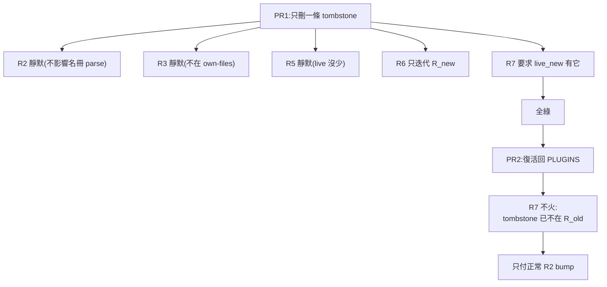
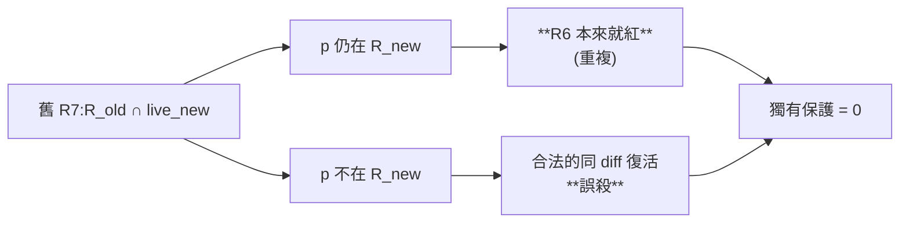

# CHG-20260816-02 — 墓碑不可靜默消失,並把散落的未結項目集中成帳本

- Project: skill-chinese-write
- Branch: claude/retired-invariant
- Date: 2026-08-16 (UTC+0)
- Type: 治理閘修正(取代舊 R7)+ 帳本集中
- Proposed by: `ACC-20260814-10` 明文「交審議席合議,不入本張」的遺留
- Implemented by: Claude Opus 5(Cowork session)
- Collaborators:
  - **OpenAI Codex(審議席)**——不變量的核心形狀 `R_old - R_new ⊆ live_new`,
    以及「不能因為需要兩次操作就視為安全」的定性
  - **Claude Fable 5(審議席)**——指出 codex 集合式寫法的縫(對 key 的斷言看不見值改寫)、
    舊 R7 的邊際貢獻為零、四個缺漏的測試端、以及帳本的最小形狀
  - **使用者**——帳本的「來源被移除時,記錄要一併刪除或告知」這條規矩
- Risk: 中(改治理閘的一條規則,無不可逆操作,不觸及 plugin id)
- Autonomy: 審議席決議
- Commit/PR: 分支 claude/retired-invariant(close-out 回填)
- Recurrence check: **重複**。「一起消失就是一致」的第二次——`CHG-20260814-10` 治的是
  plugin 消失,本張治的是**墓碑自己**消失
- Diagrams: 見 `## Design diagrams`
- Skill: ai-sdlc v1.35
- Related: CHG-20260814-10(建了 `RETIRED` 與 R5/R6/R7,並記下這兩個洞)

## 一、墓碑可以靜默消失

`ACC-20260814-10` 的 probe 實測:**「只刪 tombstone、不復活」→ 綠**。於是:

```
PR1  只刪一條 tombstone      → 全綠(該 id 本來就不在 PLUGINS 裡)
PR2  把該 id 復活回 PLUGINS  → R7 不火(tombstone 已不在 R_old 裡)
```

**R7 的保證是 per-diff 的,而歷史是跨 diff 的。**

「只刪 tombstone」這個 diff 對**每一條**既有規則都靜默:`RETIRED` 住在 `build_suite.py`
裡但不影響 `PLUGINS`/`COMMANDS` 的 parse(R2 靜默),不在任何 plugin 的 own-files 範圍
(R3 靜默),`live_old - live_new` 為空(R5 靜默),R6 只迭代 `R_new`,R7 要求 `live_new` 有它。

### 舊 R7 整條取代,不是加一條

審議席把 R7 的紅集(`R_old ∩ live_new`)二分:

| 情況 | 誰接 |
|---|---|
| p 仍在 `R_new`(復活了卻沒除名) | **R6 第一款本來就會紅**,R7 在這半是重複 |
| p 不在 `R_new`(同 diff 除名) | 這正是被 R7 **誤殺**的合法復活 |

**舊 R7 的獨有保護是零,獨有貢獻只有誤報。** 並存還會讓新規則的綠端再度不可達
——兩條規則互相咬,而這個 repo 有過「規則在自己的定義裡取消自己」的前例。

### 不變量:兩個析取支,概念上一條規則

> 對每個 `p ∈ R_old`:
> 要嘛 `R_new.get(p) == R_old[p]`(原封不動),
> 要嘛 `p ∉ R_new` **且** `p ∈ live_new`(整條移除,且同一個 diff 裡真的復活)。

第二半(值不可改寫)**不是附贈的第二條規則**:集合式的 `R_old - R_new ⊆ live_new`
是**對 key 的**斷言,改寫既有 id 的 CHG 值時 key 沒動、集合差為空,照樣通過。
少了它,集合式那半守不住帳本語意。

**代價寫明**:CHG id 打錯字一旦合入就永久不可改。per-diff 的閘沒有逃生口,
這與「歷史帳本不改寫」一致,但那是決定,不是疏忽。

## 二、散落的未結項目集中成帳本

47 條「殘留風險 / 記帳不修 / 未達標處」散在 11 張 ACC 裡,沒有集中登記處。
逐條驗證之後:**14 條早已解除**(被後續 CHG 修掉,或隨退役消失),
7 條是審議紀錄(不可回溯,不是待辦),17 條仍開放。

`BL-001~004` 被「既有債務不變」抄進三張 ACC——**兩份重複的東西靠人記得同步**,
本 repo 的第五次。

### 使用者定的規矩:來源消失,記錄要一併處理

> 單一記錄檔如果中間因為修改導致增加的被移除,那麼記錄中的增加項目也要一併刪除或告知已被移除。

這正是「一起消失就是一致」在帳本上的形狀:**留著的孤兒條目描述一個不存在的東西,
而它看起來和有效條目一模一樣。** `BL-104`/`BL-111` 就是這種——那六個 plugin 一退役,
它們的瑕疵跟著沒了,不是有人修好的,兩種解除的意義不同。

### 兩類條目的「來源」意思相反

| 類型 | 來源欄 | 來源不存在代表 |
|---|---|---|
| 風險型 | 風險住在哪個檔 | **該條過期**,要處理 |
| 待辦型 | 東西該建在哪 | **正常**,那正是它開立的原因 |

施工時我用描述性詞句去 grep 程式碼,把 `BL-001`(待辦型)誤判成來源消失。
探針要打在真實識別字上,而且要先分清楚條目是哪一類——這一筆寫進帳本檔頭。

**本帳本沒有閘在看。** 先把帳集中,值不值得機器看是另一個問題(審議席的線)。

## 驗收條件

1. 新不變量兩個析取支各有紅端,且**訊息互不匹配**
2. 綠端:刪墓碑**且同 diff 完整復活**(名冊 + 目錄 + entry + bump 全付清)
3. 綠端:**base 帶非空 `RETIRED` 的無關變更**——現有全部綠端案的 base 都沒有 `RETIRED`,
   「`R_old` 有條目就紅」這種寫錯在現有夾具下完全隱形
4. **案 37 不刪**,斷言改指 R6——換規則時最容易把舊規則的案子一起刪掉,那個形狀就無人看守
5. 基準判別性:綠端夾具在**舊 R7 的判準**下必須紅(直接證明不可達的綠端變可達)
6. 突變三發:拔掉任一析取支、把不變量寫反,各自只殺自己那一案
7. `backlog.md` 建立,17 條開放 / 14 條已解除 / 「來源已消失」區備妥
8. 每個數字附產生它的指令(KN-004)

## Design diagrams

### 兩 PR 洗白為什麼全綠



### 舊 R7 的紅集二分



## Status

已驗收 — ACC-20260816-02。八條驗收條件全部以附指令的原始輸出滿足;
突變三發各自命中,其中第二發殺兩案是案 45(訊息判別)在做事,不是失準。
