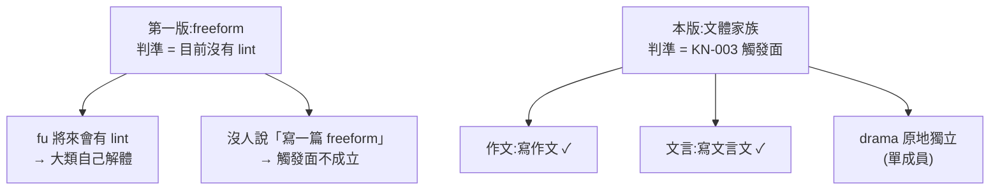

# CHG-20260816-03 — 八支文體依家族併成兩個 plugin(作文 / 文言)

- Project: skill-chinese-write
- Branch: claude/genre-families
- Date: 2026-08-16 (UTC+0)
- Type: 分組重整(退役 7 個已發布 plugin id,新增 2 個)
- Proposed by: **使用者**(依文體家族分組的裁示)
- Implemented by: Claude Opus 5(Cowork session)
- Collaborators:
  - **使用者**——分組方向(作文 / 歷史 / 藝術)、「可以調整為文言」「可以採取戲劇或藝術」
  - **Claude Fable 5(審議席)**——`poetry` 是新詩不是古典詩的事實糾正、兩條紅線、
    以及**對抗性覆核實測出中文 plugin id 的兩處 fail-open**
  - **OpenAI Codex(審議席)**——獨立得到同一結論(id 用 ASCII、顯示名稱用中文)
- Risk: 高(移除已發布 plugin id,不可逆)
- Autonomy: **人類裁決**——形狀由審議席定,merge 由使用者按
- Commit/PR: 分支 claude/genre-families(close-out 回填)
- Recurrence check: **部分重複**。退役機具與 `CHG-20260814-10` 同,但那批連 SKILL.md
  一起退;**本批 `skills/` 一個字都不動**,只改包裝
- Diagrams: 見 `## Design diagrams`
- Skill: ai-sdlc v1.35
- Related: CHG-20260814-10(建了 `RETIRED` 與 R5/R6/R7)、CHG-20260816-02(墓碑不變量)

## 起點:兩席先駁回了我的第一版

我原本要照 `fiction` 的模式把 8 支「沒有 lint」的文體併成一個 `freeform`。**兩席一致駁回**:

| 駁回理由 | 證據 |
|---|---|
| 主層沒東西可寫 | 五節內容 **9/9 各支不同**,共通只有 1 行 |
| 沒人會用那個名字找它 | 沒有使用者會說「幫我寫一篇 freeform」 |
| 判準被偷換 | 從「觸發面」偷換成「目前沒有 lint」,而 `fu` 將來會有 lint |

審議席的話:**詩、散文、劇本不是任何東西的細項,它們是與小說平級的大類。**

使用者隨後給了新方向——**依文體家族分組**,那是 KN-003 的正牌判準。

## 形狀

```
退役 7   prose、narrative、lyric、exposition、poetry、fu、historiography
新增 2   composition(作文)= prose + narrative + lyric + exposition + poetry + zh-style
         classical  (文言)= fu + historiography + zh-style
不動 2   drama、proposal
plugin   15 → 10
```

### `poetry` 的歸屬:使用者二次裁示,兩席互審後定案

**不進文言組**:它的 SKILL.md 寫「**現代詩、新詩**」、手法是「打破常規語法」,
**新詩不是文言**,沒有人會用「文言」去找新詩。

初版把它留成原地獨立。使用者隨後裁示新詩「**比較偏向藝術或作文**」,
於是兩席重新裁決,一度分歧:

| | codex 初裁 | fable |
|---|---|---|
| 歸屬 | 藝術(與 drama 同組) | **作文** |
| 組名 | 「詩歌與劇本」 | 藝術組不該成立 |

**codex 互審後三點全部改判,採 fable 案。** 決定性的論證是:

> KN-003 第一層量的不是「找不找得到」,是**安裝意圖存不存在**。
> 「我要練作文」是一個意圖,天然橫跨散文/記敘/抒情/說明;
> 而「詩歌與劇本」——**想寫詩的人不想要劇本,想寫劇本的人不想要詩**,
> 沒有任何一個使用情境橫跨這兩半。
>
> 而且列舉式命名是**萬能溶劑**:任何 N 個 plugin 都能釘成「A與B與C」,
> 照這規則,上一輪被三振的 `freeform` 只要改名叫
> 「散文與記敘與抒情與說明與賦與史傳與詩與劇本」就過關了。
> **一把什麼都能過的尺不是尺。**

我提的反例(`composition` 的 description 本身就是列舉)也被回答了:
**名字負責被找到,列舉負責讓人核對**;codex 的方案裡列舉**頂替**了不存在的類名,
那是**把成分表當品名**。

codex 反對進作文的理由「重意象、節奏、形式實驗」被判定**誤用了第二層**——
分組只走第一層,而 `composition` 不共用任何規則,只做打包。
這與本批 `exposition` 留在作文組是同一條判例。

**使用者最終確認:併入作文。**

### `drama` 的獨立從未被推翻

「藝術組加 poetry 就有兩個成員」只在**選了藝術組**的分支上成立。
poetry 歸作文後,drama 仍是單成員,「單成員合併收益為零」原封不動。
我一度以為新裁示推翻了它——那是條件式推翻,而條件未成立。

### 唐詩 / 宋詞:尚未存在,另立

repo 內**沒有**唐詩/宋詞 skill;唯一帶對仗與平仄的是 `fu`(賦 / 駢文),
使用者「印象中應該有個宋或唐」與現況不符,如實回報。

將來若建,依使用者裁示放 `classical`,且需**對仗、平仄、韻腳**三條規則對應。
**韻腳是 `fu` 沒有的維度**(賦不限韻,近體詩與詞牌嚴格押韻)——
所以它是獨立 skill 而非 `fu` 的擴充,兩席一致。
平仄字表可作共用資產(zh-style 型的第三層)。

### `exposition` 為什麼留在作文組

它的 SKILL.md 自承「`spec` 與 `architecture` 的模糊形容詞詞表可以借去用」,
但那是**規則實作層**的親緣(KN-003 第二層),不是**觸發面**的親緣(第一層)。
說「寫一篇說明文」的人在作文語境,不在規格書語境。plugin 分組跟著第一層走。

## 兩條紅線

1. **不照 `fiction` 模式轉 command。** `fiction` 敢轉,是因為主層 skill 的 description
   已逐一點名六流派、承接了「寫小說」;作文組**沒有主層**,轉了會失去自動觸發。
   **skill 必須留 skill。**
2. **不發明「作文」主層 SKILL.md。** 「主層沒東西可寫」的量測結論仍然有效——
   `composition` 就是 5 支文體 skill + zh-style,**沒有傘**。寫厚一個字都是憑空發明,
   而 `proposal` 那列的既有註記「規格來源太薄,不憑空發明」是同一條線的判例。

## plugin id 用 ASCII:兩處已量到的 fail-open

審議席這輪被指定**反過來打自己的提案**,它在乾淨 clone 裡把本形狀真的施工了一次。
中文 id 是它上一輪自己標「風險最高而未驗」的一項,**實測結果不是「可能出事」,
是已成立的 fail-open**。

根因:`core.quotepath=true`(git 預設,ubuntu CI 同)讓 `--name-only` 把 CJK 路徑
印成八進位跳脫 `"plugins/\344\275\234\346\226\207/test.txt"`。

```
同一筆「改 plugin.json、不 bump」的編輯
  writing → 紅         作文 → **靜默綠**       ← R3/R4 全盲
只改 plugins/作文/ 下的檔、marketplace 不 bump
  catalog_check --since → ✅「變動已 bump」    ← 說假話
```

成因:`tree_files()` 拿到引號路徑 → `blob_at()` 兩端都 None → `old == new` → 跳過;
`startswith("plugins/")` 對引號路徑不成立。
**那兩個新 plugin 的手寫檔會從 merge 那天起永遠不受版號閘管。**

平台層另有一條:官方文件對 plugin `name` 明定 kebab-case,非 ASCII 完全未提。

**兩席獨立得到同一修正案**:id 與目錄用 ASCII(`composition` / `classical`),
中文「作文 / 文言」放 description 與文件。
使用者裁示的是**分組與名稱**,沒有裁示機器 id 的字元集,故不違背「可以調整為文言」。

## 與 `CHG-20260814-10` 那批的關鍵差別

**`skills/` 一個字都不動。** 上一批連六份 SKILL.md 一起退,於是:

| | CHG-20260814-10 | 本批 |
|---|---|---|
| skill 內容 | 六份退役 | **零改動** |
| 自動觸發 | 由 `fiction` 主層 description 承接 | **8 個 description 全保留** |
| zh-style 連鎖 | 去字面化 → 15 宿主全 bump | **無**(內容沒變) |
| 版號連鎖 | 全 repo | 只有兩個新 plugin |

## 驗收條件

1. `PLUGINS` 移除 7、新增 2;`RETIRED` 七支具名
2. `skills/` 目錄**零改動**(以 `git diff --stat` 證明)
3. `build_suite --check` 歸零;`plugins/composition/` 與 `plugins/classical/` 各含
   自己的 skill 副本 + zh-style
4. R5/R6/R7 與 `CHG-20260816-02` 的墓碑不變量全綠;R6 三款各驗
   (名冊、磁碟目錄、marketplace entry)
5. 8 個 skill 的 description **逐支比對未變**(自動觸發不得損失)——`poetry` 併入 `composition` 之後仍是 8 支(退役的是 plugin,不是 skill)
6. plugin id 與目錄名**全為 ASCII**;中文只出現在 description 與文件
7. `docs/genres.md` 改成分組敘述;**標頭與 metadata 單獨列一輪**
   (`CHG-20260816-02` 記下的可預測盲區)
8. catalog major bump(移除已發布 id 是 breaking)
9. **commit 之後**再驗 `--since`
10. 每個數字附產生它的指令(KN-004)

## Design diagrams

### 分組判準:從實作狀態換成文體家族



### 為什麼 id 必須是 ASCII


## Status

已驗收 — ACC-20260816-03。十條驗收條件全部以附指令的原始輸出滿足;
紅端在真實退役上驗過兩輪(六支一輪、poetry 併入後單獨再一輪)。
