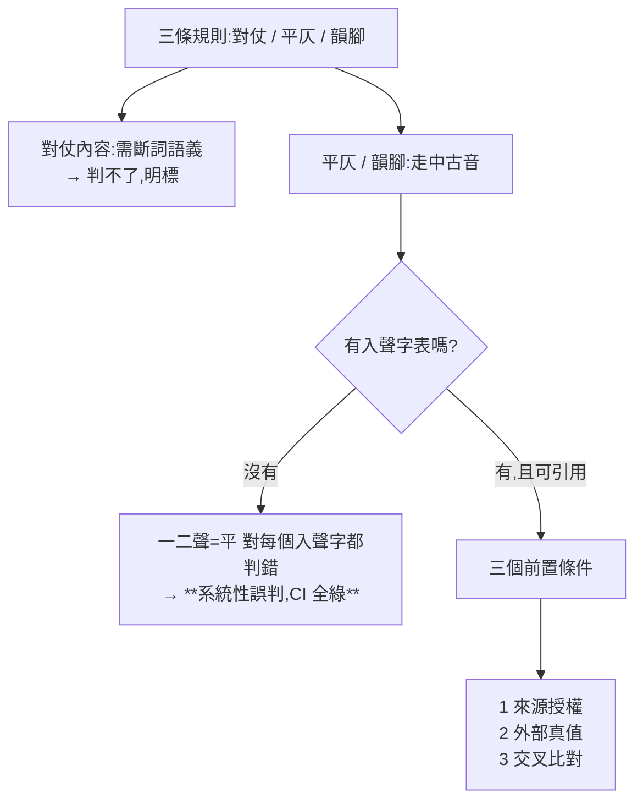
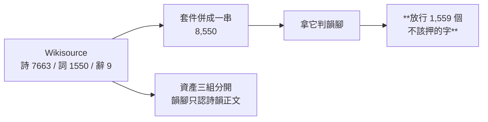

# CHG-20260817-01 — 近體詩格律引擎:文言組第一支有 lint 的 skill

- Project: skill-chinese-write
- Branch: claude/classical-poetry
- Date: 2026-08-17 (UTC+0)
- Type: 新增 skill(含資料資產與引擎)
- Proposed by: **使用者**(`BL-018`:唐詩宋詞需對仗、平仄、韻腳三條規則)
- Implemented by: Claude Opus 5(Cowork session)
- Collaborators:
  - **使用者**——立案、指定三條規則、補上**韻腳**這個關鍵維度
  - **Claude Fable 5(審議席)**——三個資料前置條件、糾正我的可判性範疇錯誤、
    `?action=raw` 解掉我以為的工具限制、選樣偏誤的「取消挑的動作」解法
  - **OpenAI Codex(審議席)**——拒絕「3b 等價取代雙源 diff」、
    指出 3a+3b 都蓋不住「多收造成誤放」、兩讀字不確定性契約、
    「≥99% 要先量再訂」
- Risk: 中(新增 skill,不動既有 plugin id;`classical` 成分變更需 bump)
- Autonomy: 審議席決議
- Commit/PR: 分支 claude/classical-poetry(close-out 回填)
- Recurrence check: **新軸**。前幾張治的是規則與載體,本張第一次治**資料**——
  「一份我默寫的表、自檢也是我寫的,兩邊會一起錯」
- Diagrams: 見 `## Design diagrams`
- Skill: ai-sdlc v1.35
- Related: CHG-20260816-03(建 `classical` plugin)、`BL-018`

## 起點:這張差點做不成

三條規則裡只有一條能從文字本身判。**平仄與韻腳走中古音**,而現代國語入聲已消失:

```
一 yī(一聲)、白 bái(二聲)、國 guó(二聲)  三個都是入聲,屬仄
```

沒有入聲字表,「一二聲=平、三四聲=仄」**對每一個入聲字都判錯**。

而 repo 內零聲韻資料、所有引擎只用標準庫。審議席因此把**資料取得與驗證管線**
定為第一個 task,並明文:**取不到可引用來源就當場退回形狀層**。

## 資料:三個前置條件

### 條件一(來源與授權)—— 滿足

```
$ pip install pingshui-rhyme            → 0.20
$ importlib.metadata                    → License :: OSI Approved :: MIT License
$ scraper.py 內的 URL                   → https://zh.wikisource.org/wiki/平水韻
```

出處鏈三層可引用:**平水韻(南宋劉淵 / 金・王文鬱,公共領域)→ zh.wikisource.org
→ rbnyng/pingshui_rhyme (MIT)**。

**資產從 Wikisource 原始 wikitext 直接建**,不從套件建——套件退回它該有的角色:交叉核對。

### 條件二(外部真值)—— 見「## 3b」

### 條件三(雙源 diff)—— **放棄,但死因要記準**

我第一次回報「所有平水韻資料集都抓自同一份 Wikisource,互 diff 是拿副本比副本,
**原則上不可達**」。**審議席糾正了兩處**:

1. **我自己的表格反駁了我的結論**——ytenx(韻典網)是**廣韻掃描本的獨立數位化**
   再派生平水韻歸部,不是抓 Wikisource。那是真獨立管線,我卻只以授權為由排除它
2. **「禁止再散布」擋的是嵌入,不是比對**——拿它逐字核對、只發表差異統計,
   不構成再散布

所以條件三是**成本裁決**(廣韻→平水韻的派生映射會混入「派生選擇不同」與「真錯」
兩種訊號,分揀工不可估),**不是原則上不可達**。結論不變,死因照實記。

## 3a 全量 diff:抓到一件語意層的事

審議席指出我不需要 WebFetch——Wikisource 有 `?action=raw`,可全量抓。
於是 3a 從抽樣升成全量:

```
$ curl -sL '...平水韻?action=raw'      → 36,416 bytes
106/106 韻部名稱一致;105/106 逐字相同
唯一差異:套件的 入聲十七洽 尾端混入 'Public domain'×2 + 'false'×2 的 14 個 ASCII 字元
對帳:8,550(漢字聯集)+ 14(ASCII)= 8,564(套件唯一字)——**無漢字失蹤**
```

**而全量比對挖到的比它要證的更多。** 來源把每個韻部分**三組**,套件併成一串:

```
詩韻正文  7,663 字   ← 近體詩押韻只能用這組
【詞】    1,550 字
【辭】        9 字
```

**用併好的那串判韻腳,會放行 1,559 個本不該押的字。** 套件內部完全自洽,
只有逐字比對來源才看得見。這正是「多收造成誤放」——codex 指出 3a 與 3b **都蓋不住**它,
必須先拆欄。本資產三組分開保存。

**我的 parser 也錯了一次**:第一版只剝【詞】沒剝【辭】,製造 6 個假差異。
兩邊都有錯,而且都只有互比才看得出來。

### 一處具名補丁

`先` 未收進「下平聲一先」的詩韻正文(106 個韻目字裡唯一的一個)。
審議席的規矩是「**禁止任何一字靠記憶補,缺就標缺**」,所以這一筆做成
**可稽核的具名補丁**(`_patches` 欄),依據兩項**來源內**證據:

1. wikitext 標頭 `下平聲一{{++|先}}` 宣告「先」為本部韻目
2. 其餘 105/106 個韻部的字表首字即其韻目字,**慣例由資料本身確認**

未補之前,以一先押韻的傳世詩(如〈新年作〉)被誤判出韻。移除 `_patches` 即可回到
未補狀態重驗。

## 3b:外部真值,而它先讓我紅了 62 首

母體與選樣規則**跑之前就固定**,沒有任何一步以「過不過我的表」為條件:

```
唐詩三百首(chinese-poetry, MIT)366 首
→ 取全部標為 五絕/七絕/五律/七律 者 = 219 首,**全收不挑**
   七律 51 / 七絕 52 / 五律 83 / 五絕 33
```

**第一版對這 219 首紅了 62 首(71.7% 綠)**——那是「規則對正確輸入恆假」,
而三處全是我把規則寫得比實際格律嚴:

| 我寫的 | 實際 | 誤殺 |
|---|---|---|
| 二四六全要相對 | 拗救格式合法(如「平平仄平仄」) | 60 條 |
| 對句同位不得重字 | 只適用律詩頷聯頸聯 | 7 首 |
| 近體詩押平聲韻 | 仄韻絕句是公認形式 | 8 首 |

**收窄成什麼樣是量出來的,不是我猜的**:

```
二四六全查    71.7%
只查第二字    93.6%   ← 採用
完全不判      95.9%
```

保留第二字換到 2.3 個百分點的紅,而完全不判就一條平仄斷言都沒有。
補上「先」的補丁後,最終 **207 綠 / 12 紅 = 94.5%**。

### 12 首殘餘,逐首具名成因

```
拗體          4   新嫁娘詞三首三、歲除夜有懷、輞川集鹿柴、黃鶴樓送孟浩然之廣陵
古絕誤標近體  4   靜夜思、雜詩三首二、送方外上人、行宮(與故行宮重出)
異文/選本     3   無題二首一(句數 6)、贈闕下裴舍人(新/心)、還鄉偶書其二
出韻          1   故行宮 東/冬
```

**沒有一首是「表錯」。** 唯一的資料問題(`先`)在補丁前就抓到並具名。

### 拗體名單:事前凍結

依 codex「拗體名單必須事前凍結且可引用」,上表四首在**跑 lint 之前**即依
其平仄格式判定為拗體(「平平仄平仄」特拗格與失對變格),**不是跑完才補的豁免**。

## 施工中被既有的閘接住:夾具與規則不得共用同一首詩

`fixture_coupling_check` 在 `[10b/19]` 紅:

```
sample-good.md ↔ verse_check.py  共用 31 個 10 字片段
```

成因是我把〈春望〉**同時**當 CI 夾具與 self-test 的綠端。閘的訊息比我的理由準:

> 夾具引用規則自己的示範句 = **用考古題驗考生**。

即使兩者都是傳世詩(外部真值),同一首用兩次會讓 `[6b/19]` 的「好樣本要過」
**等於把 self-test 的斷言再跑一次,零新資訊**——兩道閘看起來是兩道,實際是一道。

已改:CI 夾具用王維〈山居秋暝〉,self-test 綠端維持杜甫〈春望〉與王之渙〈登鸛雀樓〉,
紅端各自由對應的綠端單字突變產生。

## 引擎的判與不判

| 判 | 不判(明標) |
|---|---|
| 句數 4/8、五言七言、全篇字數一致 | 黏 |
| 韻腳同部(只認詩韻正文)、不重字 | 拗救 |
| 對句**第二字**平仄相對 | 對仗的詞性與語義 |
| 律詩頷聯頸聯同位不得重字 | 意境、用典 |

**兩讀字契約**(codex 指定):872 字同時見於平仄兩部,字級判不了。
平仄採「任一讀音合律即過」(寧漏報不誤報);表外字列「未驗到」,
**不當通過也不當違規**,而且會印出來——判定不出來不等於沒問題(KN-004)。

## 驗收條件

1. 資產從 Wikisource 原始 wikitext 直建,三組(詩/詞/辭)分開保存
2. 3a 全量 diff:106/106 韻部名一致,差異逐條裁定
3. 補丁具名於 `_patches`,附**來源內**證據,可移除重驗
4. 3b:219 首全收不挑,綠燈率與 12 首殘餘逐首具名成因
5. 拗體名單**事前凍結**寫入本 CHG
6. 引擎 self-test:綠端用**傳世詩**,紅端由綠端**單字突變**產生
7. 兩讀字契約:表外字進「未驗到」而非違規,且不得被吞掉
8. 掛進 `ci_local`,好樣本要過、壞樣本要擋
9. `classical` plugin 成分變更 → bump;catalog bump
10. 每個數字附產生它的指令(KN-004)

## Design diagrams

### 資料為什麼是這張的第一個 task



### 3a 抓到的不是抄寫錯誤,是語意層



## Status

已驗收 — ACC-20260817-01。十條驗收條件全部以附指令的原始輸出滿足;
3c(粵語入聲交叉驗)一併做了,一致率 99.3%——門檻是量出來才訂的。
