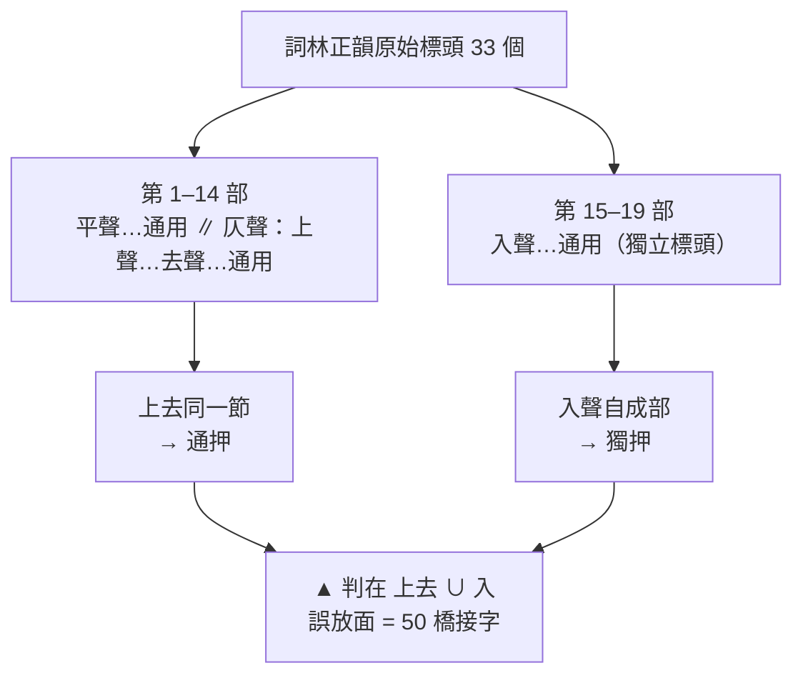
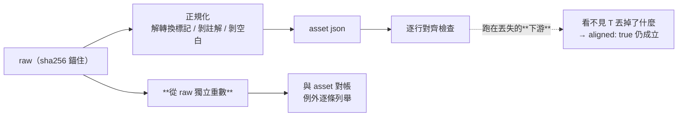

# CHG-20260817-02 — 宋詞格律引擎：文言組第二支有 lint 的 skill

- Project: skill-chinese-write
- Branch: claude/ci-poetry
- Date: 2026-08-17 (UTC+0)
- Type: 新增 skill（含資料資產與引擎）
- Proposed by: **使用者**（`BL-021`；源頭是「唐詩宋詞還需要所謂的韻腳」）
- Implemented by: Claude Opus 5（Cowork session）
- Collaborators:
  - **使用者**——立案、補上「韻腳」這個決定性維度、裁示分組與命名
  - **Claude Fable 5（審議席）**——三次資料實錘（baixiang 靜默掉 4 個句對而仍回報
    `aligned: true`、cilin 有 677 個釋義字污染 106/115 張表、`pian` 欄位 off-by-one）、
    「`仄`→`上去` 改名 + 三類標籤入契約後引擎才動工」的先後裁定
  - **OpenAI Codex（審議席）**——「先把 `平 / 上去 / 入` 寫進資料契約再接引擎」、
    3b 三條驗收線的訂定（**不訂通過率門檻**）、以及本張的**不可落地**裁決
- Risk: 中（新增 skill；`classical` 成分變更已 bump）
- Autonomy: 審議席決議
- Commit/PR: 分支 claude/ci-poetry；**尚未開 PR**（見 `## Status`）
- Recurrence check: **同軸再訪**。`CHG-20260817-01` 第一次治資料，本張治的是
  **轉換**——「sha256 錨住了輸入，沒錨住轉換」
- Diagrams: 見 `## Design diagrams`
- Skill: ai-sdlc v1.35
- Related: `CHG-20260817-01`（近體詩）、`CHG-20260816-03`（建 `classical`）、`BL-021`

## 詞跟近體詩差在哪，為什麼不能共用 `regulated-verse`

| | 近體詩 | 詞 |
|---|---|---|
| 句式 | 定句定字（4/8 句，五言或七言） | **由詞牌決定**，每牌不同 |
| 韻書 | 平水韻 106 部 | **詞林正韻 19 部** |
| 韻位 | 偶數句末，一韻到底 | **由譜標定**，可換韻 |
| 平仄 | 對句相對 | **逐字對譜**，且有 `⊙` 可平可仄 |

四條全不一樣。共用規則檔會兩邊互相誤殺。

## 決定性的一條：聲類三分「平 / 上去 / 入」

**上去通押、入聲獨押。這不是學術意見，是戈載的分部結構。**
證據在來源本身，不在任何人的主張：

```
$ python -c "…掃 cilin 原始標頭…"
第 1–14 部   平聲：…通用   ∥   仄聲：上聲…去聲…通用   ← 上去同一節
第 15–19 部  入聲：…通用                              ← 獨立成部、獨立標頭
33/33 個標頭全部匹配，無一例外
```

所以資產把 65 個原標「仄」的韻目**改名為「上去」**，並讓每個韻目帶 `tone` 欄。
`▲` 位在 `上去 ∪ 入` 聯集域求共同部。

**殘餘誤放面是可量的**：

```
△ 域 26 / ▲ 域 106 = 橋接 50 + 舒only 30 + 入only 26
```

非橋接字不可能跨舒入，混押組天然無共同部；**會被誤放的恰好是那 50 個橋接字**，
名單具名在 `cilin.json` 的 `_stats.bridge_chars`。

**不採「依詞牌要求選上去或入」**——白香的 `▲` 不分域，「某牌要求入聲韻」是
欽定詞譜層級的外部知識，造它就踩了「禁止自行造規則資料」的紅線。

## 第二條：韻組按連續同符號 run 切

菩薩蠻若把整首的 `△` 併成一組會**假陽性**：

```
run1 ▲ 織碧 → 第十七部    run2 △ 樓愁 → 第十二部
run3 ▲ 立急 → 第十七部    run4 △ 程亭 → 第十一部
pooled △「樓愁程亭」→ 無共同部
```

那是**換韻，不是違規**。組內求共同部，組間完全不比較。

## 資料：這張治的是「轉換」，不是「輸入」

`CHG-20260817-01` 用 sha256 錨住來源。本張被審議席抓到那還不夠：

> **sha256 錨住了輸入，沒錨住轉換。**

三處實錘，全部是**我的檢查跑在轉換的下游，看不見轉換丟掉了什麼**：

| 症狀 | 根因 | 為什麼閘沒紅 |
|---|---|---|
| 西江月靜默少 3 個句對，仍回報 `aligned: true` | 巢狀 `-{叶}-` 轉換標記未先解 | 逐行檢查跑在丟失之後 |
| 鷓鴣天少 1 個句對 | 行內全形空白未剝 | 同上 |
| 106/115 張表混入 677 個釋義字 | 全形括號註解未剝 | 同上 |
| `pian` 欄位 off-by-one | 片界推導錯 | 無人重算 |

改法是**守恆記帳**：從 raw 獨立重數，跟資產對帳，例外逐條列舉：

```
baixiang  raw_pairs 1528 == asset 1528
          raw_symbols 7250 == asset 7250
          raw_symbols_naive_total 7255 − legend_exemption 5 = 7250
cilin     19 部 / 5,046 字，豁免 2 條已生效
```

每個數字都附 `reproduce` 指令（KN-004）。

## 引擎的判與不判

| 判 | 不判（明標） |
|---|---|
| 啟用牌的句數、每句字數 | 未啟用牌 → 「非本工具所收白香體／未判定」 |
| 韻組（`△▲` run）內同詞林部 | 同牌異體（欽定詞譜 2304 體） |
| `○●` 位置的平仄（`⊙` 一律放行） | 換韻的合法性、通叶「平仄兩組須同部」 |
| | 領字、去聲位、片界、表外字 |

**「未收之體」不是違規。** 輸出「未判定」，不報錯、不硬猜最近的牌——
誤殺會教人忽略這道閘（KN-002）。

## self-test 八類夾具

```
1 未收牌名→未判定    2 未啟用牌→未判定    3 句數不符      4 字數不符
5 菩薩蠻譜例綠端      6 菩薩蠻四韻組 run 回歸（含 pooled △ 必須無共同部的反向斷言）
7 念奴嬌已知診斷      8 間∉第一部 且 間∈第七部（**帶正控**）
```

第 8 條的正控是必要的：只斷言「間 ∉ 第一部」會在資料整張消失時照樣綠——
**全域缺席的斷言恆真**。加上「間 ∈ 第七部」才讓它有紅端。

## 九個啟用牌的譜例：8 綠 1 紅，那 1 紅不寫「錯」

念奴嬌的譜例是**薩都剌〈登石頭城〉**（我先前口誤記成蘇軾〈大江東去〉，已更正），兩處紅皆具名：

```
韻組 ▲ 物壁雪傑發滅發月   壁屬第十七部、其餘七字屬第十八部
第 20 句第 3 字「一」      譜為 ○（平），而「一」是入聲
```

輸出「**依詞林正韻無共同部**」而不是「錯」。詞林正韻成書於 1821 年，
比薩都剌晚近五百年——**用後世的韻書量前代的作品，量出來的是差異，不是錯誤**。

也因此驗收線**不訂「名家範例 100% 通過」**：那條線會逼人回頭改資料去迎合引擎。

## 施工中被既有的閘接住一次

`[10b/19]` 紅在 `sample-good.md ↔ ci_check.py` 共用 10 字片段。
成因是我在夾具註記裡引了 self-test 綠端的首句——
**「說明我們刻意不共用」的那句話自己造成了共用**。規矩對自己也生效。

## 驗收條件

1. 聲類三分寫進資料契約，改名依據**來源結構**且可重現
2. 誤放面可量並具名（50 個橋接字）
3. 韻組 run 切法有**反向斷言**（pooled 必須紅），且突變 run 切法時 self-test 要轉紅
4. 守恆記帳：raw 獨立重算 == 資產，例外逐條列舉，每數字附指令
5. self-test 八類全過，且無恆真／恆假斷言
6. CI 夾具綠端用**外部真值**、紅端由它**單字突變**，且與 self-test 綠端不同首
7. 九牌譜例逐牌具名紅／未判定
8. 掛進 `ci_local [6c/19]`、`classical` plugin、`docs/genres.md`
9. `classical` 成分變更 → bump；catalog bump
10. **3b：chinese-poetry 宋詞全樣本**——見下

## 3b：**未跑**。審議席裁定本張因此不可落地

母體與三條驗收線在跑之前就固定（codex 訂，**不訂通過率門檻**）：

```
全樣本必須完成判定且無靜默未驗
每個不通過案例必須可重現、列出逐字部屬及具名成因
版本更新不得新增未解釋的退步
```

**取不到母體。** GitHub 整站對本機回 429：

```
$ curl -sI https://raw.githubusercontent.com/chinese-poetry/chinese-poetry/master/README.md
HTTP/1.1 429 Too Many Requests

$ curl -sL -o /dev/null -w "%{http_code}" \
    https://codeload.github.com/chinese-poetry/chinese-poetry/tar.gz/refs/heads/master
429
```

22 個分片全數失敗。**沒有加速重試**——那只會延長封鎖。

審議席（codex）裁決：

> **不可落地（不可 merge／發版）。** 429 是外部阻塞，不是驗收通過。
> 19/19 CI 與 8 案 self-test 不能替代 21,050 首母體的 3b；三項驗收目前皆屬「未判定」，
> 尤其無法證明版本沒有新增未解釋退步。可保留分支並建立具名阻塞條目，
> **但不能把必要驗收降格成後續白條**。

因此本張**不轉 ACC、不開 PR**，並在 `backlog.md` 立 `BL-023` 為具名阻塞條目。

## Design diagrams

### 為什麼「上去通押、入聲獨押」是資料說的，不是我說的



### 為什麼 sha256 不夠



## Status

**已驗收 — `ACC-20260817-02`。** 第 10 條(3b)當時因 GitHub 429 取不到母體而阻塞,
審議席裁定不可落地。**後續已解除**:母體改為**宋詞三百首**——原母體 chinese-poetry 宋詞
是簡體,33.8% 字次不在繁體詞林表內,而簡→繁一對多會把轉換歧義混入引擎誤差。
換母體的理由在看結果前成立,由審議席裁定並訂五條合格條件。`BL-023` 已解除。
