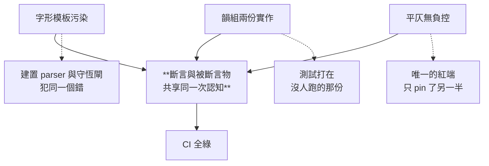
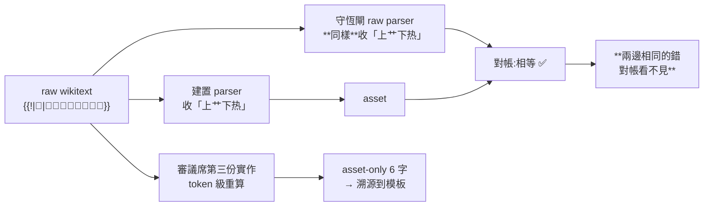

# CHG-20260817-03 — 詞資產與引擎二讀:三處「一起錯就是一致」

- Project: skill-chinese-write
- Branch: claude/ci-poetry
- Date: 2026-08-17 (UTC+0)
- Type: 修正(資料勘誤 + 測試面補洞 + 帳目更正)
- Proposed by: **審議席**(`CHG-20260817-02` 的二讀覆核)
- Implemented by: Claude Opus 5(Cowork session)
- Collaborators:
  - **Claude Fable 5(審議席)**——token 級獨立重算揪出**字形結構模板污染**
    (raw-only 0 / asset-only 6,溯源到全檔僅有的兩個 `{{!|…}}`);
    並糾正我對入聲口徑的過重自訴(**資料本來就把入獨立成類,受影響的只有 `_stats` 的
    operative 標籤**——「過重的指控會誤導下一手把它當成資料缺陷去『修』」)
  - **OpenAI Codex(審議席)**——判「守恆閘仍是**成品與自稱一致**,不是 raw→asset 守恆」;
    突變實測揪出**韻組切法有兩份實作**與**整段平仄檢查沒有負控**
- Risk: 中(改動已 commit 的資料資產數值;引擎規則本身不放寬)
- Autonomy: 審議席決議
- Commit/PR: 分支 claude/ci-poetry(close-out 回填)
- Recurrence check: **同軸第三訪,而且是最深的一次**。`-01` 治資料、`-02` 治轉換,
  本張治的是**驗證者與被驗證者共用同一個錯誤認知**——
  三處全部符合同一個形狀:**斷言與被斷言物出自同一次認知,錯會成對地錯,而 CI 全綠。**
- Diagrams: 見 `## Design diagrams`
- Skill: ai-sdlc v1.35
- Related: `CHG-20260817-02`(本張修的對象)、`CHG-20260817-01`、`BL-023`

## 三處缺陷共用同一個形狀

| # | 缺陷 | 為什麼原本綠 |
|---|---|---|
| 1 | 字形結構模板的**描述文字**被當韻字收進表 | 資產建置與守恆閘的 raw parser **犯同一個錯** |
| 2 | 韻組切法有**兩份實作**,self-test 打在沒人跑的那份 | 兩份看起來一致,測試面只覆蓋其中一份 |
| 3 | 整段平仄檢查**沒有負控** | 唯一會紅的案子只 pin 了它的另一半訊息 |

三者都不是「規則寫鬆」,是**測不到**。而測不到的成因都是同一個:
**檢查與被檢查的東西共享了一次認知。**

## 一、字形結構模板污染(資料勘誤)

來源 wikitext 用 `{{!|字|字形描述}}` 表示罕字:

```
{{!|𣘼|上「啟」下「木」}}      第三部  上去
{{!|𦶟|上「艹」下「热」}}      第十八部 入
```

**第二引數是描述,不是韻字。** 舊 parser 把它當字表文字處理,於是:

```
$ python - <<'PY'   # 逐字對照舊/新資產(完整腳本見 ACC)
字   舊版身分                                  新版身分
上   第二部上去 / 第三部上去 / **第十八部入**    第二部上去
下   第十部上去 / 第三部上去 / **第十八部入**    第十部上去
木   第三部上去 / 第十五部入                    第十五部入
𣘼   (不在表內)                                第三部上去
𦶟   (不在表內)                                第十八部入
```

真字 `𣘼 𦶟` 反而被丟掉——`CJK` 字元類別寫成 `[㐀-鿿]`,**不含 Ext-B(U+20000 以上)**,
那兩個字落在類別外。

### 為什麼這個污染落在最要命的位置

被污染出來的 `上 / 下 / 木` 全部成為**橋接字**(同時具入聲與非入聲身分),
而橋接字正是「入聲獨押」這條宣稱的**殘餘誤放面**。實測的假綠:

```
$ 舊版「月發閱上」入聲域共同部 = {第十八部}   → **四字視為可同押**
$ 新版「月發閱上」入聲域共同部 = 無           → 正確判無共同部
```

`月 發 閱` 是真入聲字,`上` 不是——舊表會放行一組本不該成立的韻。

### 守恆閘當時是綠的

`assets_verify.py` 的 raw parser **也沒有處理 `{{!|…}}`**。兩邊一起把描述當韻字,
於是 raw 側與 asset 側都算出同一個錯值,守恆等式成立。

**這正是「raw→asset 雙向對帳」也擋不住的那一層**:對帳能抓住兩邊**不同**的錯,
抓不住兩邊**相同**的錯。抓到它的是審議席用**第三份獨立實作**做的 token 級重算。

### 帳目連動

| 欄位 | 舊 | 新 |
|---|---|---|
| `tokens` | 5561 | 5557 |
| `unique_chars` | 5046 | 5048 |
| `escape_partition.bridge` | 50 | **47** |
| `escape_ze_union` | 106 | 103 |
| `multi_part_any_tone` | 147 | 144 |
| `multi_part_within_tone` | 132 | 129 |

`_stats.revision_note` 寫明**舊那組數字是錯的**,凡引用「50 個橋接字」處皆須改 47。

### `_exemptions` 現在是空的,而空是有意義的

舊版列了兩條豁免(第十八部九屑的 `热`、`艹`),理由寫成「簡化字」「部首,不是韻字」。
**那個理由是錯的**——它們根本不是來源韻字,是模板 `{{!|𦶟|上「艹」下「热」}}` 的描述碎片。
模板解對之後,這兩個字**整個不再出現,它們的來源消失了**。

依 `docs/writing/backlog.md` 的規矩,來源消失的條目必須刪除或註明被誰移除,不得留著——
留著的孤兒條目描述一個不存在的東西,而它看起來和有效條目一模一樣。
故改為 `removed_by: CHG-20260817-03`,`tokens_before: null`。

## 二、韻組切法有兩份實作(測試打在沒人跑的那份)

`rhyme_runs()` 是共用函式,而 `check()` 裡**另外內聯了一份**。self-test 的 run 回歸
(案 6)呼叫的是 `rhyme_runs()`,**引擎實際跑的是內聯那份**。

突變實測(同一個突變,分別打兩份):

```
舊版 self-test 基線                                    rc=0
  突變 A 打 check() 內聯版(只併 ▲、保留 △)            rc=0  ← **存活,假綠**
  突變 A' 打 rhyme_runs()(有被測的那份)                rc=1  ← 被殺
```

**兩份實作,測到的永遠是沒人跑的那份。** 已刪除內聯版,`check()` 改呼叫 `rhyme_runs()`:

```
新版(唯一一份)  突變 A  rc=1  ← 被殺
```

### 光合併還不夠:▲ 側原本沒有回歸

原本的 run 回歸(案 6)用菩薩蠻,而**菩薩蠻兩個 ▲ run 都在第十七部**——
pool 起來仍有共同部,所以「只併 ▲、保留 △」的突變**照樣過**。
補上案 `6b/6c` 用虞美人(了少 第八部 / 在改 第五部,pool 起來必紅),
▲ 側的 run 切法才有負控。

## 三、整段平仄檢查沒有負控

全測試面唯一會出現平仄紅的是案 7(念奴嬌譜例),而它**只斷言了韻組那半**
(`無共同部`),沒有斷言平仄那半。

```
舊版  突變 B 把整段 ○● 檢查改成 pass    rc=0  ← **存活,八案全過、CI 夾具全綠**
新版  同一個突變                        rc=1  ← 被殺
```

**一條規則可以被整段刪除而沒有任何測試發現,那條規則等於沒有被測。**
案 7 補上第二條斷言:念奴嬌第 20 句第 3 字「一」的平仄紅必須出現。

## 四、`CHG-20260814-07` 的 Status 說了假話(具名更正)

```
CHG-20260814-07  Status:「施工中 — 待 ACC-20260814-07。」
ACC-20260814-07  結論:「通過(二讀)。」
該張                已 merge(632cbe4 / #17)
```

**已驗收、已 merge,而帳面說它還在施工。**

`doc_integrity_check` 只檢查 `## Status` 這一節**存不存在**,不檢查它說什麼。
「施工中」不是可辨識的佔位字串,是一句**看起來完整的假陳述**——
這與本張其他三處同形:**外觀完好,內容失效**。

本張把它改為已驗收並具名於此,**不靜默修**。
「Status 與 ACC 存在性一致」目前**沒有閘在看**,列為 `BL-024`。

## 五、夾具的「外部真值」自稱講過頭了

`sample-good.md` 原本寫:

> 這首是外部真值,**不是我造的**。

而它與 `baixiang.json` 裡〈清平樂〉的譜例**是同一首詞,八句逐字相同**:

```
$ 譜例 春歸何處 / 寂寞無行路 / 若有人知春去處 / 喚取歸來同住 /
       春無蹤跡誰知 / 除非問取黃鸝 / 百囀無人能解 / 因風飛過薔薇
$ 夾具 同上,逐字相同
```

**閘沒有失效**——引擎只比長度與符號,不比對譜例的字,所以夾具過關不是因為它抄了答案。
但「外部真值」四個字宣稱的是**獨立性**,而獨立性到此為止。已改寫成把這件事講明,
理由是不寫的話下一個審的人會重新發現一遍——**這與本張其他四處同形:陳述比事實大。**

## 六、`classical` 版號補 bump(`CHG-20260817-02` 漏的)

`3db180c` 把 `ci-poetry` 加進 `classical` 卻沒有 bump,版號閘因此在本輪才紅:

```
$ python scripts/version_impact_check.py --since a4dca28
✗ plugin「classical」的版號沒有遞增(entry 1.1.0 → 1.1.0),但它有 2 個變更理由:
  PLUGINS 成分變了(…+ 'ci-poetry');它打包的 skill「ci-poetry」內容變了
```

已補:`classical` `1.1.0 → 1.2.0`(新增一支 skill,minor),plugin.json 與 marketplace
兩處同步,description 加上「詞」。**這是上一張漏的,記在本張,不追認為上一張已完成。**

### 這兩筆不是我改的

第五、六兩節的檔案改動,以及 `plugins/classical/` 的同步,是**併行的審議席 session
在同一個工作樹裡做的**(`marketplace.json` 的 mtime 晚於本張 CHG 建立時間,
而 `ci_local.sh` 只跑 `build_suite.py --check`,不寫檔)。

我沒有依來源決定收不收,而是**逐項驗內容**:〈清平樂〉同源以逐句比對證實、
版號 bump 由版號閘的紅燈證實。兩筆都正確,故一併納入本張並具名。

## 這張沒有做的事

- **3b(宋詞外部真值)仍未跑**,`BL-023` 不動。本張只修二讀發現的缺陷,
  **不解除阻塞**——`BL-023` 的解除條件是三條驗收線全綠,不是「又修了一輪」。
- 詞的**入聲能否與上去通押**仍是待裁(`_stats.ze_definition` 已記),列為 `BL-025`。
- **沒有補上「第三份獨立實作」的機制。** 本張這個污染是靠審議席另寫一份重算抓到的,
  而下一次未必有人這麼做——raw→asset 對帳的能力邊界(抓不到兩邊相同的錯)
  **維持原樣並具名**,列為 `BL-026`。修不掉的東西要說它修不掉,不是假裝閘變強了。

## 驗收條件

1. `{{!|…}}` 模板在**資產建置與守恆閘兩側**都解對;`𣘼 𦶟` 進表,`上下木` 的假身分消失
2. `CJK` 類別涵蓋 Ext-B,以 `𣘼 𦶟` 在表內作正控(否則斷言退化成「整段丟掉也算過」)
3. `_stats` 全組數字重算,並寫明舊值錯在哪(`revision_note`)
4. `_exemptions` 依「來源消失」規矩處理,`removed_by` 具名
5. `check()` 不得保留第二份 run 切法;突變 A 在新版**必須被殺**
6. ▲ 側 run 有獨立回歸,綠端用**▲ 換到不同仄部**的牌(虞美人)
7. 平仄檢查有負控;突變 B 在新版**必須被殺**
8. 模板污染有回歸案(`9` / `9b`),含「月發閱上」這個真實假綠實例
9. `CHG-20260814-07` 的 Status 具名更正,未被閘涵蓋處開 `BL-024`
10. 夾具的「外部真值」自稱改成與事實相符;`classical` bump 至 `1.2.0`,
    `ci_local.sh` 19 步全綠(**commit 之後**再驗 `--since`,依 `BL-014`)
11. 每個數字附產生它的指令(KN-004);`BL-023` **不解除**

## Design diagrams

### 三處缺陷的共同形狀



### 為什麼守恆閘擋不住模板污染



## Status

施工中 — 待 ACC-20260817-03。
