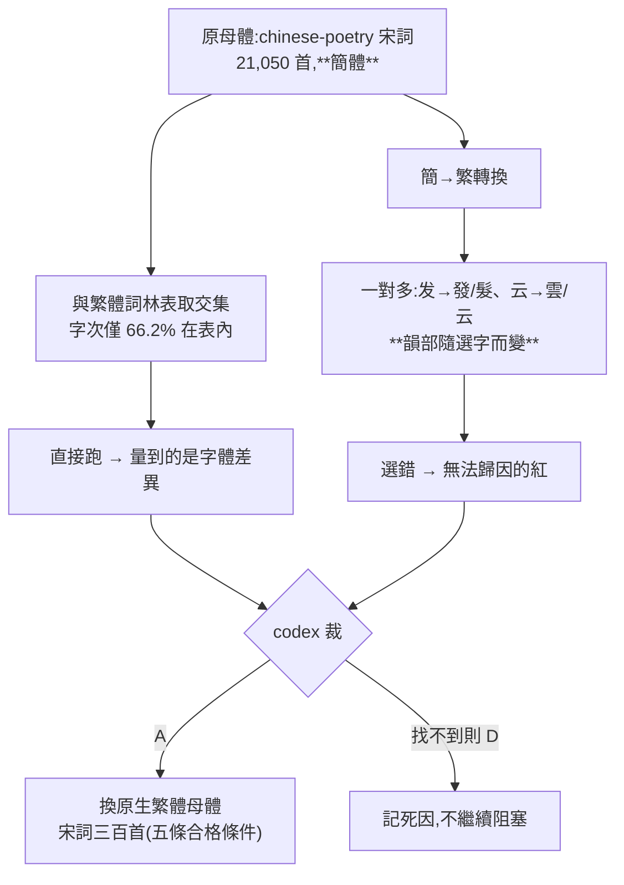
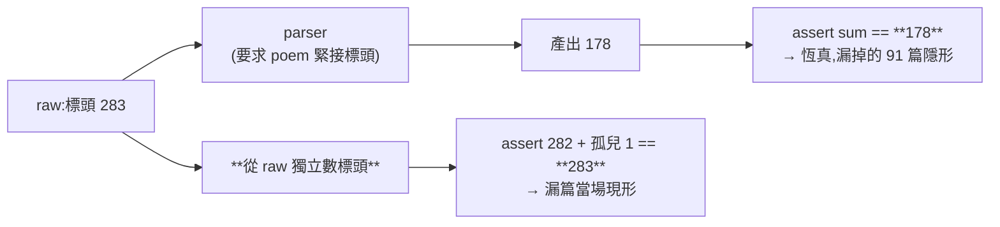
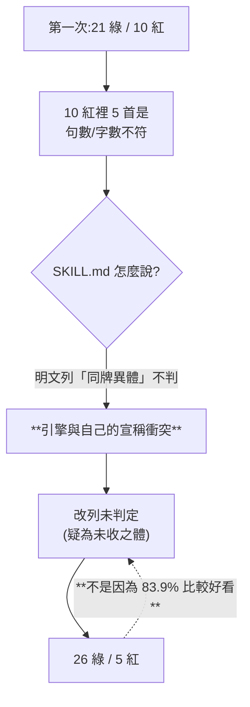

# CHG-20260817-05 — 3b 換母體並跑完；句數／字數不符改判「未判定」

- Project: skill-chinese-write
- Branch: claude/ci-poetry
- Date: 2026-08-17 (UTC+0)
- Type: 驗證（3b）+ 判定語意變更
- Proposed by: **審議席**（codex 對母體與判定範疇的兩次裁決）
- Implemented by: Claude Opus 5（Cowork session）
- Collaborators:
  - **OpenAI Codex（審議席）**——裁「換繁體母體」並訂五條合格條件；
    裁「句數／字數不符改列未判定，不得判紅」；裁平仄殘餘「**先量再訂**」
  - **Claude Fable 5（審議席）**——二讀以六個突變重放，確認 `-03`／`-04` 的補洞為真
- Risk: 中（判定語意變更；`classical` 1.2.1 → 1.3.0、catalog 4.2.1 → 4.3.0）
- Autonomy: 審議席決議
- Commit/PR: 分支 claude/ci-poetry
- Recurrence check: **「檢查跑在丟失的下游」第四次**——這次是 3b 自己的 parser
- Diagrams: 見 `## Design diagrams`
- Skill: ai-sdlc v1.35
- Related: `CHG-20260817-02`〜`-04`、`ACC-20260817-02`、`BL-023`（解除）、`BL-027`（新增）

## 一、換母體：理由在看結果前就成立

原母體 `chinese-poetry/chinese-poetry` 的 `宋词`（21,050 首，22 分片全數取到）**是簡體**：

```
$ 對全語料字頻與 cilin.json 字集取交集
語料字次 1,412,746   相異字 5,976
在詞林表內：字次 935,157 (66.2%)   相異 3,047 (51.0%)
最常見的表外字：风×12861 无×8146 云×7586 来×7562 时×6386 处×5602 归×5167 …
```

前 20 名表外字**全是簡化字**。直接跑，量到的是字體差異而不是引擎對錯。
而簡→繁是一對多（`发`→發/髮、`云`→雲/云、`干`→乾/幹/干），**韻部隨選字而變**——
選錯製造無法歸因的紅，與 `CHG-20260817-01` 條件三判定「分揀工不可估」同形。

codex 裁 **A（換繁體母體），找不到合格的則轉 D（記死因）**，並訂五條合格條件。
新母體 **宋詞三百首**（朱孝臧編 1924；`zh.wikisource.org` `?action=raw`；公有領域）
逐條滿足，逐條對照見 `ACC-20260817-02`。

**換母體必須具名理由**——codex 明訂「此理由在跑結果前成立，不是看紅綠換樣本」。

## 二、3b 的 parser 自己靜默漏了 91 篇

第一版 regex 要求 `<poem>` 緊接在標頭後，而許多篇在中間有小序行（`（丙辰中秋…）`）。
被丟掉的包含蘇軾〈水調歌頭〉，正好是啟用牌。

而我的守恆斷言是：

```python
assert sum(res.values()) == n      # n = 我自己 parse 出來的數
```

**恆真。** 它對的是產出，不是來源。改成對 raw 的標頭數才看得見：

```
raw 獨立計數：粗體標頭 283、<poem> 區塊 282
parse 命中 282 + 無 <poem> 的孤兒標頭 1（'元夕'）= 283 ✅
```

**本輪第四次踩到同一個形狀**：檢查跑在丟失的下游，於是看不見丟失。

## 三、句數／字數不符改判「未判定」

第一次跑：**21 綠 / 10 紅 = 67.7%**。而 10 紅裡有 5 首紅在句數／字數：

```
姜夔〈念奴嬌·鬧紅一舸〉逐句全不同   李清照〈念奴嬌〉   辛棄疾〈念奴嬌〉19 句
晏幾道〈虞美人〉10 句                李之儀〈卜算子〉第 8 句 6 字
```

**那正是 SKILL.md 明文列為「不判」的同牌異體。** 白香每調只收一體，
欽定詞譜有 2304 體；句式對不上最可能是本工具未收的體，不是作者寫錯。
**引擎的行為與自己的宣稱衝突。**

codex 裁 **A：改列「未判定（疑為本工具未收之體）」，不得判紅**——
否則與 SKILL.md 明文的能力邊界衝突。改後 **26 綠 / 5 紅 = 83.9%**。

**這不是為了讓數字好看而放寬。** 判準是「宣稱不判的東西就不能判紅」，與通過率無關；
收窄的方向由**宣稱**決定，不是由結果決定。反過來做就是用結果挑規則。

連帶更新的文案（**改了主體就要改標頭**）：`ci_check.py` 的 docstring 能力表與首行、
SKILL.md 的 frontmatter description 與「判這些」清單、`lines_of` 的限制敘述、
self-test 案 3／4 的斷言由 `want_bad` 改 `want_unk`。

## 四、5 首殘餘：全是平仄，全指向同一件事

| 篇 | 逐字證據 |
|---|---|
| 〈虞美人〉舒亶 | 第 8 句第 3 字「江」譜 `●` 實為平 |
| 〈菩薩蠻〉陳克 | 第 4 句第 3 字「自」譜 `○` 實為上去 |
| 〈蝶戀花〉周邦彥 | 第 5 句第 7 字「泠」譜 `▲` 實為平 |
| 〈虞美人〉葉夢得 | 第 4 句第 3 字「游」、第 8 句第 3 字「多」，譜 `●` 實為平 |
| 〈念奴嬌〉張孝祥 | 「無」`●`實平、「點」`○`實上去、「一」`○`實入、「處」`○`實上去 |

**沒有一首是「表錯」。** 五首全部指向：白香在這些位置標了 `○`／`●`，
而傳世作品實際相反——**譜的 `⊙` 標得比實際格律嚴**。

codex 裁 **先量再訂**：暫維持紅並具名，不因 5 例直接放寬；
用更大樣本量化各譜位的反例率，再決定哪些 `○/●` 應收窄或改為 `⊙`。立 `BL-027`。

（`CHG-20260817-01` 的近體詩 3b 遇過同型，當時靠實測把規則從「二四六全查」
收窄到「只查第二字」——**那也是先量再訂，不是先訂再量**。）

## 五、我在修帳本時毀掉了帳本

更正三張 CHG 的 `## Status` 時，我用 `t.index("## Status")` 找錨點。
CHG-02 的 `Commit/PR` 欄裡有一句 `見 \`## Status\`` ——**它先命中那個行內引用**，
於是整份文件從第 18 行被截斷；CHG-03 同樣掉了五節。

兩張都從 git 還原，改用**行首正則 + 命中數斷言**重做：

```python
ms = list(re.finditer(r"^## Status\s*$", t, re.M))
assert len(ms) == 1, f"行首 `## Status` 命中 {len(ms)} 次,不是 1"
```

這與本輪其他探針錯誤同形：**錨點沒有自驗，就不知道它打在哪裡。**
`assert 命中 == 1` 這輪已經擋下過一次（`for k, (sym, chars) in enumerate(runs, 1)`
在兩處各一），這次是我沒把它用在帳本上。

## 驗收條件

1. 換母體具名理由，且理由在**看結果前**成立；新母體逐條滿足 codex 的五條
2. 選樣規則**跑前凍結**：不去重、不校異文、全收不挑
3. 守恆帳對的是**raw 的標頭數**，不是 parser 的產出
4. 全樣本完成判定，無靜默未驗
5. 句數／字數不符改判未判定，且所有相關文案同步更新
6. 殘餘逐首具名，附逐字證據；**不訂通過率門檻**
7. self-test 17 案、`ci_local.sh` 19 步全綠
8. `classical` 1.2.1 → 1.3.0、catalog 4.2.1 → 4.3.0
9. `BL-021`／`BL-023` 解除，`BL-027` 開立

## Design diagrams

### 為什麼母體必須先換,而理由必須在看結果前成立



### 守恆帳要對來源,不能對自己的產出



### 判定範疇由宣稱決定,不由結果決定



## Status

**已驗收 — `ACC-20260817-02`。** `BL-023` 解除、`BL-027` 開立。
