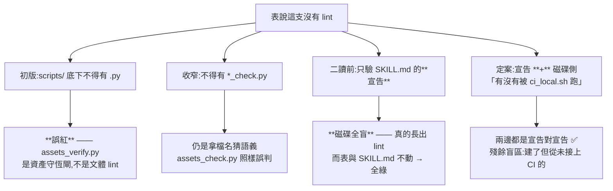
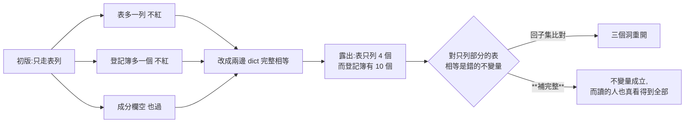

# CHG-20260818-03 — `docs/genres.md` 的表要與磁碟、與登記簿一致（BL-019）

- Project: skill-chinese-write
- Branch: claude/genres-gate
- Date: 2026-08-18 (UTC+0)
- Type: 新增斷言 + 修掉它抓到的既有不一致
- Proposed by: **審議席**（fable 排序次選、codex 對審同意；本張的判定式由 codex 擋下兩次才定案）
- Implemented by: Claude Opus 5（Cowork session）
- Collaborators:
  - **Claude Fable 5（審議席）**——排序把 BL-019 列第二；**當場抓到它的病是活的**
    （表列 `ci-poetry` 而 `classical` 那列漏了它、正文仍寫「宋詞尚未存在」）；
    劃定「可判的 slice 只有表 ↔ 檔案系統，敘述層明標不判」
  - **OpenAI Codex（審議席）**——**擋下本張兩次**：③ 用檔名猜語義會誤紅；
    ④ 根本沒做到「表 == PLUGINS」（三個洞全開）；節標題當鍵是把閘耦合到排版。
    並指出我漏了 CHG
- Risk: 低（唯讀斷言；`docs/genres.md` 的修正是把過期敘述改成事實）
- Autonomy: 審議席交叉決議
- Commit/PR: 分支 claude/genres-gate
- Recurrence check: **「宣稱與事實整段脫鉤而 CI 不知道」第二次**——
  `CHG-20260818-02` 治 CHG 的 Status，本張治文體對照表
- Diagrams: 見 `## Design diagrams`
- Skill: ai-sdlc v1.35
- Related: `BL-019`（本張解除）、`CHG-20260818-02`（同型）、`CHG-20260816-03`（建表那張）

## 病灶：這份表沒有任何機器在看，而它已經失準

`docs/genres.md` 的用途是「讓人一眼看出哪些文體目前沒有任何機器在把關」。
審議席實測：**整份一字未改也全綠**。

而它當時就是錯的：

```
表第 27 行  | 詞(宋詞) | `ci-poetry` | `ci_check.py` |
plugin 表   | `classical` | 文言 | `fu`、`historiography`、`regulated-verse` |   ← 漏了 ci-poetry
正文        「唐詩 / 宋詞尚未存在」「宋詞仍未建」
```

**主體改了、表沒跟上。** 這是 PR #25/#26 留下的未入帳損傷。

## 判什麼、不判什麼

**只判表格層。敘述層明標不判**——這是審議席劃的界，不是我省事：
敘述層要靠 NLP 才判得動，而造那個會製造誤殺面（KN-002）。

| 判 | 不判 |
|---|---|
| 表列的 skill 必須存在於 `skills/` | 正文敘述是否過期 |
| 「有引擎」表的 lint 檔要在，**且 SKILL.md 有引用它** | 分組判準說得對不對 |
| 「沒有 lint」表的 skill **其 SKILL.md 要有那句宣告** | 中文名、理由欄 |
| plugin 打包表 **== `build_suite.PLUGINS`** | |
| `skills/` 下每一支都要在表上（雙向） | |

**這道閘抓不到「宋詞尚未存在」那類過期敘述**——它自己會把這句話印出來，
免得讀的人以為有人在守。那三處由本張**手改**。

## codex 擋下的三件

### 一、③ 用檔名猜語義會誤紅

初版斷言「表說沒有 lint 的那支，`skills/<name>/scripts/` 底下不得有 `.py`」。
而 `ci-poetry` 的 `assets_verify.py` 就不是文體 lint——**任何一支加了輔助腳本都會誤紅**。

codex 否決了「收窄成 `*_check.py`」：那仍是拿檔名猜語義，`assets_check.py` 照樣誤判。
正確判準是**宣告**，不是檔名。

而宣告已經存在，16 支全部一致：

```
$ grep -o "本支沒有可跑的 lint" skills/{prose,poetry,drama,narrative,lyric,exposition,fu,historiography,proposal}/SKILL.md
9/9 命中

$ grep -o "scripts/[a-z_]*\.py" skills/{zh-style,writing,fiction,techdoc,regulated-verse,ci-poetry,bizdoc}/SKILL.md
7/7 命中，且與表列的 lint 檔名相符
```

所以改成：「沒有 lint」那張表的 skill，其 SKILL.md 必須有那句宣告；
「有引擎」那張表的 skill，其 SKILL.md 必須引用表所宣稱的那支 lint。
**兩邊都是宣告對宣告，沒有一處靠猜。**

### 二、④ 根本沒做到「表 == PLUGINS」

初版只走表列，於是三個洞全開（codex 逐條點名）：

```
pid not in plugins → continue        表上多一個 plugin 不紅
PLUGINS 有、表上沒有                  不紅
if got and got != want               成分欄是空的也過
```

**那不是「相等」，是「表列的都對」。** 已改成兩邊各建 `dict[plugin_id, set[skill]]`
（扣掉 `zh-style`）再做完整相等，並補上三個對應紅端。

而完整相等一開就露出更深的事：**打包表只列了 `CHG-20260816-03` 新分組的四個 plugin，
而登記簿有十個。** 對一張刻意只列部分的表，「表 == 登記簿」是錯的不變量。

兩條路：回到子集比對（重開那三個洞），或把表補完整。**選補完整**——
只列一部分的表沒有可判定的不變量，而補完之後讀的人也真的看得到每個 plugin 裝了什麼。

### 三、節標題當鍵，是把閘耦合到排版

初版用節標題字串當鍵（`SEC_NOLINT = "本支沒有 lint"`）。codex 指出這與他上一輪
否決內容雜湊是同一個理由：**閘要守的不變量與標題怎麼寫無關。**

改用機器錨點 `<!-- genres-table:nolint -->`，讀的人看不到，標題可自由改寫。
並斷言每個錨點**恰好出現一次**（重複也紅）。

## 我自己抓到的一件：斷言曾經整條靜默消失

我猜的兩個節標題本來就是錯的（`SEC_NOLINT` 我寫「還不是 skill 的文體」、
`SEC_PLUGIN` 我寫 `"plugin"`——而後者根本不在任何標題裡）。
而 `rows_of` 找不到節時**回空清單**：

> **plugin 那條斷言從頭到尾沒跑過，而閘照樣有輸出。**

已改成拋例外、五個錨點先全部解析、任一找不到或重複就整支紅。
這與 `chg_field_check` 的 baseline fail-open 是同一個形狀：
**規則不見了，而輸出長得跟通過一樣。**

## 我違反了流程：先動手才開 CHG

本 repo 的規矩是「任何修改先開 CHG」。本張是 codex 覆核時指出工作樹沒有新 CHG，
我才回頭補的。照實記在這裡，不追認為「本來就有」。

## 紅端（初版 11 個；二讀後補到 16 個，見下一節）

```
有引擎/skill 不存在        有引擎/lint 檔不存在      前門/命令不存在
沒有 lint 的那支其實有 lint  plugin 成分與登記簿不符   plugin 表多一列
plugin 表少一列            plugin 成分欄是空的       錨點被刪掉
錨點重複                   表上刪掉一支磁碟有的 skill
```

每個都 `assert 錨點命中 == 1`（探針自驗），且斷言**紅在對應的那一條上**，
不是「有紅就算」——我在 `CHG-20260818-02` 犯過後者。
self-test 的數字**從 `MUTATIONS` 算出來**，不寫死：寫死的數字會在加案時過期，
而它讀起來跟真的一樣。

## 審議席二讀又擋下兩件，我另外自己踩了一個坑

### 一（擋）E4：閘在對自己的守備範圍說謊

③ 改成宣告式之後，**磁碟層就完全不看了**。fable 實測：`fu` 真的長出
`scripts/fu_check.py` 而表與 SKILL.md 都不動 → 全綠。舊版抓得到，新版抓不到。

更糟的是**腳本自己的 docstring 還寫著「必須真的沒有 `scripts/*.py`」**，
而程式已經不做這件事——**閘的自述與行為分岔，正是這道閘要防的那個形狀**。

改法不是退回檔名猜測，而是換一個已經存在的判準：**`ci_local.sh` 是本 repo 的
唯一真相源，一支腳本被它跑就是在把關。** 所以「沒有 lint」那張表的 skill，
其 `scripts/` 底下的 `.py` 不得出現在 `ci_local.sh` 裡。

`assets_verify.py` 那類輔助腳本不誤紅（它沒有被當成文體 lint 掛上去），
而「建了 lint 並掛進 CI 卻沒挪表」會紅。**殘餘盲區具名**：建了腳本但從未接上 CI 的，
本閘不管——它還不是一道閘。

### 二（擋）E3：表列重複 pid 是 fail-open

`table[pid] = comp` 後者蓋前者。**把錯的那列擺在前面，閘就看不見它。**
我對錨點做了「重複就紅」，對表列沒有——同一個決定沒有貫徹到底。已補。

### 三（我自己）探針改寫了正在執行的 `ci_local.sh`

E4 的新紅端要驗「腳本在 ci_local 裡被跑」，我讓探針直接改寫 `.github/ci_local.sh`。
而 `[8b/19]` 正是由那個檔跑起來的——**bash 是邊讀邊執行的，把跑到一半的腳本換掉，
它會從錯的位置繼續**。實測：整條 CI 當場卡死，輸出全空。

改成把突變後的內容寫進暫存檔，`check()` 多收一個 `ci_path` 參數，
**探針不碰活檔**，並斷言跑完 `ci_local.sh` 逐 byte 未變。

### 順帶修掉的三件（fable 列為後續，我一併做了）

- **E1**：前門的 `/plugin:command` 只驗 `commands/<cmd>.md` 存在，plugin 前綴完全不驗
  ——把 `/fiction:` 改成 `/press:` 照樣全綠。已補對 `build_suite.COMMANDS` 的歸屬斷言。
  （施工時我拿裸名比對而登記簿存的是 `.md` 檔名，**自己造了 6 條誤紅**，當場修掉。）
- **SKILL.md 側的紅端不在 self-test 內**：原本 11 個紅端全在 `genres.md` 上突變，
  而 ①③ 新增的 SKILL.md 側斷言一個都沒被覆蓋。已補三個跨檔紅端，總數 **16**。
- `SectionMissing` 的訊息還在說「把節標題常數改成新的標題」，而機制已經是錨點
  ——照它做會改錯地方。已改。

### 探針自驗擋下我兩次

`assert 命中 == times` 這一條在本輪擋下兩個壞探針：`scripts/verse_check.py`
在 `regulated-verse/SKILL.md` 命中 **2 次**（只改一處，另一處還在，斷言照樣綠），
以及第一版的 ci_local 探針只改 CI 而沒建檔——**那 9 支「沒有 lint」的 skill
磁碟上根本沒有 `scripts/` 目錄，路徑不存在，斷言不會觸發**。

## 驗收條件

1. 「沒有 lint」與「有引擎」兩條改用 **SKILL.md 的宣告**，不靠檔名
2. plugin 那條是**兩邊完整相等**，含「表多一列 / 少一列 / 成分欄空 / 同一 pid 兩列」四個紅端
3. 表補完整為全部 10 個 plugin，並在文件裡寫明為什麼不能只列一部分
4. 改用機器錨點，且錨點缺失或重複都紅
5. **16** 個紅端各自可達、各紅在對應斷言、探針自驗命中數;
   其中三個突變的是 `genres.md` 以外的檔(SKILL.md ×2、ci_local ×1)
6. self-test 的數字從資料算出，不寫死
7. 修掉 `classical` 漏 `ci-poetry`，以及正文三處過期敘述
8. 掛進 `ci_local [8b/19]`；19 步全綠
9. `BL-019` 解除

## Design diagrams

### 「沒有 lint」怎麼判才不誤紅



### 為什麼「表 == 登記簿」逼出了補完整張表



## Status

已驗收 — `ACC-20260818-03`。`BL-019` 解除。
