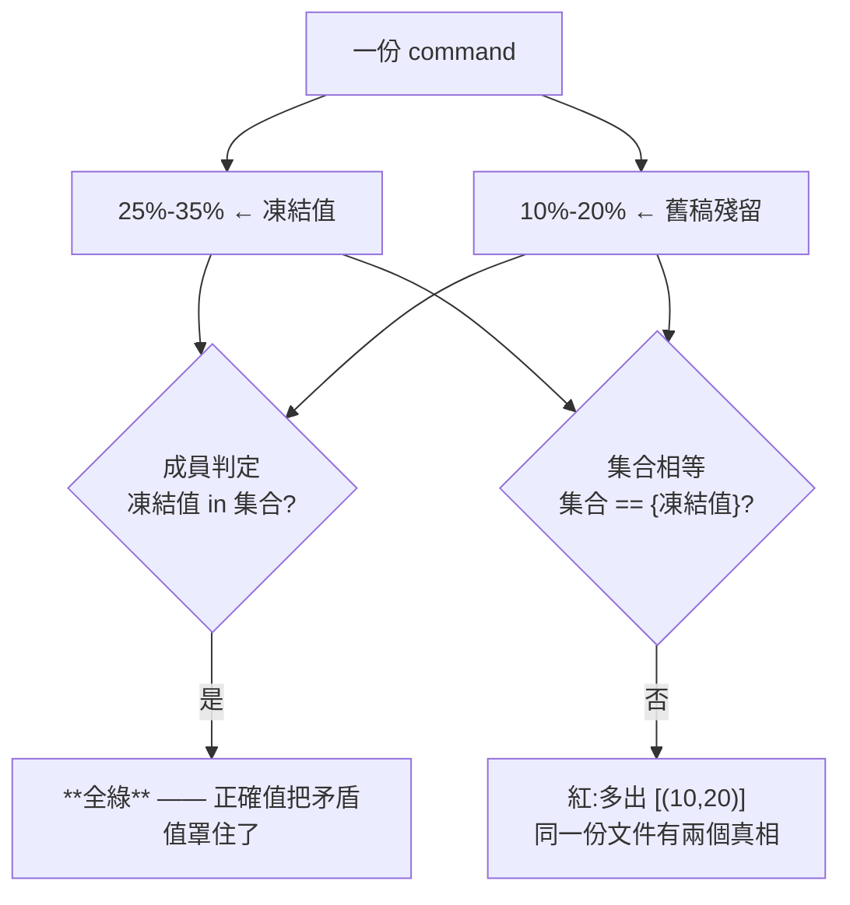

# CHG-20260820-01 — `[B]` 從「至少含一個對的」收緊成「全部都要對」（BL-009）

- Project: skill-chinese-write
- Branch: claude/ratio-contradiction
- Date: 2026-08-20 (UTC+0)
- Type: 收緊既有斷言
- Proposed by: **審議席**（codex 選定為第三順位，fable 不堅持）
- Implemented by: Claude Opus 5（Cowork session）
- Collaborators:
  - **OpenAI Codex（審議席）**——在 `BL-009` 與 `BL-013` 之間選定本條，
    理由是「已有可重現的假綠、判定邊界清楚、修補收益直接」，
    而 `BL-013` 的六種外形是多分支擴面、誤紅成本較高
  - **Claude Fable 5（審議席）**——排序時把本條列為第三順位並註明錨點仍在
- Risk: 低（收緊唯讀斷言；實測零誤紅）
- Autonomy: 審議席交叉決議
- Commit/PR: 分支 claude/ratio-contradiction
- Recurrence check: **「至少含一個對的」這個形狀第二次**——
  `[E]` 早就修過同一個病，而隔壁的 `[B]` 沒跟上
- Diagrams: 見 `## Design diagrams`
- Skill: ai-sdlc v1.35
- Related: `BL-009`（本張解除）、`CHG-20260814-05`（開立本條）

## 病灶：同一份文件可以有兩個真相

```python
if (lo_p, hi_p) not in pcts:     # 成員判定
```

`pcts` 是文件裡所有 `X%-Y%` 的集合，而斷言只要求凍結值**在裡面**。
於是一份 command 同時寫著 `25%-35%`（對）與 `10%-20%`（錯）會**全綠**——
**正確值在場，就把旁邊的矛盾值罩住了**。而讀的人看到兩個數字，不知道信哪個。

## 這條原則本檔早就寫著了

`[B]` 下面第 12 行就是 `[E]` 的註解：

> **正確性：全部出現皆須相等，不是「至少含一個正確的」。**
> 後者的漏洞是：正確 token 在場、旁邊多一個錯貼的 wuxia，照樣綠。

**同一個檔對一條斷言講對、對隔壁那條做錯。** 這不是沒想到，是修了一處沒推廣。

## 先量再訂

收緊之前先量現況——12 份住址（6 個流派 × 頂層 `commands/` 與 `plugins/fiction/commands/`）：

```
flash    [(15,20)]  [(1,3)]      mystery  [(15,20)]  [(2,5)]
long     [(25,35)]  [(4,8)]      romance  [(35,45)]  [(5,10)]
scifi    [(10,15)]  [(1,3)]      wuxia    [(30,40)]  [(8,14)]
```

**每份都恰好一組，改成集合相等零誤紅。** 這個數字是量出來的，不是我猜「應該不會有人寫兩組」。

## 訊息要分得出兩種紅

收緊後有兩種失敗，訊息不能混：

```
多出 [(10, 20)]，同一份文件有兩個真相     ← 凍結值在場，旁邊多了矛盾值
凍結值不在場                              ← 原本就會抓的那種
```

只印「不等於凍結值」的話，看的人得自己去比對兩個集合才知道發生什麼事。

## 紅端：兩個，正確值都仍在場

```
8b 修辭比例:對的旁邊多一組錯的   25%-35% → 25%-35%(舊稿寫 10%-20%)
8c 成語密度:對的旁邊多一組錯的   4-8 次/千字 → 4-8 次/千字(前版 1-3 次/千字)
```

**舊的成員判定對這兩案全綠**——那正是它被開成 backlog 的原因。

### 8c 的探針我第一版寫壞了

原本寫成 `4-8 次` → `4-8 次(前版 1-3 次)`，把 `次` 與 `/千字` 拆開，
於是**兩組都不再匹配 `IDIOM`**，結果測到的是「凍結值不在場」而不是
「多了一組矛盾值」。**探針壞了會測到別的東西，而它照樣會紅**——
紅得像對的一樣。改成插入完整片語。

## 順帶：self-test 的摘要原本是寫死的

那段「設定四條／文案四條／誠實欄五條…」是手寫的分類敘述，
而我加了兩案之後**它沒跟上**——本 repo 反覆出現的「改了主體、漏了標頭」。
已改成從 `ran` 印出案名。寫死的清單讀起來跟真的一樣，而它會在下一次加案時再過期一遍。

## 一件既有問題，記錄不修

改成印案名之後露出：**案號有重複**——兩個 `16`、兩個 `17`
（`16 成語列對下限說謊` 與 `16 [E] command 的 genre 錯置`）。
不是本張造成的。重號會讓「27 案」不可逐一追溯，但重新編號是純 churn，
**交審議席裁要不要動**，本張不自行擴張。

## 驗收條件

1. `[B]` 兩條都改成集合相等，不是成員判定
2. 收緊前實測 12 份住址的現況，證明零誤紅
3. 訊息分得出「多出矛盾值」與「凍結值不在場」
4. 兩個紅端，**正確值仍在場**，且各由 `_GOOD_DOC` 的單點插入產生
5. self-test 的案名從資料印出，不寫死
6. `ci_local` 19 步全綠
7. `BL-009` 解除

## Design diagrams

### 為什麼「至少含一個對的」擋不住矛盾



## Status

施工中 — 待 ACC-20260820-01。
