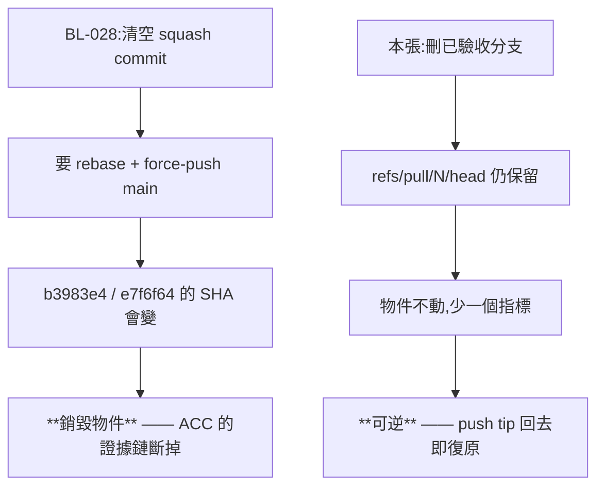

# CHG-20260820-02 — 清掉已驗收的舊分支，並讓「哪些工作還在進行中」讀得出來

- Project: skill-chinese-write
- Branch: claude/branch-cleanup
- Date: 2026-08-20 (UTC+0)
- Type: 倉庫狀態整理（ref 層，不動任何檔案內容）
- Proposed by: **使用者**（「確認分支 CI pass？是否合併？」查證時露出）
- Implemented by: Claude Opus 5（Cowork session）
- Collaborators:
  - **OpenAI Codex（審議席）**——裁「該刪，但先封存證據」；
    指出 `git cherry` 不可單獨作證；建窄閘先報告不硬紅
  - **Claude Fable 5（審議席）**——找到 codex 漏掉的**承重牆**：
    五個分支頭與 `refs/pull/20~24/head` 逐一相等，所以刪的是**指標不是物件**，
    且動作可逆；另指出本地殭屍分支是污染的另一半、閘要處理的三個邊角
- Risk: 低（可逆：tag + PR ref 兩重指標；不動任何檔案內容）
- Autonomy: 審議席交叉決議
- Commit/PR: 分支 claude/branch-cleanup
- Recurrence check: **`BL-028` 的成因第二次**——那個空 squash commit 起於
  「開 PR 前只查遠端有沒有這個 branch，沒查內容在不在 main 上」，
  而遠端留著一堆已驗收分支正是讓那個查法失準的原因
- Diagrams: 見 `## Design diagrams`
- Skill: ai-sdlc v1.35
- Related: `BL-028`（同因）、`BL-031`（本張開立的窄閘）

## 起點：查「是否該合併」時發現沒有東西該合併

`main` = `70383f8`、CI `governance success`、**沒有開著的 PR**。
而 `git branch -a --no-merged origin/main` 列出十個分支——因為 squash-merge
之後 git 看不出祖先關係，**已經進了 main 的分支照樣被列成「未合併」**。

那正是 `BL-028` 那個空 squash commit 的成因：
「開 PR 前只查遠端有沒有這個 branch，沒查內容在不在 main 上」。

## 這會不會踩到 `BL-028` 自己的裁決？不會，而兩者的差別是承重的

`BL-028` 裁定**留著**那個空 commit，理由是清它要 rebase + force-push main，
`b3983e4`、`e7f6f64` 的 SHA 都會變，而 ACC 裡「在 `b3983e4` 上覆驗 rc=0」
會指向不存在的 commit——**斷掉的證據鏈比一個被寫明的空 commit 更糟**。

那是**改寫歷史、銷毀物件**。而刪分支刪的是**一個指標**：

```
$ git ls-remote origin
7bda543  refs/heads/claude/carrier-parity     refs/pull/21/head
b97f95a  refs/heads/claude/classical-poetry   refs/pull/24/head
ccb4b1a  refs/heads/claude/retired-invariant  refs/pull/22/head
f187118  refs/heads/claude/genre-families     refs/pull/23/head
fd135a3  refs/heads/claude/fiction-retire     refs/pull/20/head
```

**五個分支頭與 PR head ref 逐一相等**，而 GitHub 的 `refs/pull/N/head`
在分支刪除後仍保留。物件不會消失，指標少一個。
而且動作**可逆**——`git push origin fd135a3:refs/heads/claude/fiction-retire` 隨時復原。

## 內容是否真的都在 main：三重交叉驗證

審議席要求「`git cherry` 不可單獨作證」。實際用了三條互相獨立的路徑：

1. squash commit 的 parent == 分支的 merge-base
2. `git diff merge-base..分支頭` 與 `git diff squash^..squash` 的 **sha256 位元組級相等**
3. **分支頭的 tree hash == squash commit 的 tree hash**

第 3 條天然免疫「多 commit 被 squash 時只看單一 tree 不夠」的疑慮——
因為它比的是**淨結果快照**，而第 2 條比的是**完整淨 diff**，兩條路徑各自獨立。

### 我的第一版探針壞了，而它產出的是嚇人的假差異

初版用 `git log --grep=<CHG id>` 找對應的 squash commit。而 commit **內文**
會交叉引用別張 CHG，於是 `fiction-retire` 配到了 `b98caa3`（`CHG-20260816-03`），
跑出「78 files changed, 1963 insertions」。

**探針壞了，而輸出看起來像發現了問題。** 改成只比對**主旨行**、
且斷言主旨命中數為 1 才採信。

## 被引用的 commit：四個，全在 PR ref 的祖先鏈上

```
ACC-20260814-10:39        1bc3848
ACC-20260816-01:115,130,157  7f8c867、ba96a43、fd135a3
```

四個都是 `refs/pull/20`／`21/head` 的祖先，刪分支後在 GitHub 上**仍可解析**。

**但 fresh clone 不抓 `refs/pull/*`**——新 clone 裡 `git show ba96a43` 會失敗。
以 KN-004 為地基的 repo 不該讓這個成立，所以本張對**五個分支頭全部打 archival tag**
（不只被引用的那兩個——一致比省事重要，成本近零）。

## 本地殭屍分支是污染的另一半

只刪遠端的話 `git branch -a` 照樣一團——本 clone 有十二個本地分支，
其中九個的內容都已進 main。本張同輪清掉並 `--prune`，**每個都先記 hash**。

保留：`main`、以及本 session 的 worktree 分支。

## 驗收條件

1. 五個分支頭與 `refs/pull/N/head` 的對照表寫進 ACC（原始 `git ls-remote` 輸出）
2. 三重交叉驗證逐分支通過，**三條路徑各自列出結果**
3. archival tag 五個全打並推上遠端，**推完先驗 tag 可解析再刪分支**
4. 被引用的四個 commit 逐一列出其可達路徑
5. 本地殭屍分支清理前逐一記 hash
6. `ci_local` 全綠
7. 開 `BL-031`：窄閘（見下）

## `BL-031`：窄閘只判可判的

審議席定的形狀：**只判「分支明確關聯的 CHG 全部已驗收，且 main 已有對應成果，
而分支仍存在」**。不判「分支是否太老」，不禁止長命分支。

fable 實測出閘必須吃下的三個邊角：

| 邊角 | 實例 |
|---|---|
| 多 CHG 對一分支 | `claude/ci-poetry` 掛 4 份、`claude/fixture-cross-review` 掛 2 份 → 要**全部**已驗收才算可刪 |
| `- Branch: main` | 早期 3 份 CHG 直接寫 main → 排除 |
| 無 CHG 的分支 | session worktree 分支 → 依 KN-002 **明標不判** |

且「main 已有對應成果」那一腳**不能用 `git branch --merged`**（squash 下恆假），
要用本張的 tree/diff 等價法。

**先做報告不硬紅**（codex 裁），待誤判夾具與豁免機制成熟再考慮。

## Design diagrams

### 為什麼刪分支不踩 `BL-028`



## Status

已驗收 — `ACC-20260820-02`。開 `BL-031`。
