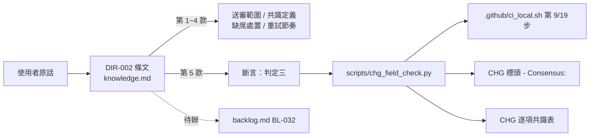
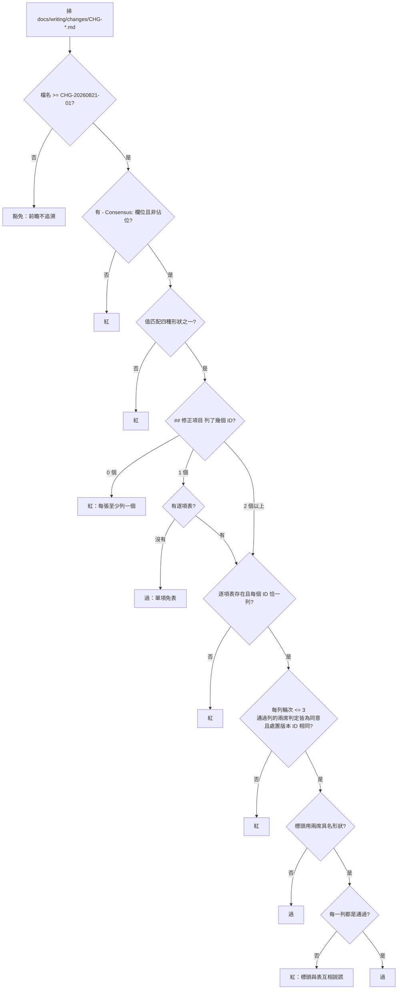

# CHG-20260821-01 — DIR-002 擴大到「所有修正項目」，並補上它一直沒有的那條斷言

- Project: skill-chinese-write
- Branch: claude/ai-sdlc-handshake-c7b2a2
- Date: 2026-08-21 (UTC+0)
- Type: 治理條文改寫 + 新增斷言
- Proposed by: **使用者**（原話：「所有及往後的修正項目全部交由 fable 和 codex 交叉決議達成共識」）
- Implemented by: Claude Opus 5（Cowork session，主 agent）
- Collaborators:
  - **OpenAI Codex（審議席）**——三輪；第二輪在分歧一、分歧二**改判**採對造方向，
    並**自行撤回**它第一輪提的「內容摘要雜湊」欄位，理由是那個欄位沒有穩定可當場量測的對象、
    會製造假精確而違反 KN-004；第三輪同意第 1~4 款，第 5 款主張單項 CHG 也不得免表
  - **Claude Fable 5（審議席）**——三輪；第二輪在分歧二**改判**接受逐項顆粒度，
    援引 `CHG-20260814-02`「一張票裡 KN-001 觸發兩次、第二次藏在同票內」為實據；
    第三輪明示接受逐項表本身，另補兩處合併稿自己沒走完的邏輯
  - **使用者（第三席）**——第 5 款三輪未收斂，依第 2 款上報後裁決「兩者都要，但分階段」，
    並就風險評級與施工邊界裁決「照 DIR-001 走到 merge」
- Risk: 中（治理條文 + 唯讀斷言；**codex 判高、fable 判中**，使用者裁決以中風險路徑執行）
- Autonomy: 審議席三輪交叉決議 + 使用者裁決第 5 款
- Consensus: 使用者裁決（記於 CHG-20260821-01）
- Commit/PR: 分支 claude/ai-sdlc-handshake-c7b2a2
- Recurrence check: **「規則存在、沒有斷言」第 10 次**——DIR-002 自 2026-08-13 生效以來
  從來沒有任何機器在看它，全靠主 agent 記得送審。KN-001 的同一個型樣，這次落在
  **決定誰有權判定的那條規則自己身上**
- Diagrams: 見 `## Design diagrams`
- Skill: ai-sdlc v1.64

## 背景：為什麼這張是必要的

DIR-002 從 2026-08-13 生效，管的是「誰有權判定」。它列舉了三類事項（需求確認、驗證/驗收、
依 skill 產出的文章），而使用者 2026-08-21 的原話把它擴大成「所有修正項目」，
並把收斂強度從「分歧送回去裁決」提高到「**達成共識**」。

兩件事同時要處理：

1. **範圍與強度的條文改寫**——「所有修正項目」若不給可判定的邊界，會有兩個相反的壞結果：
   邊界太寬則每次存檔都要開會、流程停擺；太窄則等於沒改。
2. **它一直沒有斷言**——DIR-002 規範的是治理流程本身，而本 repo 的 KN-001 明文要求
   「寫下的每一條規則都要在同一輪配上斷言；配不上的要明講靠人判斷」。
   DIR-002 生效八天，沒有任何機器在看它。**這是第 10 次遇到同一個型樣。**

## 修正項目

- CHG-20260821-01.1 — DIR-002 第 1~4 款條文改寫（送審範圍與邊界、共識的操作定義與僵局出口、
  一方不可用時的處置、重試節奏），並同步改寫 knowledge INDEX 的 DIR-002 那一列
- CHG-20260821-01.2 — DIR-002 第 5 款（斷言）條文：兩層結構、單項免表、前瞻不追溯
- CHG-20260821-01.3 — `scripts/chg_field_check.py` 增設判定三（`- Consensus:` 欄位與
  逐項共識表），附 `--self-test` 紅綠端，掛在 `.github/ci_local.sh` 第 [9/19] 步
- CHG-20260821-01.4 — `docs/writing/backlog.md` 開立 `BL-032`：codex 主張的
  「單項 CHG 也一律附表」依使用者裁決轉為待辦，跑過幾張單項 CHG 後再決定要不要收緊

## 審議席共識

| 修正項目 ID | 處置版本 ID | codex 判定 | fable 判定 | 共識狀態 | 收斂輪次 | 未決理由 |
|---|---|---|---|---|---|---|
| CHG-20260821-01.1 | v3-款1到4 | 同意 | 同意 | 通過 | 3 | — |
| CHG-20260821-01.2 | v3-款5-分階段 | 不同意（主張單項也附表） | 同意（接受單項免表） | 使用者裁決 | 3 | 三輪未收斂，依第 2 款上報；使用者裁決「兩者都要但分階段」，本輪落 fable 版 |
| CHG-20260821-01.3 | v3-款5-分階段 | 不同意（同上） | 同意 | 使用者裁決 | 3 | 實作依 .2 的裁決結果；含兩席**都**要求的標頭↔逐項表一致性檢查 |
| CHG-20260821-01.4 | v3-BL029 | 未審 | 未審 | 使用者裁決 | 0 | 本項由使用者裁決直接產生（「分階段」的後半），未經兩席審 |

**標頭 `- Consensus:` 為什麼不是兩席具名**：依本張確立的第 5 款，含逐項表的 CHG，
標頭只有在**每一列**都是「通過」時才可用兩席具名形狀。本表有三列不是通過，
所以標頭寫 `使用者裁決`——這正是該規則要防的那件事，第一張就用上了。

## 三輪審議的完整記錄

**第一輪（各自獨立審五題）**：兩席在 Q1（改寫 DIR-002 而非新開 DIR-003）與
「Q5 的判定分界」（程序完整性判得了、共識是否為真判不了）獨立得出相同結論。
Q2、Q4、Q5 的份量三處分歧。

**第二輪（分歧連同雙方理由送回）**：

- **分歧一（缺席時是否停擺）**：codex **改判**採 fable 的「可回復施工、共識前不得交付」，
  並加五個護欄——記施工前基準 revision 與變更檔案清單、標「未共識候選」、
  不得夾帶進其他已通過項目、恢復後不因既有施工推定同意、否決或僵局須回復至記錄的基準。
  fable 維持原判，正面回應代價比較：「一個是**無界且無審**的代價，一個是**有界且受審**的代價，
  治理該選後者」，並援引 KN-002「規則一旦讓正常工作天天停擺，操作者學到的不是遵守而是繞開」。
- **分歧二（顆粒度）**：fable **改判**接受合併版，援引 `CHG-20260814-02` 為實據，
  並區分「邊界問哪些變更要送審」與「顆粒度問同意的是什麼」——
  「同意必須落在可獨立驗收的處置上，否則『明示同意同一個處置』會退化成
  『明示同意同一張票』——票一大，共識就空了」。codex 同時改判採合併版。
- **分歧三（斷言份量）**：codex 撤回雜湊欄位（理由見 Collaborators）；
  fable 援引 `scripts/chg_field_check.py` 的 `STATUS_BASELINE` 註解，
  指出本 repo 早記過同型：雜湊會讓**閘紅的理由與它要守的不變量無關**。兩席均同意前瞻不追溯。

**第三輪（主 agent 提合併稿，兩席逐款表態）**：第 1~4 款兩席**均明示同意同一份文字**。
第 5 款兩席都投不同意，但方向相反且其餘補強不衝突——

- codex：單項免表不可接受，否則「閘便無處檢查『修正項目 ID—處置版本 ID—兩席判定—ACC』這條鏈，
  反而重新形成兩套承接規則」。
- fable：明示接受單項免表，並**改判接受逐項表本身**——
  「引用一致性是機器判得動的不變量……它宣稱的只是『帳面對得上』，不宣稱『同意是真的』。
  宣稱與能力一致，就不是假追溯」。另補兩處：①標頭↔逐項表的一致性檢查（codex 也要，
  兩席在此重合）；②把「不得覆寫舊版本後沿用原判定」明列進「判不了、靠人」清單，
  因為雜湊撤回後這條禁令兩頭落空，KN-001 不准。

三輪用盡，依第 2 款不由主 agent 拍板、主動上報使用者。

## 使用者裁決（第三席）

1. **第 5 款**：「兩者都要，但分階段」——先落 fable 版（單項免表）讓規則上線，
   codex 的「一律附表」轉為 `BL-032` 待辦，跑過幾張單項 CHG 後再決定是否收緊。
2. **施工邊界**：「照 DIR-001 走到 merge」——推翻 codex 的高風險評級，以中風險路徑執行。

## 主 agent 的一項具名補充（不是兩席審過的東西）

第 5 款的標頭三種形狀（兩席具名／單方／僵局）**沒有涵蓋「使用者裁決後」這個狀態**，
而本張自己就落在這個狀態裡。主 agent 依第 2 款「使用者是唯一的第三席」推導，
新增第四種形狀 `使用者裁決(記於 <編號>)`，並**具名記在這裡**：
它是主 agent 推導的，不是兩席審過的文字。下一次有修正項目送審時，
第一項議程就是覆核這一格（已一併記入 `BL-032` 的備註）。

## Design diagrams

### 受影響區域

### 本次變更的判定流程

## Status

**已驗收 — `ACC-20260821-01`。** 第 1~4 款為兩席共識(codex 與 fable 第三輪各自明示同意同一份文字);第 5 款三輪未收斂,依第 2 款上報後由使用者裁決「兩者都要,但分階段」,本輪落 fable 版,codex 的一律附表轉為 `BL-032`。
