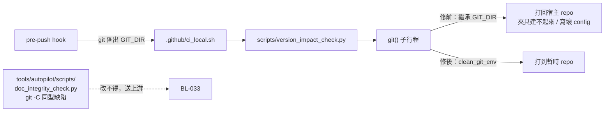
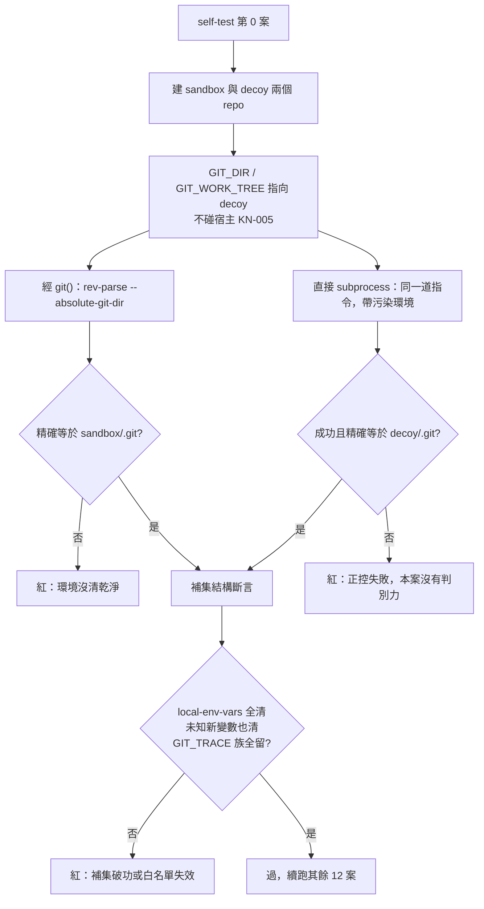

# CHG-20260821-02 — 一支唯讀的檢查腳本寫壞了被檢查的 repo

- Project: skill-chinese-write
- Branch: claude/ai-sdlc-handshake-c7b2a2
- Date: 2026-08-21 (UTC+0)
- Type: 修復 + 新增斷言
- Proposed by: **主 agent**（`CHG-20260821-01` 收尾 push 時被 pre-push 閘擋下，追成因發現）
- Implemented by: Claude Opus 5（Cowork session，主 agent）
- Collaborators:
  - **OpenAI Codex（審議席）**
  - **Claude Fable 5（審議席）**
- Risk: 中（修的是閘自己；誤修的代價是版號閘繼續在唯一自動路徑上失效）
- Autonomy: DIR-001 低/中風險預先授權 + DIR-002 兩席共識
- Consensus: codex ✓ 2026-08-22 / fable ✓ 2026-08-22
- Commit/PR: 分支 claude/ai-sdlc-handshake-c7b2a2
- Recurrence check: **「本機綠、自動路徑紅」第二次**——`CHG-20260816-01` 記的是
  兩份 CI 載體不同步造成的本機綠而 CI 紅；這次是**同一份載體**在兩種執行環境下結果不同，
  而分岔點在腳本繼承的環境變數
- Diagrams: 見下方 `## Design diagrams`
- Skill: ai-sdlc v1.64

## 事實

`CHG-20260821-01` commit 之後 push，被 pre-push hook 擋下。同一支 `.github/ci_local.sh`：

| 執行路徑 | 結果 |
|---|---|
| 直接 `bash .github/ci_local.sh` | 19 步全綠，exit 0 |
| 經 pre-push hook | `version_impact_check.py --self-test` 紅 |

成因：`scripts/version_impact_check.py` 的 `git()` 用
`subprocess.run(["git", *args], cwd=repo)`，**沒有清掉環境變數**。
git 執行 hook 時會匯出 `GIT_DIR`，子行程繼承之後 `cwd` 就不再決定它打到哪個 repo——
**`GIT_DIR` 贏**。本檔的 self-test 建暫時 repo 跑夾具，於是從 hook 跑時每一個 `git`
都打回宿主 repo，夾具建不起來，下游一律報「紅端不可達」。

**代價不只是誤紅，而且已經真的發生。** 主 agent 為了確認成因，在真 repo 上跑

    GIT_DIR=$(git rev-parse --absolute-git-dir) python3 scripts/version_impact_check.py --self-test

它的 `git init` 把 `core.bare = true` 與一組假身分 `t <t@t>` 寫進**宿主 repo 的 config**，
宿主的 `git status` / `git push` / `git log` 當場全部回
`fatal: this operation must be run in a work tree`，要人工改 config 才救得回來。

**一支唯讀的檢查腳本寫壞了被檢查的 repo。**

這件事有兩個責任面，都要記：腳本沒清環境是缺陷；而主 agent 讀出了缺陷之後，
**把驗證動作直接打在正屋而不是沙盒**，是同一個缺陷的第二次觸發，只是這次是人為的。

## 修正項目

- CHG-20260821-02.1 — `scripts/version_impact_check.py` 的 `clean_git_env()` 採**補集定義**:
  剔除所有 `GIT_*`,只留 `GIT_TRACE` 族白名單。**第一版的十項列舉被兩席各自獨立打回**,
  理由同型:名單窄於規則自己寫的範圍
- CHG-20260821-02.2 — `--self-test` 第 0 案改為 **sandbox + decoy 兩個受控暫存 repo**,
  兩端都必須**成功**且**精確命中各自的 gitdir**;另加補集語意的結構斷言
  （`git rev-parse --local-env-vars` 全數必清 + 未知新變數必清 + 白名單必留）
- CHG-20260821-02.3 — `.github/ci_local.sh` 開頭清 `GIT_*`（呼叫端補償）：
  一次涵蓋全部 19 步與未來新增的步驟，**也涵蓋改不得的隨身副本**
- CHG-20260821-02.4 — `docs/writing/backlog.md` 開立 `BL-033`：
  隨身副本 `doc_integrity_check.py` 用 `git -C`，**`-C` 同樣輸給 `GIT_DIR`**，同型缺陷；
  依 AGENTS.md 第 4 條不得就地改，須送回上游。與 `.3` 是**縱深不是替代**
- CHG-20260821-02.5 — `docs/writing/knowledge/knowledge.md` 新增 `KN-005`：
  重現懷疑有破壞性的行為時，靶必須是沙盒，正屋只准讀。與 KN-004 的失效軸相反，不得合併

## 審議席共識

| 修正項目 ID | 處置版本 ID | codex 判定 | fable 判定 | 共識狀態 | 收斂輪次 | 未決理由 |
|---|---|---|---|---|---|---|
| CHG-20260821-02.1 | v2-補集 | 同意 | 同意 | 通過 | 2 | — |
| CHG-20260821-02.2 | v4-文件重建 | 同意 | 同意 | 通過 | 3 | — |
| CHG-20260821-02.3 | v4-compgen | 同意 | 同意 | 通過 | 3 | — |
| CHG-20260821-02.4 | v4-BL033已上線 | 同意 | 同意 | 通過 | 3 | — |
| CHG-20260821-02.5 | v2-KN005 | 同意 | 同意 | 通過 | 2 | — |

**處置版本 ID 的意義**:`v2` 是第二輪合併稿的文字,`v4` 是第三輪照兩席處方改完並**凍結**的文字。
`.2` / `.3` / `.4` 在第三輪換過處置文字,依第 5 款「處置實質改變時必須建立新版本 ID,
不得覆寫舊版本後沿用原判定」——所以是 v4,不是把 v2 改一改繼續掛原判定。

**兩席都是對凍結後的 bytes 投的票。** 五檔 md5 寫在案卷裡,兩席各自算過並比對相符;
主 agent 在收票後**重算一次**,五筆全數未變——沒有人在投票期間動過標的。

## 第一輪兩席各自抓到、而主 agent 沒看到的東西

**列舉式清單本身就是缺陷,兩席獨立同判。** 主 agent 的 v1 手寫十項,兩席各自指出它窄於
規則自己寫的範圍。codex 給的修法是問 git 自己(`git rev-parse --local-env-vars`,
本機 git 2.55 回 15 項);fable 給的是補集定義(清掉所有 `GIT_*`,只留白名單),
並舉出一個列舉必漏的具體例子:使用者跑 `git -c core.worktree=/別處 push`,
hook 子行程繼承 `GIT_CONFIG_PARAMETERS`,**十項全清之後 sandbox 裡的每個 git 照樣被拉走**。
採 fable 的補集定義(它是 codex 那份的超集),並把 codex 的 `--local-env-vars`
用成**斷言的一部分**——不是拿它當清單,是拿它當「有沒有漏」的檢查基準。

**正控只證明了結果不同,沒證明污染打到哪。** codex 指出 v1 的紅端「打不到 sandbox」偏弱:
污染呼叫若因路徑格式、worktree 的 `.git` 是文字檔、或 git 版本差異而**直接失敗**,
也會被算成合格正控。改成 sandbox + decoy,兩端都要成功且精確命中。
fable 從另一端補上同一個洞的另一半:正控只毒 `GIT_DIR` 一項,
**把 `GIT_INDEX_FILE` 從清單移除不會有任何一案轉紅**——可判而未判,不在 KN-001 的豁免內。
所以另加補集語意的結構斷言。

**「開 BL 等上游」不是補償控制,兩席同判。** `doc_integrity_check.py` 在 `ci_local.sh`
第 [15/19] 步、經 pre-push hook 執行。fable 查出它今天沒發作的原因:
**`-C` 目標與繼承的 `GIT_DIR` 恰指同一個宿主**——潛伏,不是不存在。
兩席也都否掉主 agent 在 brief 裡floated 的「不得在有 `GIT_DIR` 時呼叫」拒絕式護欄:
hook 永遠會匯出 `GIT_DIR`,那道護欄等於把唯一自動路徑判死。
補償改放在本 repo 自己擁有的呼叫端(`ci_local.sh` 開頭),不觸碰 `tools/`,不造成 drift。

**主 agent 在正屋跑診斷這件事要立條目,兩席同判,且都指出 KN-004 涵蓋不到。**
KN-004 要求「指過去」(驗證錨定同一棵樹),本條要求「指開」(重現的靶在別處)——
失效軸相反,合併會讓其中一條的判準吃掉另一條。

## 普查範圍（先量再訂）

`scripts/` 底下用 `subprocess` 的兩支：

- `version_impact_check.py` — 呼叫 `git`，**命中**
- `genre_ratio_freeze.py` — 呼叫的是 `sys.executable` 跑引擎，不碰 git，**不命中**

`tools/autopilot/scripts/` 的隨身副本：`doc_integrity_check.py` 用 `git -C`，**命中但改不得**（→ `BL-033`）。

## 斷言怎麼寫的,以及施工中被打回三次

`--self-test` 新增第 0 案,跑在其餘 12 案之前——這一條壞了,底下 12 案全是空的。

**現行設計(v2,兩席合併)**:同一個 `TemporaryDirectory` 底下建 **sandbox 與 decoy 兩個** repo。
污染環境的 `GIT_DIR` / `GIT_WORK_TREE` **只指向 decoy,不碰宿主**。
兩端都必須**成功**且**精確命中各自的 gitdir**:經 `git()`(已清環境)必須是 `sandbox/.git`,
直接帶污染環境呼叫 `subprocess` 的必須是 `decoy/.git`。
另加補集語意的結構斷言:`git rev-parse --local-env-vars` 回的每一項必清、
`GIT_ZZZ_NOT_YET_INVENTED`(代表下一個新變數)必清、`GIT_TRACE` 與 `GIT_TRACE_PACKET`
(白名單本尊與族成員)必留。

### 施工中被打回三次,三次都是同一族的病:斷言的範圍窄於規則的範圍

**第一次(主 agent 自己抓到)**:探針初版用 `git rev-parse --show-toplevel`,而它分不出兩邊——
`GIT_DIR` 有設、`GIT_WORK_TREE` 沒設時,git 拿 **cwd 當工作樹**,於是污染與乾淨兩次都回 sandbox,
**正控假過**。改成 `--absolute-git-dir`:要判的是「git 打到哪個 `.git`」,探針就要問那一格。

**第二次(codex 第一輪)**:紅端只斷言「沒命中 sandbox」偏弱——污染呼叫若因路徑格式、
worktree 的 `.git` 是文字檔、或 git 版本差異而**直接失敗**,也會被算成合格正控。
它只證明結果不同,沒證明污染確實把 git 導向預定的錯誤 repo。改成 sandbox + decoy 雙端命中。

**第三次(fable 第二輪,實跑抓到)**:洩漏斷言寫的是
`leaked = sorted(set(kept) - {"GIT_TRACE"})`——**精確比對**,而規則寫的是**前綴族**。
於是任何人帶著 `GIT_TRACE_SETUP` 之類的除錯變數 push,就會吃到一個**說謊的紅**:
白名單其實運作正常,訊息卻控訴「補集定義破功」。改成前綴比對,並加 `GIT_TRACE_PACKET` 族成員正控。

三次都是 **KN-001 第四問**(斷言的範圍等不等於規則的範圍)。
而它出現在一張**專門修「列舉窄於規則」的 CHG** 裡,三次。

## 第二輪:審議席逐位元組讀出 `.3` 的實作錯誤,而三道自驗全部沒抓到

codex 在第二輪對 `.3` 投**不同意**,理由是實際落地的 sed replacement 是**控制字元 `0x01`**,
不是字面 `\1`。逐位元組確認屬實:

    for _v in $(env | sed -n 's/^\(GIT_[A-Za-z0-9_]*\)=.*/<這裡是碼值 0x01,不是兩個字元 \1>/p'); do

**後果比兩席任何一方預測的都糟,而且是 fable 實跑量出來的。**
codex 推測「迴圈會嘗試 unset 無效識別字,配合 `set -e`,預期直接紅退」;
fable 拿磁碟上的 bytes 在沙盒實跑,結果是**靜默無作用**:
sed 對每個命中的變數輸出一個 SOH 字元,迴圈逐字拿 SOH 去 `unset`,這版 bash **靜默回 0**——

    GIT_DIR=/tmp/x 進 → GIT_DIR=/tmp/x 出,EXIT=0

**一個變數都沒清,而且十九步全綠。** 紅退還會被人看見;靜默綠不會。
主 agent 在回報中先採信了 codex 的推測並轉述給使用者,那是錯的——已更正。
**推測與實跑不是同一種證據**,而這張 CHG 的主題正好就是這件事。

**三道自驗全部對它全盲,而且每一道盲的理由不同:**

1. `bash -n` — 控制字元在字串裡是合法的,語法層看不出來。
2. 主 agent 的「實測」——它把迴圈**重打一遍**在另一個 shell 裡跑,
   驗的不是這個檔。**量的東西和判的東西不是同一個**(KN-004 的形狀)。
3. 肉眼 review — 終端把 `0x01` 顯示成什麼都不是,看起來就是 `\1`。

**成因值得單獨記:跳脫序列在轉手之間被吃掉。** 施工用的是
`python3 - <<'PYEOF'` 的堆疊字串,而字串裡的跳脫序列在傳遞途中被收斂掉一層,
Python 再把它讀成 `chr(1)`。修這個 bug 時**又踩了同一格一次**——
修正稿的註解裡想寫「字面的反斜線加一」,落地後同樣是碼值 0x01。
第二次改用碼值組字(`chr(92) + "1"`),不寫跳脫序列,才乾淨。

處置:**行動端**採 fable 的替代文字(`for _v in "${!GIT_@}"` 原生前綴展開),
它同時解掉第二個病——`for $(env …)` 會做 word splitting,環境變數值含空白或換行時會漏清或誤清。
codex 的 `compgen -e` 沒有被丟掉,它在**第三輪落到斷言端**(見下)。

覆驗方式跟著改:**從檔案本身抽出那一段來跑**,不重打。

    GIT_DIR=<worktree gitdir> GIT_INDEX_FILE=/nope GIT_TRACE=0       sed -n '/呼叫端清 git 環境/,/^unset _v$/p' .github/ci_local.sh > seg.sh && . seg.sh
    → GIT_DIR=[unset] GIT_INDEX_FILE=[unset] GIT_TRACE=[0]

全檔控制字元掃描:無。

## 第三輪:`.3` 的紅端自己會說謊,而且是白名單造成的

codex 第三輪對 `.3` 再投不同意,指出事後斷言仍在**解析 `env` 的值**:
白名單變數的值若含真換行、換行後那一段又長得像賦值,`sed` 就會從**值**裡撈出一個
根本不存在的變數名。實跑重現(用檔案本身的 bytes):

    GIT_TRACE=<值為「1」換行再接「GIT_FAKE=b」>
    → ❌ 呼叫端清 GIT_* 失敗,還留著:GIT_FAKE    rc=1

**白名單運作正常,紅卻在說謊。** 這與第二輪測過的「值含換行」是同型輸入,
只因當時毒的是 `GIT_DIR`、它**先被清掉了**才沒觸發——測到的是同一族的另一側,不是這一側。

處置:採 codex 的替代文字,`env | sed` 換成 `compgen -e | grep '^GIT_'`。
`compgen -e` 只輸出**名稱**,值裡有什麼都影響不到它,而它與行動端的參數展開仍是兩條路,
不會同病相憐。

codex 同時指出 `ci_local.sh` 還留著一句**過期的註解**:
「`set -e` 下直接紅退」——那是第二輪已被 fable 實跑推翻的推測,而檔內下方的新註解寫的是
「靜默回 0」,**同一個檔自相矛盾**。已一併更正。

### 這是同一個跳脫收斂第三次咬人

修這一格時,寫進註解的那個「值含換行」範例字串又被收斂了一層——跳脫的 n 變成真換行,
把註解切成兩行,第二行帶著一個落單的單引號——`bash -n` 直接紅在
`unexpected EOF while looking for matching '`。第三次,而且每一次都在**同一支腳本的同一段**。
教訓已落在 `KN-005` 之外的另一格:凡要寫進檔案的跳脫序列,一律用碼值組字,不寫跳脫。

### 覆核(四種條件 + 紅端,全部用檔案本身的 bytes)

| 條件 | 結果 |
|---|---|
| 毒化 `GIT_DIR` / `GIT_INDEX_FILE`,帶 `GIT_TRACE` / `GIT_TRACE_PACKET` | 前兩者 unset、後兩者留,rc=0 |
| **待清**變數的值含換行 | rc=0 |
| **白名單**變數的值含換行(codex 的假紅案) | 沒紅,rc=0 |
| 完全沒有 `GIT_*`,`set -euo pipefail` 下 `${!GIT_@}` | rc=0 |
| 紅端:行動端換成 `:`(語法合法),模擬清理沒跑 | `❌ … 還留著:GIT_DIR`,rc=1 |

全檔控制字元掃描:無。

## Design diagrams

### 受影響區域

### 判定流程

## Status

**已驗收 — `ACC-20260821-02`。** 五個修正項目全部由 codex 與 fable 各自明示同意同一處置版本,收斂輪次 2~3,無僵局。
