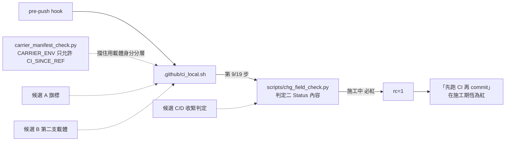
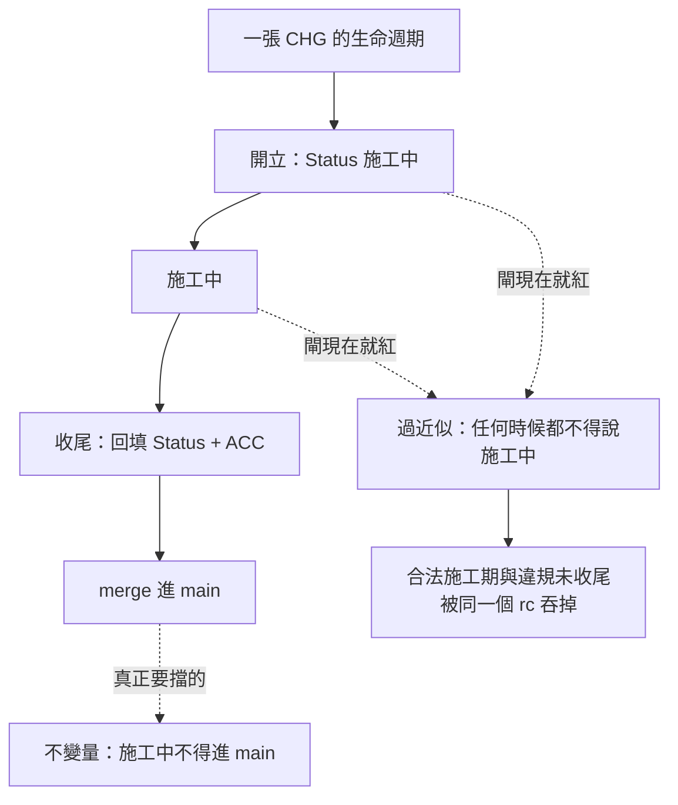

# CHG-20260822-01 — 「施工中必紅」與「CI 當作 commit 判準」被混成同一個 rc(BL-030)

- Project: skill-chinese-write
- Branch: claude/bl-030-two-tier
- Date: 2026-08-22 (UTC+0)
- Type: 閘的語義拆層
- Proposed by: **使用者**(指定處理 `BL-030`);原始觀察來自**審議席(codex)**,記於 `ACC-20260820-01`
- Implemented by: Claude Opus 5(Cowork session,主 agent)
- Collaborators:
  - **OpenAI Digital Codex（審議席）**
  - **Claude Fable 5（審議席）**
- Risk: 中(兩席第三輪一致;fable 由高改判,codex 維持中)
- Autonomy: DIR-002 兩席共識
- Consensus: codex ✓ 2026-08-22 / fable ✓ 2026-08-22
- Commit/PR: 分支 claude/bl-030-two-tier
- Recurrence check: **`BL-030` 第三次現形**——`ACC-20260820-01` 開立、`ACC-20260821-01` 記一次、
  `ACC-20260821-02` 再記一次,三次的處置都是「施工完才回填 Status 再跑 CI」,
  也就是**繞過,不是解法**
- Diagrams: 見下方 `## Design diagrams`
- Skill: ai-sdlc v1.64

## 事實與重現

`scripts/chg_field_check.py` 的判定二對 `## Status` 首個平文段含「施工中 / 進行中 / WIP」的 CHG **必紅**,
而它掛在 `.github/ci_local.sh` 第 [9/19] 步,`ci_local.sh` 又是 pre-push hook 的內容。

後果:**「先跑 CI 再 commit」這條紀律,在施工期間恆為紅,無從據以判斷。**
綠不了不是因為東西壞了,是因為東西還沒做完——而這兩件事在 rc 上長得一樣。

沙盒重現(拿 `CHG-20260821-02` 自己當夾具,只把 `## Status` 改回施工中,其餘一字未動):

    python3 scripts/chg_field_check.py --repo <沙盒> --glob 'changes/CHG-*.md'
    → CHG-20260821-02.md:`## Status` 說它還在施工,而它已經在帳本裡「**施工中 — 待 ACC-20260821-02。**」
    → EXIT=1

## 為什麼這不是「把 `;` 改成 `&&`」能解的

審議席(codex)在 `ACC-20260820-01` 已裁過:
「現行流程把『施工中必紅』與『CI 應作為 commit 判準』**混成同一個 rc**;
`;` 改 `&&` 只能防誤操作,不能解決語義衝突。」

## 這一格的真正病灶:閘執行的是不變量的**過近似**

要守的不變量是——**Status 說「施工中」的 CHG 不得進 main**
(`CHG-20260814-07` 掛著它一路 merge,第三天才被眼睛抓到,`632cbe4` / `#17`)。

閘實際執行的是——**任何時候都不得有 CHG 說「施工中」**。

後者嚴格強於前者。強出來的那一塊,正好覆蓋了「一張 CHG 從開立到收尾之間」的全部時間,
而那段時間本來就該存在——治理流程明文要求**動手前先開 CHG**,
於是「合法的施工中狀態」與「違規的未收尾狀態」被同一條判定吞掉。

## 約束(先量再訂,兩席請據此判)

**`carrier_manifest_check.py` 擋住「用載體身分分層」這條路。** 它的 `ENV_TOKEN` 掃
`GITHUB_[A-Z_]+ | RUNNER_[A-Z_]+ | CI_[A-Z_]+`,而 `CARRIER_ENV` 允許名單**只有 `CI_SINCE_REF` 一個**,
每一個新增都要在該處具名並附理由。理由寫在檔內:

> 每多一個,ci_local 就多知道一點「自己跑在哪裡」,而載體不可知正是合一的前提。

所以任何「本機跑寬、CI 跑嚴」的設計,都要先回答:**它是不是又讓唯一真相源知道自己跑在哪裡。**

## 候選設計(主 agent 提案,兩席請判定並得選別的)

**候選 A — 明示意圖旗標,預設從嚴。**
`chg_field_check.py` 加 `--allow-wip`;`ci_local.sh` 讀一個新的跨界變數(需在 `CARRIER_ENV` 具名附理由),
預設不給。施工中要跑閘就自己帶旗標。
*代價*:多一個跨界變數,而那正是 `carrier_manifest_check` 想壓低的數目;
旗標可被誤用成長期關閉。

**候選 B — 拆兩支進入點,不用變數。**
`ci_local.sh` 維持從嚴(收尾用);另出一支 `.github/dev_check.sh` 跑「除了 Status 收尾以外的全部」。
*代價*:**第二份載體**——`CHG-20260816-01` 才剛因為「兩份重複、沒有東西斷言一致」把兩份合成一份,
這是往回走,除非配一道「兩支的閘清單必須一致」的斷言。

**候選 C — 收緊判定本身,讓它只擋真正的違規。**
判定二改成:施工中的 CHG **只有在它已經可從 `origin/main` 到達時**才紅。
不變量直接對上「不得進 main」,不需要任何模式旗標,也不需要第二份載體。
*代價*:PR 尚未 merge 時 CHG 不在 main 上,**於是 PR 的閘也不會紅**——
擋 merge 的責任要移到別處(merge 前的收尾檢查、或 PR CI 用 `CI_SINCE_REF` 判「這批 diff 有沒有把施工中的 CHG 帶進來」)。
這一格是候選 C 的死穴,請兩席特別判。

**候選 D — 綁 ACC 而不是綁時間。**
判定二改成:CHG 說「施工中」而**對應的 ACC 已存在**才紅(自相矛盾);
ACC 不存在時視為合法的施工期。
**已查證(本張開立時補上,不留給兩席)**:`632cbe4` 那一個 commit 裡,
`docs/writing/acceptance/ACC-20260814-07.md` **已經存在**,而
`docs/writing/changes/CHG-20260814-07.md` 的 `## Status` 寫的是「施工中 — 待 ACC-20260814-07。」
——**ACC 已經寫完了,Status 忘了改**。

也就是說:**候選 D 的判準會抓到那次事故**,而且抓得比現行判定精確——
現行判定是「任何時候說施工中就紅」,D 是「ACC 都寫完了你還說施工中」,
後者正是那次的形狀,前者則連合法施工期一起吞。

*代價*:D 擋不到「ACC 也沒寫、CHG 也沒收,整批就 merge 了」這一型。
那一型現在由 `doc_integrity_check` 的 CHG↔ACC 配對接住(缺 ACC 會紅),
所以**兩層合起來是否已經無縫,請兩席判**——這是 D 能不能單獨成立的關鍵。

## 修正項目

(切項提案,兩席得要求重切)

- CHG-20260822-01.1 — 選定設計並改寫 `scripts/chg_field_check.py` 的判定二,
  含 `--self-test` 的紅綠端(合法施工期必綠、違規未收尾必紅,兩端皆由對方突變產生)
- CHG-20260822-01.2 — 依選定設計調整 `.github/ci_local.sh`(以及必要時 `carrier_manifest_check.py`
  的 `CARRIER_ENV` 具名附理由)
- CHG-20260822-01.3 — `docs/writing/backlog.md` 解除 `BL-030`,並記錄它三次現形的處置差異

## 審議席共識

| 修正項目 ID | 處置版本 ID | codex 判定 | fable 判定 | 共識狀態 | 收斂輪次 | 未決理由 |
|---|---|---|---|---|---|---|
| CHG-20260822-01.1 | v3-E-argv | 同意 | 同意 | 通過 | 3 | — |
| CHG-20260822-01.2 | v3-E-argv | 同意 | 同意 | 通過 | 3 | — |
| CHG-20260822-01.3 | v3-解除BL030 | 同意 | 同意 | 通過 | 3 | — |

## 三輪收斂的路徑:兩席交叉改判,最後都落在對方原本沒提的地方

**第一輪**:codex 選 A(旗標,環境變數)並自行收緊——旗標僅放行「施工中 ∧ ACC 不存在」;
fable 四個候選全否,提第五案 D+C(不新增變數、不開第二載體)。

**第二輪:兩席都改判,而且是往對方那邊動,然後在半路交錯而過。**

- fable 放棄 D+C,改採 codex 的 A 收緊版。它自承第一輪 cost #3 有個錯的隱含:
  「降級不是過渡性的,是結構性的。就算 `-02` 把配對層修活,它也**永遠**接不住這一型——
  配對層的語義本來就必須豁免施工中的 CHG(合法施工期無 ACC 是常態)。」
  它也界定了自己「機器不可能區分」那個論證的範圍:「我證的是**僅憑 repo 狀態**……
  這只否決了 C 單獨與維持現狀,**沒有否決引入明示意圖訊號**。」
- codex 同一輪放棄環境變數版,改提 E:旗標走**命令列參數**,`CARRIER_ENV` 一格都不動。
  它承認 fable 的反駁「成立一半」:環境變數版若被 workflow 長期設定會形成靜默綠,
  **而目前沒有任何既有閘會因此轉紅,單寫「CI 不得設定」不符合 KN-001。**

**第三輪**:fable 改判到 E,分歧歸零。它的理由是兩輪都沒人說出來的:

> **環境是可寫的環境通道,釘死字面值的 argv 不是。** GitHub Actions 的 `GITHUB_ENV` 允許
> 前置步驟用 `echo "NAME=value" >> "$GITHUB_ENV"` 為後續步驟注入環境變數,而那行字串
> **可以拼接構造**——`CI_ALLOW_WIP` 七個字元不必完整出現在 workflow 檔的任何地方。
> 我的文字層掃描對這條路**必然全盲**……我把一道已知繞得過的文字斷言,放在了唯一守衛的位置。

以及一個機械事實,反而是 E 的加分:

> **argv 穿不過 `git push`。** pre-push hook 的呼叫形式是固定的,人沒有辦法對一次 push
> 臨時傳參數——於是 hook **恆為全嚴**,施工中的東西一個位元組都出不了本機。
> ……環境變數版反而做不到這一點——`CI_ALLOW_WIP=1 git push` 會穿過 hook。

兩席也一致否決了主 agent 提的第六案(拿 `CI_SINCE_REF` 或 merge base 當比較基準)。
fable 的理由最尖銳:`CI_SINCE_REF` 只在 push 事件被設定,拿「有設 / 沒設」切換嚴格度
**等於拿它當載體探針的代理**——「變數本身合法,但這種用法讓唯一真相源間接知道
自己跑在哪個事件裡,正是硬規矩禁止的事,只是換了件衣服。」

## 最終設計(E:命令列參數 + 結構釘死)

判定二拆成兩個具名紅出口:

- **`RED(acc-contradiction)`**:施工中 ∧ 對應 ACC 檔**已存在** → **任何模式都紅**。
  這是 `632cbe4` 事故的精確形狀(ACC 寫完了、Status 忘了改)。
- **`RED(wip-not-explicitly-allowed)`**:施工中 ∧ ACC 不存在 → **預設紅**,
  僅在呼叫者明示 `--allow-wip` 時綠。

守衛:

- `--allow-wip` **只從命令列進來**,不讀任何環境變數;`CARRIER_ENV` 維持唯一成員
- 正式 workflow 必須**無參數**呼叫唯一真相源;`carrier_manifest_check.py` 新增結構斷言,
  把那一步的 `run:` 區塊與核准字面值**整段比對**,偏離即紅
  (fable 指出這不需要真的「解析」指令列,也就不引入 `steps_of` 刻意迴避的 PyYAML 依賴)
- **釘子三**:施工模式啟用時輸出須帶醒目標示,不得與全嚴通過一字不差——
  否則長期掛旗標的靜默綠又回來

## 兩席共同記下的殘餘誠實極限

「ci_local 不得因環境而變更判定二行為」對**任意命名**的環境變數沒有機器斷言
(`ENV_TOKEN` 只掃 `GITHUB_/RUNNER_/CI_` 三族,族外名字全盲)。
這是既有的、`BL-017` 型的極限,**不是本案新開的洞**,在 `CARRIER_ENV` 註解區具名記一句。

## 這張自己就踩在 BL-030 上

本張開立時 `## Status` 必然是「施工中」,於是**從現在到收尾為止,本機 19 道閘恆紅**——
而恆紅的原因正是這張要修的東西。這不是巧合,是 `BL-030` 的定義域:
任何一張 CHG 的施工期都落在裡面。

處置:本輪仍走「施工完才回填 Status 再跑閘」,並在此**具名記下這是第四次繞過**;
`.1` 落地之後,下一張 CHG 起才會有真解。

## Design diagrams

### 受影響區域

### 要守的不變量 vs 閘實際執行的

## Status

**已驗收 — `ACC-20260822-01`。** 三個修正項目全部由 codex 與 fable 各自明示同意同一處置版本(v3-E-argv),收斂輪次 3,無僵局。
