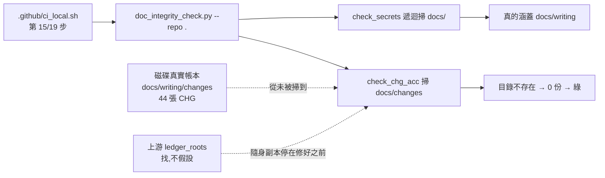
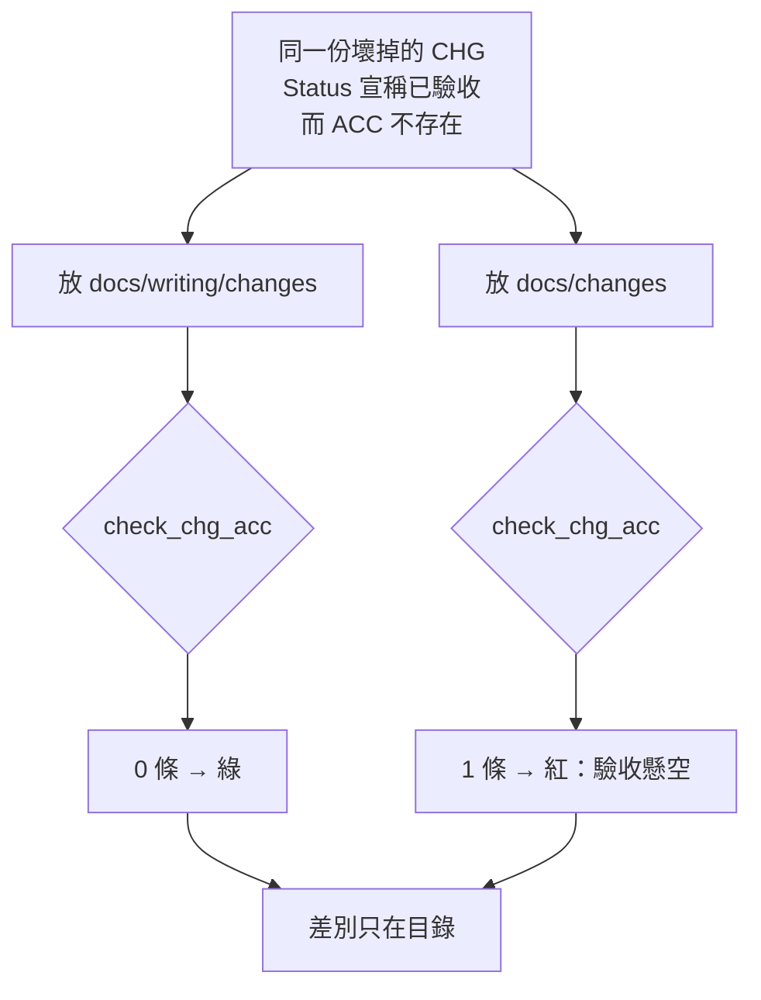

# CHG-20260822-02 — `[15/19] 帳本完整性(CHG↔ACC…)` 在本 repo 是恆真的,而它印綠燈

- Project: skill-chinese-write
- Branch: claude/bl-030-two-tier
- Date: 2026-08-22 (UTC+0)
- Type: 修復恆真閘
- Proposed by: **主 agent**(處理 `BL-030` 時查證候選 D 的前提,撞到這件事);使用者指定開 CHG
- Implemented by: Claude Opus 5(Cowork session,主 agent)
- Collaborators:
  - **OpenAI Codex（審議席）**——第一輪審 `CHG-20260822-01` 時實際讀了該支,
    抓到 `施工中` 被歸類為 `unknown` 而 `check_chg_acc` 對 `unknown` 直接 `continue`;
    本張的路徑錯位是主 agent 循它那條線索往下查到的
  - **Claude Fable 5（審議席）**
- Risk: 中(**使用者裁決** — codex 判高、fable 判中,三輪未收斂;依 DIR-002 第 2 款上報後由使用者裁定,經過記於 `## 風險等級的僵局與裁決`)
- Autonomy: DIR-002 兩席共識
- Consensus: codex ✓ 2026-08-22 / fable ✓ 2026-08-22
- Commit/PR: 分支 claude/bl-030-two-tier
- Recurrence check: **上游同名檔的註解自己寫著「同一個錯誤修過兩次,這是第三次」**——
  而本 repo 的隨身副本停在修好之前的版本,於是這是**第四次**,只是換了一個 repo 發生。
  與 `BL-033` 同族:隨身副本落後上游,而漂移檢查依設計查不出來
- Diagrams: 見下方 `## Design diagrams`
- Skill: ai-sdlc v1.64

## 事實

`.github/ci_local.sh` 第 [15/19] 步的標題是「帳本完整性(**CHG↔ACC** + 結構同步 + secrets)」,
它呼叫 `tools/autopilot/scripts/doc_integrity_check.py --repo .`,
而該支的 `check_chg_acc` 掃的是 `repo/docs/changes`。

**本 repo 的帳本在 `docs/writing/changes`。`docs/changes` 不存在。**

實測:

    check_chg_acc 實際掃到的 CHG 份數: 0
    check_chg_acc 回傳: []
    磁碟上真正的 CHG 份數: 45(含本張)

45 張 CHG,它一張都沒看過,然後印
「✅ doc-integrity 檢查通過(結構同步 + CHG↔ACC + 欄位 + secrets)」。

### A/B 決定性測試

同一份故意壞掉的 CHG(`## Status` 宣稱「已驗收 — ACC-99999999-99」,而該 ACC 不存在),
放兩個位置各跑一次:

| 位置 | `check_chg_acc` |
|---|---|
| `docs/writing/changes`(**本 repo 的真實位置**) | 0 條 → **綠** |
| `docs/changes`(工具寫死的位置) | 1 條 → 紅:「已實作但 `docs/acceptance/` 找不到對應 ACC — 驗收懸空」 |

**差別只在目錄。**

## 不是只有一格——先量再訂

`doc_integrity_check` 的十個檢查,逐一實跑本 repo:

| 檢查 | 掃描路徑 | 在本 repo |
|---|---|---|
| `check_chg_acc` | `docs/changes` | **空轉** |
| `check_fields` | `docs/changes` / `docs/acceptance` | **空轉** |
| `check_recurrence_field` | `docs/changes` | **空轉** |
| `check_knowledge_bootstrap` | 需 `docs/changes` 存在 | **空轉(路徑病)** |
| `check_knowledge_entries` | `docs/knowledge/entries` | 空轉,**但不是路徑病**——本 repo 是單檔 `knowledge.md`,沒有 `entries/` |
| `check_knowledge_index` | `docs/knowledge/INDEX.md` | 空轉,**不是路徑病**——同上 |
| `check_regression_pointers` | `docs/acceptance/regression.md` | 空轉,**不是路徑病**——該檔全 repo 不存在 |
| `check_coverage_registry` | `repo.glob("docs/*/acceptance/…")` | 空轉,**它本來就認得分目錄,沒有路徑病** |
| `check_entry_point` | `governed = (docs/changes).is_dir()` → **False** | **判定本 repo 未受治理** |
| `check_secrets` | `docs/` **遞迴** | **真的有在跑**(涵蓋 `docs/writing`) |

**兩席各自獨立修正了主 agent 的歸因**——八個機械上都空轉,但成因是兩種:

- **四格是路徑病,修好路徑就活**:`check_chg_acc` / `check_fields` /
  `check_recurrence_field` / `check_knowledge_bootstrap`。
  fable 實測:把 `docs/writing` 鏡射進 `docs/`,前三格立刻噴出 **11 + 34 + 4** 條。
- **四格修好路徑也不會活**:標的物在本 repo 根本不存在(單檔 knowledge、無 regression.md、
  無 verification-coverage.md)。其中 `check_coverage_registry` 用的是
  `repo.glob("docs/*/acceptance/…")`——**同一個檔案裡已經有正確的 glob 寫法**。

這個拆分不是吹毛求疵:**任何驗收判準都不能宣稱「修好路徑會救回八格」,只會救回四格。**

另外 codex 抓到**第三個假宣稱**:`check_structural_sync` 只在帶 `--staged` 時執行,
而第 [15/19] 步呼叫時**沒有帶**——標題卻寫著「結構同步」。
所以那一行有三個假宣稱:CHG↔ACC 空轉、欄位空轉、結構同步根本沒跑。**只有 secrets 是真的。**

`check_entry_point` 那一格特別要記:它用 `docs/changes` 的存在與否判斷「這個 repo 受不受治理」,
於是本 repo 在它眼裡**不是治理專案**——`AGENTS.md` 必須存在這條規則對本 repo 從未生效過
(AGENTS.md 剛好存在,所以看不出來)。

## 上游早就修了,而且修過兩次

上游同名檔有 `ledger_roots()`,其 docstring 原文:

> 同一個錯誤修過兩次,這是第三次:
> · 第一次(CHG-20260804-17):工具寫死 `docs/changes/`。對分目錄帳本的 repo
>   那些檢查**全部靜默空轉**……而回報「沒問題」比回報「有問題」更難被發現:
>   **沒有人會去追查一個綠燈**(KN-001 的鏡像)。
> · 第二次(CHG-20260811-01):那次只修了分目錄那一層,`docs` 這個名字本身還是寫死的,
>   而兜底 `return roots or [docs]` 更糟——找不到任何帳本時**回傳一個假設**。

上游的 `check_chg_acc` 簽章也已改成 `check_chg_acc(repo, docs=None)`。
本 repo 的隨身副本停在 `88ac05a`,在這些修正之前。

## 候選處置(主 agent 提案,兩席請判定並得選別的)

**候選 A — 同步隨身副本到上游最新。**
`tools/` 從上游重新帶一次,更新 `PROVENANCE.json` 的 `source_commit` 與 42 筆雜湊。
*收益*:一次修好本張與 `BL-033`(`git -C` 那個同型缺陷),而且拿回 `--check-baseline` 等新旗標。
*代價*:**開案時寫的同步終點 `e09d721` 當場就已過時**——上游現在是 `e3d27c3`,
距離隨身副本的 `88ac05a` **121 個 commit**(fable 量到 120,期間又進了一個)。
而 fable 拿上游現版直接跑本 repo 的 docs 快照,得到 exit 1、**19 條潛在紅**:
9 條「高風險無審議判決」(上游的 `VERDICT_RE` 只認 `[verdict]` / 審議判決,
而本 repo 依 DIR-002 記的是「審議席共識」表——**大半是詞彙方言不匹配,不是真沒審**,
`CHG-20260821-01` 明明有共識表也中)、8 條近期 ACC 缺「驗收者 / 風險分級」欄(模板方言漂移)、
2 條在途 CHG 懸空(正是 `BL-030` 的施工期紅形狀)。
**17 / 19 是方言不匹配**——處分它們要嘛改寫 17 份歷史文件、要嘛上游長出方言設定。
fable 的判定:「**這是導入工程,不是同步。**」

**候選 B — 本 repo 自己寫一支 CHG↔ACC 配對閘,放 `scripts/`。**
有現成先例:`chg_field_check.py` 的 docstring 明寫「隨身副本就地改會讓漂移檢查轉紅,
所以本 repo 自己的斷言放在 `scripts/`」。
*收益*:變更面小、路徑由本 repo 自己控、可立刻配紅端。
*代價*:**只修 CHG↔ACC 這一格**,其餘七格照樣空轉;而且與上游功能重複,
上游同步回來之後會有兩份在做同一件事——`CHG-20260816-01` 記過「兩份重複靠人記得同步」的代價。

**候選 C — 兩層都做:先 B 止血,再把 A 列成 backlog。**
*代價*:重複問題延後而非解決;要明訂 A 完成後 B 退不退役。

**候選 D — 不修 `check_chg_acc`,改為讓 `[15/19]` 這一步誠實。**
既然它在本 repo 幾乎全空轉,就把步驟標題與它自己的成功訊息改成只宣稱它真的驗到的東西(secrets),
並把空轉的部分明列為未涵蓋。
*收益*:立刻消滅假綠——**假綠比沒有閘更糟**,因為沒有人會去追查一個綠燈。
*代價*:治理覆蓋率不變,只是不再說謊;要配一道斷言防止它日後又宣稱得比實際多。

**主 agent 的觀察(不是判定)**:D 與 A/B/C 不互斥,而且 D 是唯一能**立刻**止住假綠的。
但只做 D 等於承認 CHG↔ACC 沒有機器在看,那件事本身要不要接受,是兩席的判斷。

## 修正項目

(切項提案,兩席得要求重切)

- CHG-20260822-02.1 — 選定處置並落地(修復或誠實化 `[15/19]` 的覆蓋範圍)
- CHG-20260822-02.2 — 配可跑的斷言:壞掉的 CHG 放在**本 repo 的真實帳本路徑**必須被擋,
  紅端由綠端突變產生
- CHG-20260822-02.3 — 帳本記錄:`BL-034`(或依處置解除/開立對應條目),
  並把「隨身副本落後上游」這一族與 `BL-033` 併記

## 審議席共識

| 修正項目 ID | 處置版本 ID | codex 判定 | fable 判定 | 共識狀態 | 收斂輪次 | 未決理由 |
|---|---|---|---|---|---|---|
| CHG-20260822-02.1 | v3-D+止血 | 同意 | 同意 | 通過 | 3 | — |
| CHG-20260822-02.2 | v3-三組並列 | 同意 | 同意 | 通過 | 3 | — |
| CHG-20260822-02.3 | v3-BL034 | 同意 | 同意 | 通過 | 3 | — |

**三個修正項目全部通過。僵局在 `Risk` 欄位,不在修正項目上**——見下節。

## 風險等級的僵局與裁決(三輪未收斂 → 使用者裁定)

兩席在三輪裡**交換了兩次位置**,第三輪仍不一致:

| 輪次 | codex | fable |
|---|---|---|
| 一 | 高 | 中 |
| 二 | **中**(A 移出本張,修改面縮小) | **高**(失效型態是靜默綠) |
| 三 | **高** | **中** |

**fable 判中**(第三輪),理由是它把自己的尺補完:

> 尺的前半段我維持:分級量失效型態,不量改動大小;凡失效型態為靜默綠者**起評高**。
> 但尺有後半段:分級的對象是**本張規格下的變更整體,含它強制配備的斷言**;
> 我第二輪列舉的每一條靜默路徑,在 `.2` 裡都有一條由綠端突變產生、進 CI 的紅端對應——
> **一條配了突變紅端的靜默路徑,依構造不再靜默**。量裸標的,高;量含護欄的成品,中。

它附了一條但書:**施工中任一紅端縮水、移除、或改為不進 CI,分級即回高並重新過席。**

**codex 判高**(第三輪),理由是爆炸半徑與失效可見性:

> 即使 A 已移出,本張仍修改所有未來 CHG 都會經過的 `[9/19]`,並新增專門防止假綠的斷言。
> 若判定、路徑或夾具寫錯,最危險的結果不是 CI 明顯故障,而是**全帳本繼續靜默綠**;
> 這正是本案要修的失效型態。D 的改動量小,但止血層的爆炸半徑與失效不可見性足以判高。

**兩席其實同意判準**(量失效型態不量改動大小),分歧在**護欄算不算進被量的對象**。

依 DIR-002 第 2 款:三輪用盡即為僵局,不由主 agent 拍板,記帳(`BL-035`)並**主動告知使用者**;
不可逆動作一律等。主 agent 在 merge 前停下,fail-closed 取高風險那一側。

**使用者裁決(2026-08-22,第三席):中,照常設授權 merge。** `BL-035` 隨之解除。

**要留意的是共識欄位與風險欄位分屬兩件事**:三個修正項目是**兩席共識**(逐項 codex ✓ / fable ✓),
所以標頭用兩席具名形狀;僵局只在 `Risk` 這一格,由使用者這個第三席裁定。
兩者混寫會讓下一個讀的人以為整張都是裁決產物——而它不是。

fable 的但書隨裁決一併生效:**施工中任一紅端縮水、移除、或改為不進 CI,分級即回高並重新過席。**
本張落地的紅端清單見 `.2`,全部進 CI。

## 這件事怎麼被發現的,值得記

不是任何一道閘抓到的,是**追一個候選設計的前提**時撞到的。

`CHG-20260822-01` 的候選 D 主張「D 擋不到的那型由 CHG↔ACC 配對接住」,
codex 第一輪去讀了那支、抓到 `施工中 → unknown → continue`,推翻了那個主張;
主 agent 循同一條線索往下查路徑,才發現配對**根本沒在掃這個 repo**。

**一個綠燈之所以沒人追查,正因為它是綠的。** 它在這個 repo 綠了 45 張 CHG。

## Design diagrams

### 錯位在哪

### A/B 測試的判定

## Status

**已驗收 — `ACC-20260822-02`。** 三個修正項目為兩席共識;`Risk` 欄位三輪未收斂,由使用者裁定為中(`BL-035` 已解除)。
