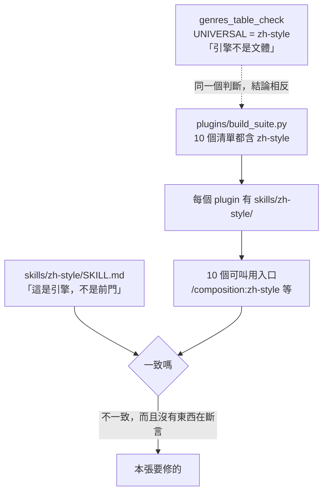
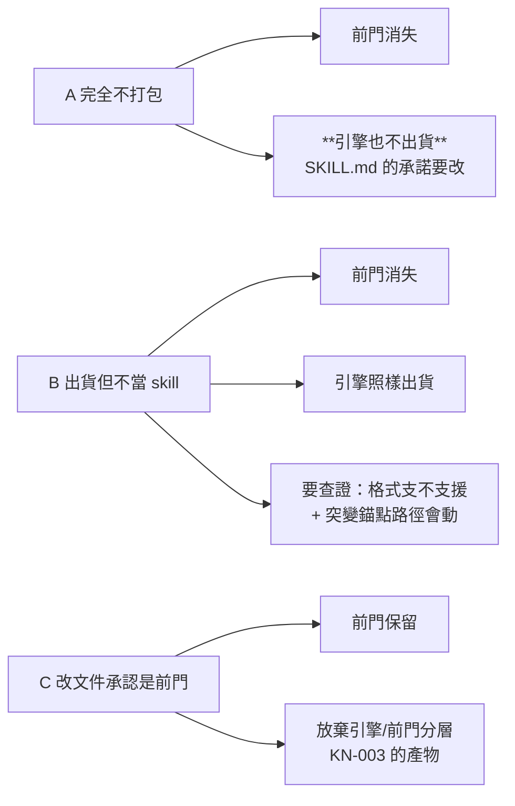

# CHG-20260829-01 — zh-style 自稱「引擎,不是前門」,而它在每個 plugin 都長出一個前門

- Project: skill-chinese-write
- Branch: claude/zh-style-not-a-command
- Date: 2026-08-29 (UTC+0)
- Type: 出貨形狀修正
- Proposed by: **使用者**(「先移除 zh-style 的 command」;候選送審後裁決「**不納入 command 即可**」→ 採 B)
- Implemented by: Claude Opus 5(Cowork session,主 agent)
- Collaborators:
  - **OpenAI Codex（審議席）**
  - **Claude Fable 5（審議席）**
- Risk: 中(兩席三輪一致)
- Autonomy: DIR-002 兩席共識
- Consensus: codex ✓ 2026-08-29 / fable ✓ 2026-08-29
- Commit/PR: 分支 claude/zh-style-not-a-command
- Recurrence check: **「宣稱與實際相反」第三次**——`CHG-20260822-02` 是
  「閘宣稱驗了 CHG↔ACC 而它一張沒看」;`CHG-20260821-02` 是
  「腳本自稱唯讀而它寫壞宿主」;這次是**文件自稱不是前門,而打包讓它變成十個前門**。
  三次的形狀相同:**宣稱寫在文件裡,實際由別處決定,而沒有東西斷言兩者一致。**
- Diagrams: 見文末的設計圖節
- Skill: ai-sdlc v1.64

## 事實

`skills/zh-style/SKILL.md` 第 16 行自述:

> **這是引擎,不是前門。** 它沒有自己的 plugin,由所有 plugin 打包帶入。

前半句是意圖,後半句是機制——而**後半句正好讓前半句失效**。
`plugins/build_suite.py` 第 28~40 行把 `zh-style` 列進**全部 10 個** plugin 的打包清單,
於是它以 skill 目錄的形式出現在每個 plugin 裡:

    architecture → architecture techdoc zh-style
    classical    → ci-poetry fu historiography regulated-verse zh-style
    composition  → exposition lyric narrative poetry prose zh-style
    drama / fiction / official / press / proposal / spec / writing → …zh-style

skill 目錄一存在就是可叫用的入口,於是使用者會看到 `/composition:zh-style`、
`/classical:zh-style`、`/press:zh-style`……**十個前門**,而 SKILL.md 說它不是前門。

**marketplace 沒有 zh-style 的 plugin 條目**(實測 `grep` 零命中)——
那一半是對的:它確實沒有自己的 plugin。錯的是它有十個借來的門。

## 這件事本 repo 早就判過了,只是判在別的地方

`scripts/genres_table_check.py` 第 68~69 行:

    # zh-style 是引擎不是文體,由所有 plugin 打包,不列在 plugin 表的成分欄裡。
    UNIVERSAL = "zh-style"

**閘已經把它當引擎特別處理**(不列進文體表的成分欄),而打包仍把它當文體出貨。
同一個判斷,兩個地方,結論相反。

## 順手量到的:一個過期的手抄數字

`scripts/version_impact_check.py` 第 13~17 行的說明文字:

> 實測 `zh-style` 被**全部 21 個** plugin 打包、`fiction` 被 7 個。
> ……而那 21 個 plugin 的出貨行為全變了

marketplace 實際是 **10 個** plugin。這是本 repo 記過的「文件裡手抄的數字」那一族,
出現在**治理腳本自己的 docstring 裡**。不是本張的主題,但既然量到了就一併處分。

## 處置:B(使用者裁決),兩席審的是機制與斷言

主 agent 在開案時把三個候選送到使用者面前,因為 A 與 B 的差別**不是文字,是使用者拿不拿得到那支 lint**
——那是產品決定,不是技術判斷。使用者原話:「**不納入 command 即可**」。

**採 B:引擎檔照樣隨每個 plugin 出貨,但不以 skill 形式曝露,不長出可叫用入口。**

已排除的兩個,連理由一併記下(不是沒考慮過):

- **A 完全不打包** —— 前門會消失,但**引擎也不出貨**,已安裝的使用者跑不了 `zh_style_check.py`,
  而 `SKILL.md` 自己承諾「由所有 plugin 打包帶入」。使用者要的是移除 command,不是移除引擎。
- **C 改文件承認它是前門** —— 等於放棄「引擎 / 前門」分層,而那條分層是 `KN-003` 的產物
  (規則不隨文體改變就放共用引擎)。誠實但往回走,且與使用者的裁決相反。

### B 的可行性:已查證

plugin 出貨樹本來就有非 `skills/` 的目錄——`plugins/fiction/` 底下有 `commands/`,
多個 plugin 有 `README.md` 與 `THIRD-PARTY-NOTICES.md`,它們照樣出貨而**不被當成 skill**。
所以「出貨引擎檔但不建立 skill 入口」在格式上成立。

### B 會踩到的三處,兩席請判機制

1. **`genres_table_check.py` 第 444 行**拿
   `$PY skills/zh-style/scripts/zh_style_check.py --self-test` 當 `ci_local.sh` 的**突變錨點**。
   路徑一動,那道閘會紅在「錨點找不到」——**fail-closed,不是靜默**,所以它會逼我們同步改,
   但改法要判:錨點跟著新路徑走,還是改成不綁路徑的形式?
2. **`skill_inventory_check.py` 第 298 行**的合成樹夾具把 `zh-style` 釘進
   `official` 的打包形狀(`SHAPE_PLUGINS`)。夾具要跟著改,而**改夾具就是改判準**——
   要確認改完之後那道閘守的還是同一個不變量。
3. **`genres_table_check.py` 的 `UNIVERSAL = "zh-style"`** 本來就註明「引擎不是文體」。
   B 落地之後這個特例還需不需要?若不需要,移除它是化簡;若需要,理由要重寫。

### 主 agent 認為最要緊、但沒有既定答案的一格

`.3` 要的斷言是「**文件說它不是前門」與「打包讓它成為前門」不得再度分岔**」。
問題是這條規則的兩端一端在散文(`SKILL.md` 的自述)、一端在資料(`build_suite.py` 的清單),
而本 repo 記過「敘述層要靠 NLP 才判得動,造那個會製造誤殺面」(`genres_table_check` 的自述)。

所以要判:**這條規則是可斷言的,還是依 `KN-001` 第二條路明講靠人?**
若可斷言,斷言打在哪一端——是「`zh-style` 不得出現在任何 plugin 的 `skills/` 底下」
(資料端,判得動),還是要連 `SKILL.md` 的措辭一起管(散文端,判不動)?
**主 agent 傾向前者,但這正是要兩席判的東西。**

## 第一輪把影響面撐開了三倍,而其中一處是唯一會靜默的

v1 只列三個行號。兩席**各自獨立**指出不夠,主 agent 逐條覆核,全部屬實。

### 唯一的 fail-open:`version_impact_check.py`(fable 抓到)

    :244  hosts_of(plugins, skill)          ← 從 PLUGINS 種 host
    :273  path = f"skills/{skill}/SKILL.md"
    :283  git ls-tree … -- skills/          ← 只掃 skills/ 前綴

B 落地後引擎**同時離開這兩個命名空間**,於是「引擎內容變了、十個 plugin 出貨全變」
這件事那道閘**永遠看不見**——**而它 docstring 自述要堵的洞,舉的例子就是 zh-style**。

**其他觸點全是 fail-closed,會逼我們同步改;只有這一處落地後永久靜默。**
所以它不是 `.2` 裡一筆帶過的連帶項,是必修,且 `.3` 的突變要打到它。

### 其餘連帶面(兩席合併,主 agent 覆核)

| 觸點 | 實況 | 方向 |
|---|---|---|
| `.github/ci_local.sh` | **7 行**硬編碼 `skills/zh-style/`(212–217、277、295、306) | fail-closed |
| `skill_inventory_check.py` `ENGINE_CALL_RE` | `r"skills/([a-z-]+)/scripts/[a-z_]+\.py"` ——移到 `engines/` 就**認不出引擎引用** | fail-closed |
| `genres_table_check.py` `[有引擎]` 判定 | `SEC_UNIVERSAL` 的列釘在 `skills_dir`,三條全綁舊路徑與 `SKILL.md` 這個檔名 | fail-closed |
| `skill_inventory_check.py` `PLUGIN_TOP_ALLOWED`(第 96 行) | 新增 `engines` 是**登記變更**,白名單自己的註解已寫明程序 | fail-closed |
| `plugins/catalog_check.py` 第 101 行 | 另一處「21 個」 | 敘述 |

### 過期數字不只一個,而且不能用下一個手抄數字換掉

「21」在 `version_impact_check.py` 第 13、16、17、38 行**共四處**,加 `catalog_check.py` 第 101 行。
**而同一段的「`fiction` 被 7 個」也過期**——實測現在是 **1 個**(fiction-* 六支退役後)。

fable 的判定:**不要把 21 改成 10**,那是「用下一個會過期的手抄數字換掉這一個」。
改寫成不含現況計數的措辭。可判的最小替代是**「別在治理腳本敘述裡放現況計數」**,
那是寫作紀律不是斷言——依 `KN-001` 第二條路明講靠人。

## 兩席獨立收斂的三個判定

**落點**(兩席同判 `engines/zh-style/`,fable 給的判準更根本):

> **「skill」這個身分是由列舉器定義的**——誰列舉 `skills/`,誰就在定義什麼是 skill。
> 本案有兩個列舉器:平台載入器列舉 `plugins/
/skills/*`,repo 的兩道閘列舉頂層 `skills/*`。
> 「它不是 skill 在結構上成立」= **兩個列舉器都構造上走不到它**。

由此排除三個變體:只刪 `SKILL.md` 留目錄(治理面列舉器仍走得到,會被判成「缺 SKILL.md 的壞 skill」)、
塞進各前門 skill 目錄(複製十份,重蹈 `KN-003`)、只從 dist 移除而 source 留在 `skills/`
(inventory 第 3 項會紅「沒被任何 plugin 打包」)。codex 同判:**不得留 `SKILL.md` 空殼**——「空殼仍是 skill」。

**突變錨點**:兩席同判解綁。codex:「不要拿另一支 lint 的命令當**寄生錨點**。」
fable 補一格 codex 沒看到的——現行錨點**寄生了一條隱性斷言**「zh-style 的 self-test 在 CI 裡」,
解綁後它會蒸發;**它不該以副作用形式存在,但也不該無聲消失**,要升格為具名斷言。

**夾具**:兩席同判「不能只從 `SHAPE_PLUGINS` 刪掉 zh-style」——那只證明它沒有 skill,
**沒有證明「引擎仍出貨」**。要新增 `ENGINES` 名冊,樹形檢查驗兩個生成空間。
fable 另指出縫:`engines/` 加進白名單後現行第 7 項**不走進它內部**,
`plugins/
/engines/rogue/` 兩閘都走不到——與 `CHG-20260814-02` 的孤兒事故同構。

## `.3` 的關鍵:單腿斷言擋不住復發

fable 復查現行閘後指出的洞:

> zh-style 若重現於頂層 `skills/`,inventory 第 3 項紅;若重現於 `plugins/*/skills/`,第 7 項紅;
> 但**若有人把它加回 `PLUGINS` 成分並重建 `skills/zh-style/`,全部閘同時轉綠**
> ——分岔以完全一致的姿態回歸,現有閘一根手指都不會動。

所以 `.3` 要的是**集合不相交**三腿:ENGINES 名冊的 id 不得出現在 `PLUGINS` 任何成分、
不得存在於頂層 `skills/`、不得存在於任何 `plugins/*/skills/`;
外加「引擎樹內不得存在名為 `SKILL.md` 的檔」——那是把散文端唯一判得動的部分收進資料端。

`UNIVERSAL` 的處置兩席都不是「刪掉」:codex 判移除(留著會讓日後加回 `PLUGINS` 時被靜默扣除);
fable 判**換極性**(從「減掉別比」變成「出現即紅」),且單一真相移到 `ENGINES` 名冊,
不另留硬編碼常數——**否則兩份名單自己又會分岔**。

## 修正項目

**v2 — 兩席條文合併收編。** v1 的四條停在敘事之前:`.1` 只寫「引擎檔移出」、`.2` 只點三處,
而 `.4` 寫著「21 → 10」,與敘事節裡 fable 的「**不要把 21 改成 10**」**在同一份文件內正面互斥**。
fable 第二輪抓到這件事,並指出它就是本張 Recurrence 欄自己記的形狀的**院內感染**:
**ACC 對帳的是條文,不是敘事**——兩席辯出來的每一刀,在對帳面上會全數蒸發。

- CHG-20260829-01.1 — **v2-B-引擎落地**:頂層 `skills/zh-style/` **整個目錄移除**,
  引擎遷至 `engines/zh-style/`,`SKILL.md` **不得以此檔名存續**(隨遷改名);
  `build_suite.py` 新增 `ENGINES` 名冊,出貨至 `plugins/
/engines/zh-style/`,
  並自**全部十個** `PLUGINS` 成分移除 `zh-style`(十個宿主依版號閘 bump,ACC 應預期此波動);
  README 與 `docs/genres.md` 敘述對齊實際。
  **驗收判準**:平台列舉器(`plugins/
/skills/*`)與治理列舉器(頂層 `skills/*`)
  **構造上皆不可達**,不依賴任何人記得。

- CHG-20260829-01.2 — **v2-連帶閘與生成空間**,**七處具名,缺一即本項未完成**:
  1. `version_impact_check` 驅動源擴至 `ENGINES` 名冊與 `engines/` 前綴——**唯一 fail-open,必修**
  2. `genres_table_check` 的 `SEC_UNIVERSAL` / `[有引擎]` 判定改讀引擎新路徑與新檔名
  3. 突變錨點解綁(暫存副本文末附加);原**寄生**斷言「引擎 self-test 在 CI 裡」**升格為具名斷言**
  4. `UNIVERSAL` **換極性**(豁免改禁令),單一真相移至 `ENGINES` 名冊,不留硬編碼副本
  5. `skill_inventory_check`:`PLUGIN_TOP_ALLOWED` 依**登記變更程序**增列 `engines`、
     `ENGINE_CALL_RE` 認得 `engines/` 引用、樹形第 7 項對 `engines/` 補**雙向**斷言與紅端夾具
     (未登記 engine、缺少或多餘出貨、rogue 子樹),`SHAPE_PLUGINS` / `_OK_NODE` 隨真實形狀更新
  6. `ci_local.sh` **七行**硬編碼路徑(212–217、277、295、306)遷移
  7. `version_impact_check` docstring 的**機制敘述**隨驅動源改寫(**計數修正歸 `.4`**)

- CHG-20260829-01.3 — **v2-三腿集合不相交**:`ENGINES` 名冊之 id 不得出現於 `PLUGINS` 任何成分、
  不得存在於頂層 `skills/`、不得存在於任何 `plugins/*/skills/`;
  **引擎樹內不得存在名為 `SKILL.md` 之檔**(把散文端唯一判得動的部分收進資料端)。
  紅端由綠端突變產生,**須覆蓋兩條路**:
  ①「加回 `PLUGINS` 並重建 `skills/zh-style/` 而現行閘全綠」的**復發路**;
  ②`version_impact` 驅動源的**靜默路**。
  散文措辭(`SKILL.md` 是否仍宣稱「不是前門」)依 `KN-001` 第二條路**明講靠人**,不造 NLP lint。

- CHG-20260829-01.4 — **v2-去除現況計數**(落點:同案獨立項,兩席第三輪合流):
  `version_impact_check.py` 第 13、16、17、38 行的「21」與同段「`fiction` 被 7 個」、
  `catalog_check.py` 第 101 行的「21 個」,一律改寫為**不含現況計數**的措辭
  (指稱「打包它的每一個宿主」,或標明寫作當時的歷史實測),**不得以 10 與 1 替換**
  ——那是用下一個會過期的手抄數字換掉這一個。
  此族依 `KN-001` 第二條路**明講靠人**;可判的最小替代「治理腳本敘述不放現況計數」
  是**寫作紀律,不偽裝成斷言**。

## 審議席共識

| 修正項目 ID | 處置版本 ID | codex 判定 | fable 判定 | 共識狀態 | 收斂輪次 | 未決理由 |
|---|---|---|---|---|---|---|
| CHG-20260829-01.1 | v2-B-引擎落地 | 同意 | 同意 | 通過 | 3 | — |
| CHG-20260829-01.2 | v2-連帶閘與生成空間 | 同意 | 同意 | 通過 | 3 | — |
| CHG-20260829-01.3 | v2-三腿集合不相交 | 同意 | 同意 | 通過 | 3 | — |
| CHG-20260829-01.4 | v2-去除現況計數 | 同意 | 同意 | 通過 | 3 | 落點:同案獨立項 |

**版本 ID 與條文對齊**:fable 第三輪順手點名——共識表的「處置版本 ID」欄一度還是 `v1-*`
而條文已是 `v2-*`,**別讓帳本欄位指著不存在的處置版本**。已對齊。

## `.4` 的落點:兩席交叉兩次後合流在「同案獨立項」

| 輪次 | codex | fable |
|---|---|---|
| 一 | 要拆 | 不拆 |
| 二 | **改判不拆**(但同案獨立裁決) | **改判要拆** |
| 三 | 維持不拆 | **改判不拆** → 合流 |

**codex 的關鍵區分**:「**同張票不等於合併處置**」——DIR-002 已把裁決顆粒度錨定在**處置**
而非整張票,`.4` 留在本案仍可獨立接受、拒絕、驗收與回復。

**fable 第三輪把帳算完**:

> 拆案的**淨增益就只剩一個票號**;而它的淨成本是 `.4` 與 `.2` 之⑦
> **永久共有 `version_impact_check.py` 同一段 docstring 的擁有權**。
> 我第二輪的時序處置(後行者以先行者文本為基)只解**施工**時序,**解不了回復**——
> 先行票落地、後行票在其文本上重寫之後,若要回復先行票,revert 要嘛衝突、
> 要嘛把後行票的改寫無聲拖回舊文。同案內這個問題消失,因為同一段文字可以由
> **一次改寫同時滿足 ⑦ 與 `.4`**、被**兩個項分別驗收**——一份 patch、兩道判準。

**fable 並撤回自己第二輪的佐證**:

> 那個矛盾的成因是「敘事更新、條文未動」,這在**單項的票**上一樣會發生——
> 它是更新紀律的失誤,不是多項同居的結構產物。把它當拆案佐證是**用一次個案疏失
> 冒充結構性質,我自己在本案罵的就是這類推理**。

codex 同判:「真正防線是 **ACC 對帳具名處置與凍結條文,不是票數**。」

### `.2` 之⑦ 與 `.4` 的邊界:以判準切,不以文字切

- **⑦ 擁有機制敘述的正確性**——host 從何處種、掃哪個前綴;驗收問「機制描述與驅動源程式碼一致嗎」
- **`.4` 擁有計數禁令**——具名五處的「21」加「`fiction` 被 7 個」;驗收問「具名範圍內還有沒有現況計數」

施工為**同一次改寫**,兩項各自過帳。兩個反事實都走得通:
`.4` 過而 `.1`/`.2` 否 → 單改計數不碰機制敘述;
`.2` 過而 `.4` 否 → ⑦ 為求敘述屬實只能填當前實數(10/1),
**那正是被 `.4` 否決掉的下一個手抄數字,後果自負而邏輯自洽**。

## Design diagrams

### 宣稱與實際在哪裡分岔

### 三個候選的差別在「引擎還出不出貨」

## Status

**施工中 — 待 ACC-20260829-01。**
