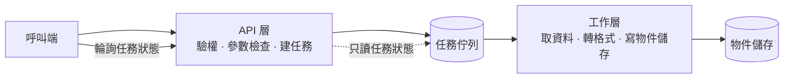

# 匯出服務架構說明

## 整體結構

匯出服務由三個模組組成：接單的 API 層、排程的佇列層、實際跑資料的工作層。依賴方向只有一個：API 層寫入佇列，工作層讀取佇列，兩者不直接互相呼叫。

## 模組依賴說明

API 層不認識資料庫的匯出邏輯，只認識佇列的介面。這一刀的用意是讓工作層可以獨立重啟、獨立擴充，而不影響正在收單的 API。

工作層可以水平長到任意數量，因為它們之間沒有共享狀態——每個工作者一次認領一個任務，認領靠佇列的原子操作，不靠鎖。這個結構好比超市的取號機：號碼發出去之後，誰去哪個櫃檯結帳都不影響其他人。

## 資料流

1. 呼叫端送出匯出請求，API 層驗權、檢查參數、建立任務，回傳任務識別碼。
2. 工作層認領任務，分頁讀取來源資料，邊讀邊寫入物件儲存。
3. 工作層寫完後更新任務狀態為完成，並附上下載連結與過期時間。
4. 呼叫端輪詢任務狀態，取得連結。

分頁讀取的頁大小固定為 5,000 列。這個數字來自第 3 節的量測：再大會讓單一工作者的記憶體峰值超過 512 MB。

## 技術選型的權衡

| 決策 | 選項 | 為什麼這樣選 |
|------|------|--------------|
| 任務佇列 | 資料庫表 vs 專用佇列 | 選資料庫表。目前尖峰每分鐘 40 個任務，專用佇列多一個要維運的元件，換到的吞吐這個量級用不到 |
| 匯出寫入 | 先組完再寫 vs 邊讀邊寫 | 選邊讀邊寫。先組完的峰值記憶體與列數成正比，100,000 列會超過單一工作者的配額 |
| 狀態查詢 | 推播 vs 輪詢 | 選輪詢。推播要維護長連線與重連，而呼叫端目前都是批次程式，延遲 5 秒可以接受 |
| 檔案保留 | 永久 vs 24 小時 | 選 24 小時。永久保留的儲存成本與匯出次數成正比，且沒有任何呼叫端要求過 |

## 已知限制

- 單一任務不支援斷點續傳。工作者在中途死亡時，任務會被重新認領並從頭跑。
- 佇列用資料庫表實作，任務量成長到每分鐘 500 個以上時，輪詢的鎖競爭會成為瓶頸，屆時要換成專用佇列。
